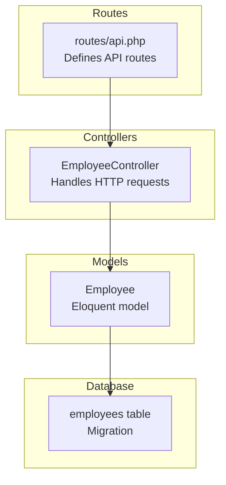
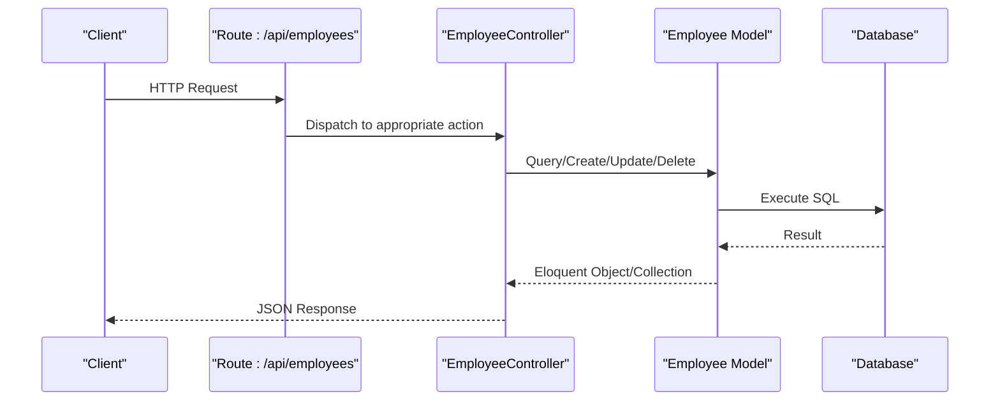
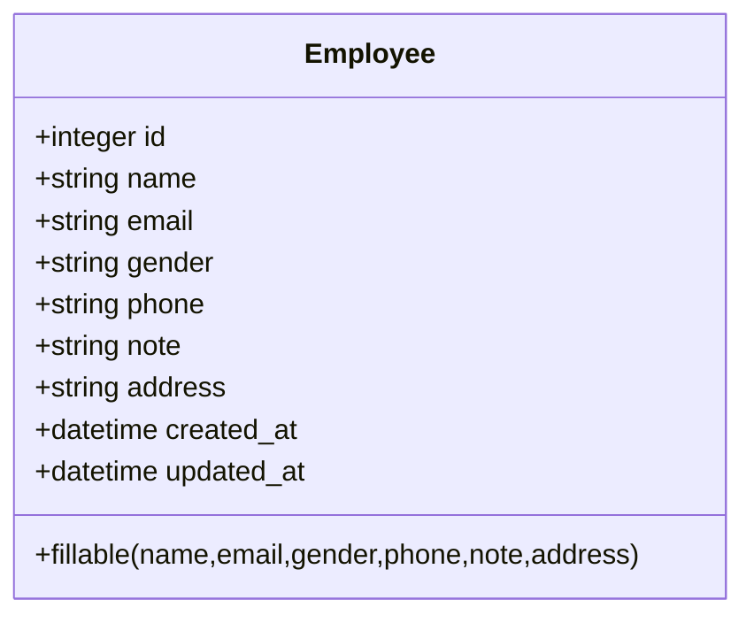
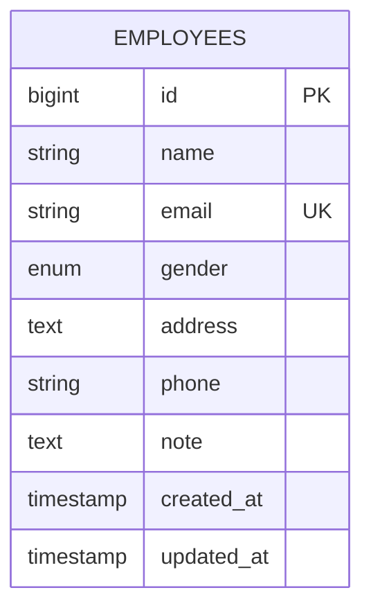
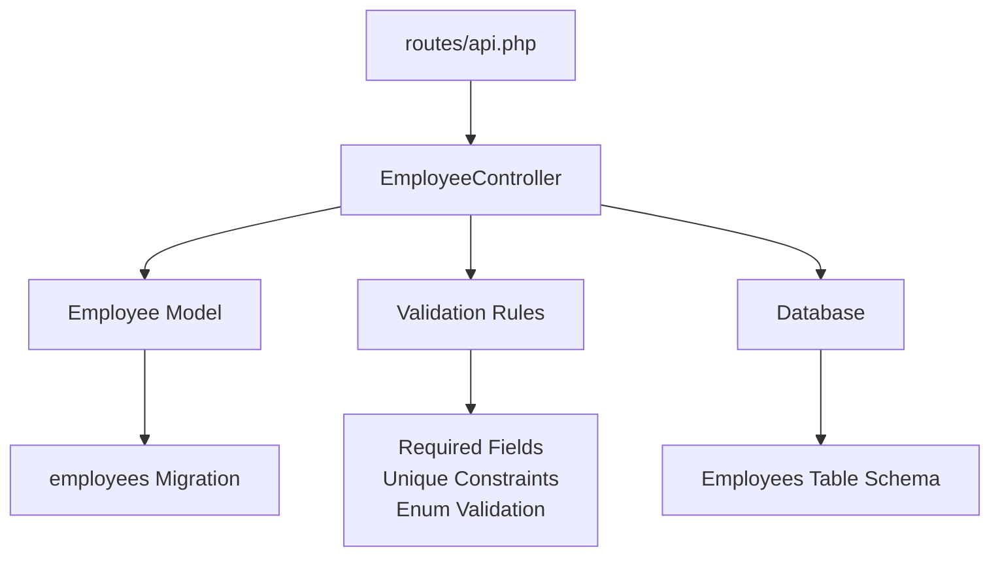

# API Reference

<cite>
**Referenced Files in This Document**
- [routes/api.php](file://routes/api.php)
- [EmployeeController.php](file://app/Http/Controllers/EmployeeController.php)
- [Employee.php](file://app/Models/Employee.php)
- [2026_04_11_134759_create_employees_table.php](file://database/migrations/2026_04_11_134759_create_employees_table.php)
- [AppServiceProvider.php](file://app/Providers/AppServiceProvider.php)
- [auth.php](file://config/auth.php)
- [app.php](file://config/app.php)
</cite>

## Table of Contents
1. [Introduction](#introduction)
2. [Project Structure](#project-structure)
3. [Core Components](#core-components)
4. [Architecture Overview](#architecture-overview)
5. [Detailed Component Analysis](#detailed-component-analysis)
6. [Dependency Analysis](#dependency-analysis)
7. [Performance Considerations](#performance-considerations)
8. [Troubleshooting Guide](#troubleshooting-guide)
9. [Conclusion](#conclusion)

## Introduction
This document provides comprehensive API documentation for the employees management system. It covers all RESTful endpoints for listing, creating, retrieving, updating, deleting, and searching employees. The API follows standard HTTP semantics and returns JSON responses. Authentication and rate limiting considerations are documented along with practical examples and error handling patterns.

## Project Structure
The API is built using Laravel and consists of:
- Routes grouped under `/api` with middleware applied globally
- An EmployeeController implementing CRUD operations and search
- An Employee model mapped to the employees database table
- Database migration defining the employees table schema



**Diagram sources**
- [routes/api.php:1-8](file://routes/api.php#L1-L8)
- [EmployeeController.php:1-95](file://app/Http/Controllers/EmployeeController.php#L1-L95)
- [Employee.php:1-18](file://app/Models/Employee.php#L1-L18)
- [2026_04_11_134759_create_employees_table.php:1-34](file://database/migrations/2026_04_11_134759_create_employees_table.php#L1-L34)

**Section sources**
- [routes/api.php:1-8](file://routes/api.php#L1-L8)
- [AppServiceProvider.php:22-26](file://app/Providers/AppServiceProvider.php#L22-L26)

## Core Components
- API Routing: Routes are prefixed with `/api` and grouped with middleware applied at the service provider level.
- Controller: EmployeeController implements index, store, show, update, destroy, and search actions.
- Model: Employee model defines fillable attributes and maps to the employees table.
- Database: Migration creates the employees table with required fields and constraints.

Key implementation references:
- Route registration and resource routing
- Controller action implementations
- Model fillable attributes
- Database schema definition

**Section sources**
- [routes/api.php:6-7](file://routes/api.php#L6-L7)
- [EmployeeController.php:13-92](file://app/Http/Controllers/EmployeeController.php#L13-L92)
- [Employee.php:9-16](file://app/Models/Employee.php#L9-L16)
- [2026_04_11_134759_create_employees_table.php:14-22](file://database/migrations/2026_04_11_134759_create_employees_table.php#L14-L22)

## Architecture Overview
The API follows a standard MVC pattern with Laravel's routing, controller, and Eloquent ORM layers.



**Diagram sources**
- [routes/api.php:6-7](file://routes/api.php#L6-L7)
- [EmployeeController.php:13-92](file://app/Http/Controllers/EmployeeController.php#L13-L92)
- [Employee.php:9-16](file://app/Models/Employee.php#L9-L16)

## Detailed Component Analysis

### Endpoint Definitions

#### List Employees
- **Method**: GET
- **URL**: `/api/employees`
- **Description**: Retrieves all employees from the database
- **Response**: Array of employee objects
- **Status Codes**: 200 OK

Request example:
```bash
curl -X GET http://localhost/api/employees
```

Response example:
```json
[
  {
    "id": 1,
    "name": "John Doe",
    "email": "john@example.com",
    "gender": "male",
    "phone": "123-456-7890",
    "note": "Software Engineer",
    "address": "123 Main St",
    "created_at": "2023-01-01T00:00:00Z",
    "updated_at": "2023-01-01T00:00:00Z"
  }
]
```

**Section sources**
- [routes/api.php:6-7](file://routes/api.php#L6-L7)
- [EmployeeController.php:13-16](file://app/Http/Controllers/EmployeeController.php#L13-L16)

#### Create Employee
- **Method**: POST
- **URL**: `/api/employees`
- **Description**: Creates a new employee record
- **Request Body**: JSON object containing employee fields
- **Response**: Created employee object
- **Status Codes**: 201 Created, 422 Unprocessable Entity

Request example:
```bash
curl -X POST http://localhost/api/employees \
  -H "Content-Type: application/json" \
  -d '{
    "name": "Jane Smith",
    "email": "jane@example.com",
    "gender": "female",
    "phone": "098-765-4321",
    "note": "Product Manager",
    "address": "456 Oak Ave"
  }'
```

Response example:
```json
{
  "id": 2,
  "name": "Jane Smith",
  "email": "jane@example.com",
  "gender": "female",
  "phone": "098-765-4321",
  "note": "Product Manager",
  "address": "456 Oak Ave",
  "created_at": "2023-01-01T00:00:00Z",
  "updated_at": "2023-01-01T00:00:00Z"
}
```

Validation rules:
- name: required, string
- email: required, string, valid email, unique
- gender: required, in:male,female,other
- phone: required, string
- note: nullable, string
- address: required, string

**Section sources**
- [routes/api.php:6-7](file://routes/api.php#L6-L7)
- [EmployeeController.php:21-31](file://app/Http/Controllers/EmployeeController.php#L21-L31)
- [Employee.php:9-16](file://app/Models/Employee.php#L9-L16)
- [2026_04_11_134759_create_employees_table.php:16-21](file://database/migrations/2026_04_11_134759_create_employees_table.php#L16-L21)

#### Get Employee Details
- **Method**: GET
- **URL**: `/api/employees/{id}`
- **Description**: Retrieves a specific employee by ID
- **Parameters**: 
  - id (path): Employee identifier
- **Response**: Employee object
- **Status Codes**: 200 OK, 404 Not Found

Request example:
```bash
curl -X GET http://localhost/api/employees/1
```

Response example (success):
```json
{
  "id": 1,
  "name": "John Doe",
  "email": "john@example.com",
  "gender": "male",
  "phone": "123-456-7890",
  "note": "Software Engineer",
  "address": "123 Main St",
  "created_at": "2023-01-01T00:00:00Z",
  "updated_at": "2023-01-01T00:00:00Z"
}
```

Response example (not found):
```json
{
  "message": "Employee not found"
}
```

**Section sources**
- [routes/api.php:6-7](file://routes/api.php#L6-L7)
- [EmployeeController.php:34-41](file://app/Http/Controllers/EmployeeController.php#L34-L41)

#### Update Employee
- **Method**: PUT/PATCH
- **URL**: `/api/employees/{id}`
- **Description**: Updates an existing employee record
- **Parameters**: 
  - id (path): Employee identifier
- **Request Body**: JSON object with fields to update
- **Response**: Updated employee object
- **Status Codes**: 200 OK, 404 Not Found, 422 Unprocessable Entity

Request example (PATCH):
```bash
curl -X PATCH http://localhost/api/employees/1 \
  -H "Content-Type: application/json" \
  -d '{
    "phone": "555-555-5555",
    "note": "Senior Software Engineer"
  }'
```

Response example:
```json
{
  "id": 1,
  "name": "John Doe",
  "email": "john@example.com",
  "gender": "male",
  "phone": "555-555-5555",
  "note": "Senior Software Engineer",
  "address": "123 Main St",
  "created_at": "2023-01-01T00:00:00Z",
  "updated_at": "2023-01-01T00:00:00Z"
}
```

Validation rules (fields are optional but validated when present):
- name: sometimes required, string
- email: sometimes required, string, valid email, unique (excluding current employee)
- gender: sometimes required, in:male,female,other
- phone: sometimes required, string
- note: sometimes nullable, string
- address: sometimes required, string

**Section sources**
- [routes/api.php:6-7](file://routes/api.php#L6-L7)
- [EmployeeController.php:46-62](file://app/Http/Controllers/EmployeeController.php#L46-L62)

#### Delete Employee
- **Method**: DELETE
- **URL**: `/api/employees/{id}`
- **Description**: Deletes an employee record
- **Parameters**: 
  - id (path): Employee identifier
- **Response**: Success message
- **Status Codes**: 200 OK, 404 Not Found

Request example:
```bash
curl -X DELETE http://localhost/api/employees/1
```

Response example (success):
```json
{
  "message": "Employee deleted successfully"
}
```

**Section sources**
- [routes/api.php:6-7](file://routes/api.php#L6-L7)
- [EmployeeController.php:69-76](file://app/Http/Controllers/EmployeeController.php#L69-L76)

#### Search Employees
- **Method**: GET
- **URL**: `/api/employees/search`
- **Description**: Searches employees by name, email, or phone
- **Query Parameters**:
  - q (query): Search query string (required)
- **Response**: Array of matching employee objects
- **Status Codes**: 200 OK, 400 Bad Request

Request example:
```bash
curl -X GET "http://localhost/api/employees/search?q=john"
```

Response example:
```json
[
  {
    "id": 1,
    "name": "John Doe",
    "email": "john@example.com",
    "gender": "male",
    "phone": "123-456-7890",
    "note": "Software Engineer",
    "address": "123 Main St",
    "created_at": "2023-01-01T00:00:00Z",
    "updated_at": "2023-01-01T00:00:00Z"
  }
]
```

Validation rules:
- q: required, string

**Section sources**
- [routes/api.php:6-7](file://routes/api.php#L6-L7)
- [EmployeeController.php:78-92](file://app/Http/Controllers/EmployeeController.php#L78-L92)

### Data Models

#### Employee Model
The Employee model defines the fillable attributes that can be mass-assigned and maps to the employees table.



**Diagram sources**
- [Employee.php:9-16](file://app/Models/Employee.php#L9-L16)

**Section sources**
- [Employee.php:9-16](file://app/Models/Employee.php#L9-L16)

### Database Schema

#### Employees Table
The employees table schema defines the structure and constraints for employee records.



**Diagram sources**
- [2026_04_11_134759_create_employees_table.php:14-22](file://database/migrations/2026_04_11_134759_create_employees_table.php#L14-L22)

**Section sources**
- [2026_04_11_134759_create_employees_table.php:14-22](file://database/migrations/2026_04_11_134759_create_employees_table.php#L14-L22)

## Dependency Analysis
The API components have the following dependencies:



**Diagram sources**
- [routes/api.php:6-7](file://routes/api.php#L6-L7)
- [EmployeeController.php:21-62](file://app/Http/Controllers/EmployeeController.php#L21-L62)
- [Employee.php:9-16](file://app/Models/Employee.php#L9-L16)
- [2026_04_11_134759_create_employees_table.php:14-22](file://database/migrations/2026_04_11_134759_create_employees_table.php#L14-L22)

**Section sources**
- [routes/api.php:6-7](file://routes/api.php#L6-L7)
- [EmployeeController.php:21-62](file://app/Http/Controllers/EmployeeController.php#L21-L62)

## Performance Considerations
- Database Indexes: Consider adding indexes on frequently searched columns (email, phone) for improved search performance
- Pagination: For large datasets, implement pagination in the index endpoint to limit response size
- Validation: Current validation runs per request; consider caching validation rules if needed
- Response Size: The current implementation returns all fields. Consider implementing field selection or projection for clients that don't need all fields

## Troubleshooting Guide

### Common Error Scenarios

#### 404 Not Found
**Cause**: Employee ID does not exist
**Solution**: Verify the employee ID exists in the database
**Response**: 
```json
{
  "message": "Employee not found"
}
```

#### 422 Unprocessable Entity
**Cause**: Validation failed (missing required fields, invalid email format, unique constraint violation)
**Solution**: Review the request payload against validation rules
**Response Examples**:
```json
{
  "message": "The email has already been taken."
}
```

#### 400 Bad Request
**Cause**: Search endpoint called without query parameter
**Solution**: Include the `q` parameter in the search request
**Response**:
```json
{
  "message": "Search query required"
}
```

### Authentication and Authorization
- **Current State**: No authentication middleware is configured for the API routes
- **Recommendation**: Add authentication middleware (e.g., API tokens, JWT) for production environments
- **Implementation**: Configure in the route middleware stack or globally in the service provider

### Rate Limiting
- **Current State**: No rate limiting is configured
- **Recommendation**: Implement rate limiting using Laravel's built-in rate limiting features
- **Implementation**: Add rate limiter middleware to routes or configure globally

**Section sources**
- [EmployeeController.php:37-39](file://app/Http/Controllers/EmployeeController.php#L37-L39)
- [EmployeeController.php:82-84](file://app/Http/Controllers/EmployeeController.php#L82-L84)

## Conclusion
This API provides a complete CRUD interface for employee management with search capabilities. The implementation follows Laravel conventions with proper validation, error handling, and clean separation of concerns. For production deployment, consider adding authentication, rate limiting, and performance optimizations such as pagination and database indexing.