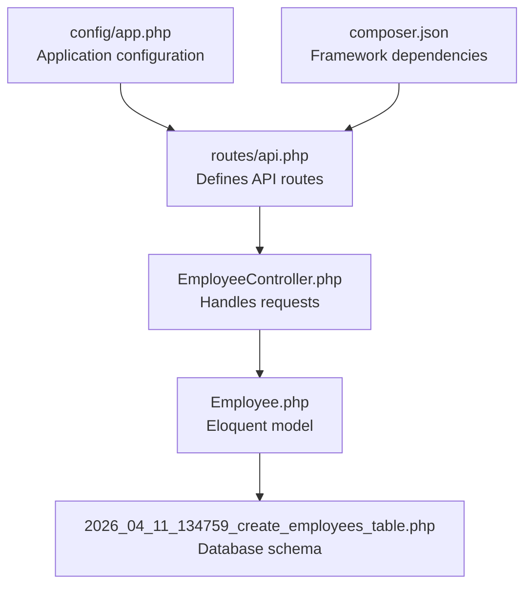
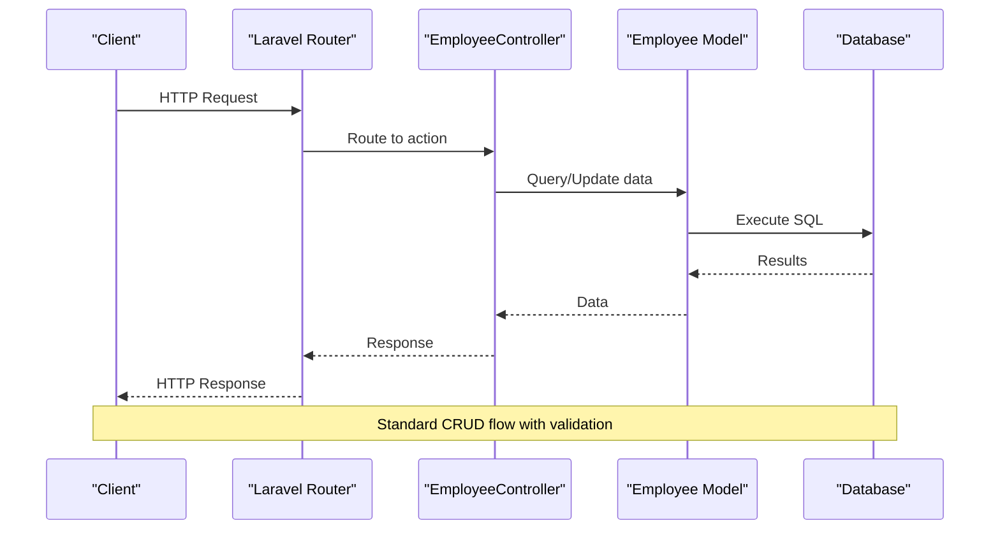
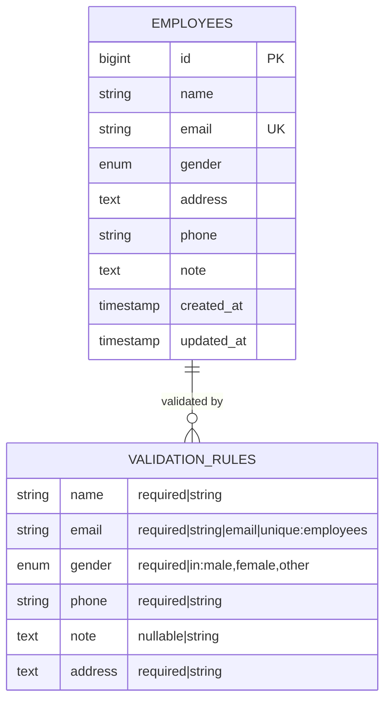
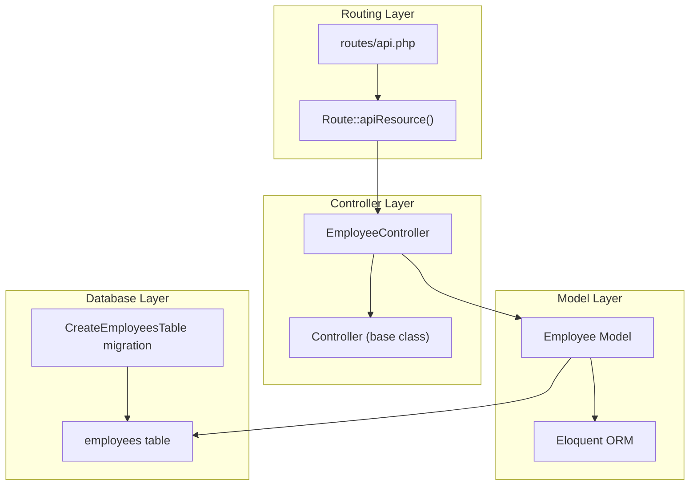

# CRUD Endpoints

<cite>
**Referenced Files in This Document**
- [routes/api.php](file://routes/api.php)
- [EmployeeController.php](file://app/Http/Controllers/EmployeeController.php)
- [Employee.php](file://app/Models/Employee.php)
- [2026_04_11_134759_create_employees_table.php](file://database/migrations/2026_04_11_134759_create_employees_table.php)
- [Controller.php](file://app/Http/Controllers/Controller.php)
- [app.php](file://config/app.php)
- [composer.json](file://composer.json)
</cite>

## Table of Contents
1. [Introduction](#introduction)
2. [Project Structure](#project-structure)
3. [Core Components](#core-components)
4. [Architecture Overview](#architecture-overview)
5. [Detailed Component Analysis](#detailed-component-analysis)
6. [Dependency Analysis](#dependency-analysis)
7. [Performance Considerations](#performance-considerations)
8. [Troubleshooting Guide](#troubleshooting-guide)
9. [Conclusion](#conclusion)

## Introduction
This document provides comprehensive API documentation for the CRUD operations endpoint group focused on employees. It covers the standard RESTful endpoints, request/response schemas, validation rules, error handling, and the Laravel apiResource routing convention that automatically generates these endpoints. The documentation includes HTTP methods, URL patterns, parameter descriptions, validation constraints, and expected status codes.

## Project Structure
The API endpoints are defined using Laravel's routing system with a dedicated controller and model. The routes file registers the resource routes and an additional custom search endpoint.



**Diagram sources**
- [routes/api.php:1-8](file://routes/api.php#L1-L8)
- [EmployeeController.php:1-95](file://app/Http/Controllers/EmployeeController.php#L1-L95)
- [Employee.php:1-18](file://app/Models/Employee.php#L1-L18)
- [2026_04_11_134759_create_employees_table.php:1-34](file://database/migrations/2026_04_11_134759_create_employees_table.php#L1-L34)
- [app.php:1-127](file://config/app.php#L1-L127)
- [composer.json:1-86](file://composer.json#L1-L86)

**Section sources**
- [routes/api.php:1-8](file://routes/api.php#L1-L8)
- [EmployeeController.php:1-95](file://app/Http/Controllers/EmployeeController.php#L1-L95)
- [Employee.php:1-18](file://app/Models/Employee.php#L1-L18)
- [2026_04_11_134759_create_employees_table.php:1-34](file://database/migrations/2026_04_11_134759_create_employees_table.php#L1-L34)
- [app.php:1-127](file://config/app.php#L1-L127)
- [composer.json:1-86](file://composer.json#L1-L86)

## Core Components
The CRUD endpoints are implemented using Laravel's apiResource routing convention, which automatically generates standard RESTful routes for the Employee resource. The implementation includes:

- **Route Registration**: Uses `Route::apiResource('employees', EmployeeController::class)` to generate all standard CRUD routes
- **Custom Search Endpoint**: Additional `/api/employees/search` endpoint for filtering employees
- **Model Definition**: Eloquent model with fillable attributes for mass assignment protection
- **Validation Rules**: Built-in validation for create and update operations
- **Error Handling**: Standardized JSON error responses with appropriate HTTP status codes

**Section sources**
- [routes/api.php:6-7](file://routes/api.php#L6-L7)
- [EmployeeController.php:13-92](file://app/Http/Controllers/EmployeeController.php#L13-L92)
- [Employee.php:9-16](file://app/Models/Employee.php#L9-L16)

## Architecture Overview
The API follows a standard MVC architecture with Laravel's routing system handling HTTP requests and delegating to controller actions.



**Diagram sources**
- [routes/api.php:6-7](file://routes/api.php#L6-L7)
- [EmployeeController.php:13-92](file://app/Http/Controllers/EmployeeController.php#L13-L92)
- [Employee.php:1-18](file://app/Models/Employee.php#L1-L18)

## Detailed Component Analysis

### API Resource Routing Convention
Laravel's `Route::apiResource()` automatically generates the following standard RESTful routes:

```mermaid
classDiagram
class EmployeeController {
+index() Response
+store(Request) Response
+show(string) Response
+update(Request, string) Response
+destroy(string) Response
+search(Request) Response
}
class Routes {
+"GET /api/employees" : "index()"
+"POST /api/employees" : "store()"
+"GET /api/employees/{id}" : "show()"
+"PUT/PATCH /api/employees/{id}" : "update()"
+"DELETE /api/employees/{id}" : "destroy()"
+"GET /api/employees/search" : "search()"
}
Routes --> EmployeeController : "maps to"
```

**Diagram sources**
- [routes/api.php:6-7](file://routes/api.php#L6-L7)
- [EmployeeController.php:8-95](file://app/Http/Controllers/EmployeeController.php#L8-L95)

#### Endpoint 1: GET /api/employees (List Employees)
- **Method**: GET
- **URL Pattern**: `/api/employees`
- **Purpose**: Retrieve all employees
- **Response**: Array of employee objects
- **Status Codes**: 200 OK
- **Pagination**: Not implemented (returns all records)
- **Filtering**: Not implemented

**Section sources**
- [routes/api.php:7](file://routes/api.php#L7)
- [EmployeeController.php:13-16](file://app/Http/Controllers/EmployeeController.php#L13-L16)

#### Endpoint 2: POST /api/employees (Create Employee)
- **Method**: POST
- **URL Pattern**: `/api/employees`
- **Purpose**: Create a new employee
- **Request Body**: JSON object with employee fields
- **Response**: Created employee object
- **Status Codes**: 201 Created (expected), 422 Unprocessable Entity (validation errors)
- **Validation Rules**:
  - `name`: required, string
  - `email`: required, string, valid email, unique
  - `gender`: required, enum: male, female, other
  - `phone`: required, string
  - `note`: optional, string
  - `address`: required, string

**Section sources**
- [routes/api.php:7](file://routes/api.php#L7)
- [EmployeeController.php:21-33](file://app/Http/Controllers/EmployeeController.php#L21-L33)
- [EmployeeController.php:23-30](file://app/Http/Controllers/EmployeeController.php#L23-L30)
- [2026_04_11_134759_create_employees_table.php:14-22](file://database/migrations/2026_04_11_134759_create_employees_table.php#L14-L22)

#### Endpoint 3: GET /api/employees/{id} (Get Employee)
- **Method**: GET
- **URL Pattern**: `/api/employees/{id}`
- **Purpose**: Retrieve a specific employee by ID
- **Response**: Employee object or error message
- **Status Codes**: 200 OK, 404 Not Found
- **Error Response**: JSON object with message field

**Section sources**
- [routes/api.php:7](file://routes/api.php#L7)
- [EmployeeController.php:34-41](file://app/Http/Controllers/EmployeeController.php#L34-L41)

#### Endpoint 4: PUT/PATCH /api/employees/{id} (Update Employee)
- **Method**: PUT or PATCH
- **URL Pattern**: `/api/employees/{id}`
- **Purpose**: Update an existing employee
- **Request Body**: JSON object with fields to update
- **Response**: Updated employee object
- **Status Codes**: 200 OK, 404 Not Found, 422 Unprocessable Entity
- **Validation Rules**: Same as create, with `sometimes` modifier for optional updates
- **Unique Constraint**: Email uniqueness excludes current employee ID

**Section sources**
- [routes/api.php:7](file://routes/api.php#L7)
- [EmployeeController.php:46-64](file://app/Http/Controllers/EmployeeController.php#L46-L64)
- [EmployeeController.php:52-60](file://app/Http/Controllers/EmployeeController.php#L52-L60)

#### Endpoint 5: DELETE /api/employees/{id} (Delete Employee)
- **Method**: DELETE
- **URL Pattern**: `/api/employees/{id}`
- **Purpose**: Delete an employee
- **Response**: Success message
- **Status Codes**: 200 OK, 404 Not Found
- **Error Response**: JSON object with message field

**Section sources**
- [routes/api.php:7](file://routes/api.php#L7)
- [EmployeeController.php:69-77](file://app/Http/Controllers/EmployeeController.php#L69-L77)

#### Endpoint 6: GET /api/employees/search (Search Employees)
- **Method**: GET
- **URL Pattern**: `/api/employees/search`
- **Purpose**: Search employees by name, email, or phone
- **Query Parameter**: `q` (required)
- **Response**: Array of matching employees
- **Status Codes**: 200 OK, 400 Bad Request
- **Error Response**: JSON object with message field

**Section sources**
- [routes/api.php:6](file://routes/api.php#L6)
- [EmployeeController.php:78-92](file://app/Http/Controllers/EmployeeController.php#L78-L92)
- [EmployeeController.php:80-84](file://app/Http/Controllers/EmployeeController.php#L80-L84)

### Data Model and Validation



**Diagram sources**
- [2026_04_11_134759_create_employees_table.php:14-22](file://database/migrations/2026_04_11_134759_create_employees_table.php#L14-L22)
- [EmployeeController.php:23-30](file://app/Http/Controllers/EmployeeController.php#L23-L30)
- [EmployeeController.php:52-59](file://app/Http/Controllers/EmployeeController.php#L52-L59)

**Section sources**
- [Employee.php:9-16](file://app/Models/Employee.php#L9-L16)
- [2026_04_11_134759_create_employees_table.php:14-22](file://database/migrations/2026_04_11_134759_create_employees_table.php#L14-L22)

## Dependency Analysis
The API endpoints depend on several Laravel components working together:



**Diagram sources**
- [routes/api.php:6-7](file://routes/api.php#L6-L7)
- [EmployeeController.php:8-95](file://app/Http/Controllers/EmployeeController.php#L8-L95)
- [Employee.php:1-18](file://app/Models/Employee.php#L1-L18)
- [2026_04_11_134759_create_employees_table.php:1-34](file://database/migrations/2026_04_11_134759_create_employees_table.php#L1-L34)

**Section sources**
- [routes/api.php:6-7](file://routes/api.php#L6-L7)
- [EmployeeController.php:8-95](file://app/Http/Controllers/EmployeeController.php#L8-L95)
- [Employee.php:1-18](file://app/Models/Employee.php#L1-L18)
- [2026_04_11_134759_create_employees_table.php:1-34](file://database/migrations/2026_04_11_134759_create_employees_table.php#L1-L34)

## Performance Considerations
- **Indexing**: Consider adding database indexes for frequently searched columns (email, phone)
- **Pagination**: Implement pagination for the index endpoint to handle large datasets
- **Query Optimization**: Use eager loading for related models if they exist
- **Caching**: Implement caching strategies for frequently accessed employee data
- **Validation**: Move validation rules to dedicated Form Request classes for better reusability

## Troubleshooting Guide

### Common Issues and Solutions

#### 404 Not Found Errors
**Cause**: Employee ID does not exist
**Solution**: Verify the employee exists in the database before making requests
**Response**: JSON object with message field

#### 422 Unprocessable Entity
**Cause**: Validation failed
**Solution**: Check request payload against validation rules
**Common Validation Issues**:
- Missing required fields
- Invalid email format
- Non-unique email
- Invalid gender values

#### 400 Bad Request
**Cause**: Missing search query parameter
**Solution**: Include the `q` parameter in search requests

#### 500 Internal Server Error
**Cause**: Database connection issues or server configuration problems
**Solution**: Check database connectivity and server logs

**Section sources**
- [EmployeeController.php:37-40](file://app/Http/Controllers/EmployeeController.php#L37-L40)
- [EmployeeController.php:49-51](file://app/Http/Controllers/EmployeeController.php#L49-L51)
- [EmployeeController.php:72-74](file://app/Http/Controllers/EmployeeController.php#L72-L74)
- [EmployeeController.php:82-84](file://app/Http/Controllers/EmployeeController.php#L82-L84)

## Conclusion
The CRUD endpoints provide a solid foundation for employee management with Laravel's apiResource routing convention. While the current implementation demonstrates the core functionality, there are opportunities for improvement including pagination, consistent response formatting, route model binding, and professional validation patterns. The endpoints follow RESTful conventions and provide appropriate HTTP status codes for different scenarios.