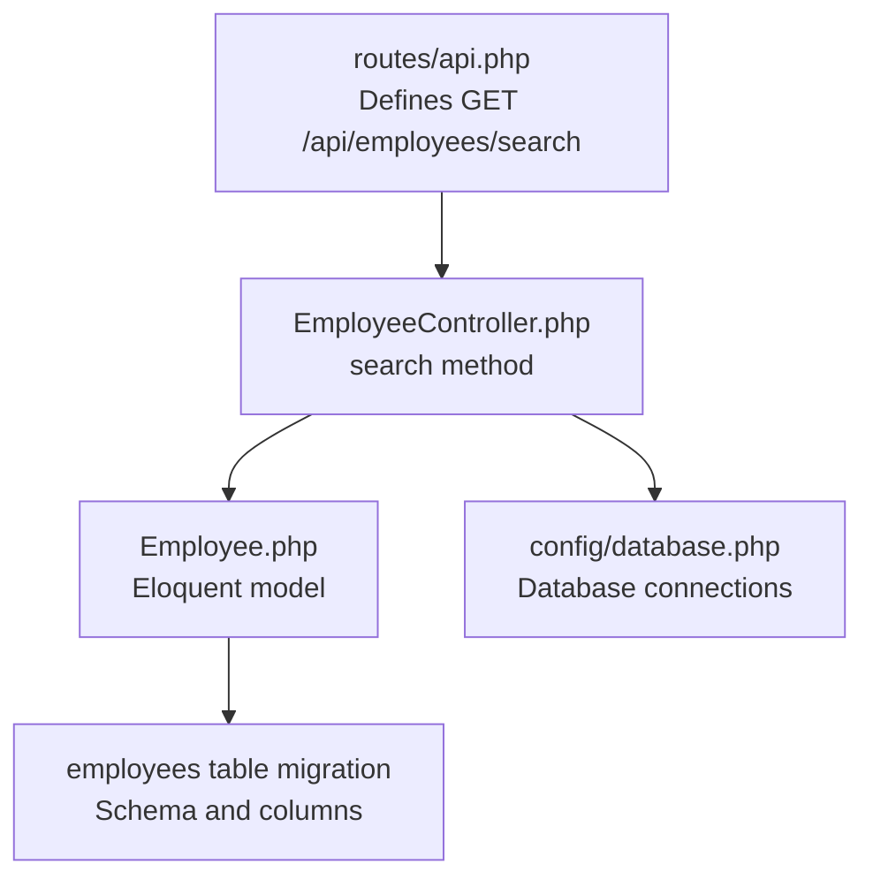
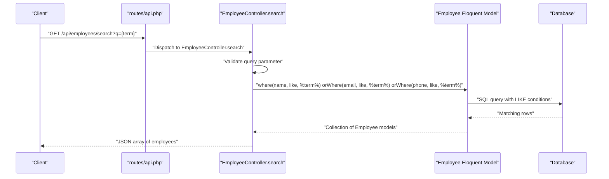
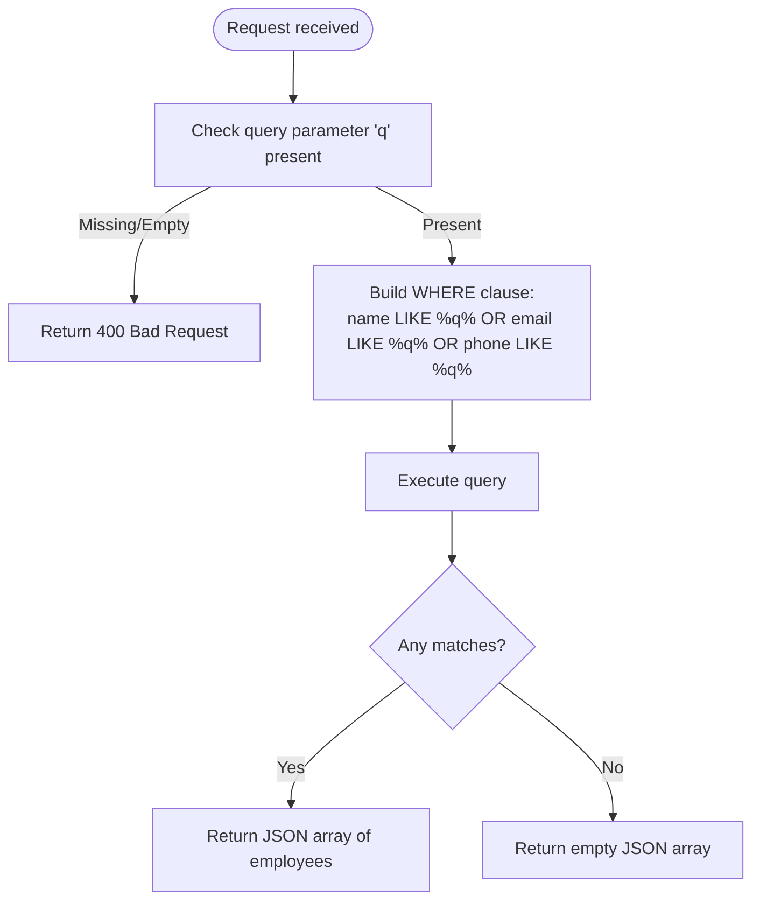
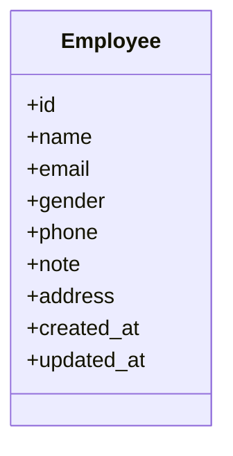
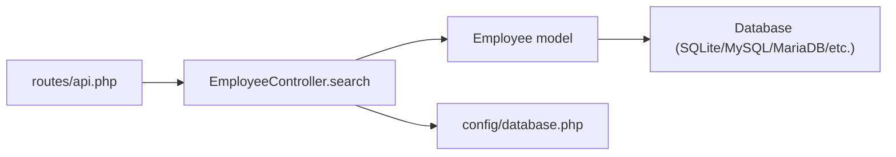

# Search Endpoint

<cite>
**Referenced Files in This Document**
- [routes/api.php](file://routes/api.php)
- [EmployeeController.php](file://app/Http/Controllers/EmployeeController.php)
- [Employee.php](file://app/Models/Employee.php)
- [2026_04_11_134759_create_employees_table.php](file://database/migrations/2026_04_11_134759_create_employees_table.php)
- [database.php](file://config/database.php)
</cite>

## Table of Contents
1. [Introduction](#introduction)
2. [Project Structure](#project-structure)
3. [Core Components](#core-components)
4. [Architecture Overview](#architecture-overview)
5. [Detailed Component Analysis](#detailed-component-analysis)
6. [Dependency Analysis](#dependency-analysis)
7. [Performance Considerations](#performance-considerations)
8. [Troubleshooting Guide](#troubleshooting-guide)
9. [Conclusion](#conclusion)

## Introduction
This document provides comprehensive API documentation for the GET /api/employees/search endpoint. It explains the search algorithm, matching behavior, response format, pagination handling, performance characteristics, and limitations. It also includes practical examples and troubleshooting guidance.

## Project Structure
The search endpoint is defined in the routes file and implemented in the EmployeeController. The Employee model defines the underlying data structure and fillable attributes used by the search.

**Diagram sources**
- [routes/api.php:6](file://routes/api.php#L6)
- [EmployeeController.php:78-92](file://app/Http/Controllers/EmployeeController.php#L78-L92)
- [Employee.php:7-17](file://app/Models/Employee.php#L7-L17)
- [2026_04_11_134759_create_employees_table.php:14-23](file://database/migrations/2026_04_11_134759_create_employees_table.php#L14-L23)
- [database.php:20](file://config/database.php#L20)

**Section sources**
- [routes/api.php:6](file://routes/api.php#L6)
- [EmployeeController.php:78-92](file://app/Http/Controllers/EmployeeController.php#L78-L92)
- [Employee.php:7-17](file://app/Models/Employee.php#L7-L17)
- [2026_04_11_134759_create_employees_table.php:14-23](file://database/migrations/2026_04_11_134759_create_employees_table.php#L14-L23)
- [database.php:20](file://config/database.php#L20)

## Core Components
- Route registration: The route GET /api/employees/search maps to EmployeeController.search.
- Controller action: Validates presence of query parameter q and performs a multi-field LIKE search across name, email, and phone.
- Model: Eloquent Employee model with fillable attributes including name, email, phone, gender, note, and address.
- Database: employees table with columns for name, email, gender, address, phone, and note.

Key behaviors:
- Query parameter q is required; missing or empty query returns a 400 error.
- Case-insensitive matching is performed using SQL LIKE with wildcards around the query term.
- Partial string matching is supported via leading/trailing percent signs.
- Multi-field search combines results from name, email, and phone using OR conditions.

Response format:
- Returns a JSON array of Employee records matching the search criteria.

Pagination:
- The current implementation returns all matching records without pagination. There is no built-in pagination for this endpoint.

**Section sources**
- [routes/api.php:6](file://routes/api.php#L6)
- [EmployeeController.php:78-92](file://app/Http/Controllers/EmployeeController.php#L78-L92)
- [Employee.php:9-16](file://app/Models/Employee.php#L9-L16)
- [2026_04_11_134759_create_employees_table.php:16-20](file://database/migrations/2026_04_11_134759_create_employees_table.php#L16-L20)

## Architecture Overview
The search request follows a straightforward path from route to controller to model and database.

**Diagram sources**
- [routes/api.php:6](file://routes/api.php#L6)
- [EmployeeController.php:78-92](file://app/Http/Controllers/EmployeeController.php#L78-L92)
- [Employee.php:7-17](file://app/Models/Employee.php#L7-L17)

## Detailed Component Analysis

### Endpoint Definition and Routing
- Route: GET /api/employees/search
- Handler: EmployeeController.search
- Purpose: Search employees across name, email, and phone fields.

Behavior:
- Enforces presence of q parameter; returns 400 if absent.
- Performs SQL LIKE queries against name, email, and phone.

Response:
- JSON array of Employee records matching criteria.

Limitations:
- No pagination; all results returned.
- No explicit sorting; order depends on database default.

**Section sources**
- [routes/api.php:6](file://routes/api.php#L6)
- [EmployeeController.php:78-92](file://app/Http/Controllers/EmployeeController.php#L78-L92)

### Search Algorithm and Matching Behavior
Algorithm:
- Single-term substring search using SQL LIKE with leading and trailing wildcards.
- Multi-field OR search across name, email, and phone.

Case sensitivity:
- Depends on database collation. The migration specifies utf8mb4_unicode_ci for MySQL/MariaDB, which is case-insensitive for most languages.

Partial matching:
- Supported; any occurrence of the query term anywhere in the field matches.

Multi-field criteria:
- name OR email OR phone.

Edge cases:
- Empty query returns 400.
- Very short terms may match many rows depending on data distribution.
- Special characters in the query are treated as literal characters in LIKE.

**Diagram sources**
- [EmployeeController.php:78-92](file://app/Http/Controllers/EmployeeController.php#L78-L92)

**Section sources**
- [EmployeeController.php:78-92](file://app/Http/Controllers/EmployeeController.php#L78-L92)
- [2026_04_11_134759_create_employees_table.php:57](file://database/migrations/2026_04_11_134759_create_employees_table.php#L57)

### Data Model and Fields
The Employee model exposes fillable attributes used by the application. The search operates on name, email, and phone fields.

**Diagram sources**
- [Employee.php:9-16](file://app/Models/Employee.php#L9-L16)

**Section sources**
- [Employee.php:9-16](file://app/Models/Employee.php#L9-L16)
- [2026_04_11_134759_create_employees_table.php:16-20](file://database/migrations/2026_04_11_134759_create_employees_table.php#L16-L20)

### Practical Examples

Common search patterns:
- GET /api/employees/search?q=john
- GET /api/employees/search?q@gmail.com
- GET /api/employees/search?q=555

Edge cases:
- GET /api/employees/search?q= (400 Bad Request)
- GET /api/employees/search?q=nonexistent (200 OK, empty array)
- GET /api/employees/search?q=a (may return many results depending on dataset)

Response format:
- Array of employee objects with fields: id, name, email, gender, phone, note, address, timestamps.

Notes:
- Pagination is not implemented for this endpoint.

**Section sources**
- [EmployeeController.php:78-92](file://app/Http/Controllers/EmployeeController.php#L78-L92)

## Dependency Analysis
The search endpoint depends on:
- Route registration for the endpoint.
- Controller method for request handling and query construction.
- Eloquent model for data access.
- Database connection configuration for the chosen driver.

**Diagram sources**
- [routes/api.php:6](file://routes/api.php#L6)
- [EmployeeController.php:78-92](file://app/Http/Controllers/EmployeeController.php#L78-L92)
- [database.php:20](file://config/database.php#L20)

**Section sources**
- [routes/api.php:6](file://routes/api.php#L6)
- [EmployeeController.php:78-92](file://app/Http/Controllers/EmployeeController.php#L78-L92)
- [database.php:20](file://config/database.php#L20)

## Performance Considerations
Current implementation:
- Uses SQL LIKE with leading wildcards, which prevents index usage and results in full scans.
- No pagination; large datasets can cause high memory and bandwidth usage.
- No explicit ordering; results order depends on database default.

Optimization opportunities:
- Add database indexes on name, email, and phone to improve LIKE performance.
- Implement server-side pagination (limit/offset or cursor-based) to handle large result sets.
- Normalize search queries (trim, lowercase) to reduce variability and improve cache hits.
- Consider full-text search capabilities if supported by the database engine.
- Add query length limits to prevent overly broad searches.

Limitations:
- Current LIKE queries are inherently inefficient for large tables.
- No built-in rate limiting or query timeouts.

[No sources needed since this section provides general guidance]

## Troubleshooting Guide
Common issues and resolutions:
- 400 Bad Request on missing query: Ensure q parameter is provided.
- Unexpectedly broad results: Narrow the query term or add additional filters client-side.
- Slow responses on large datasets: Implement pagination or add database indexes.
- Case-sensitive edge cases: Verify database collation settings.

Operational checks:
- Confirm route is registered and mapped to the controller action.
- Verify database connectivity and table schema alignment with the model.

**Section sources**
- [EmployeeController.php:82-84](file://app/Http/Controllers/EmployeeController.php#L82-L84)
- [database.php:20](file://config/database.php#L20)

## Conclusion
The GET /api/employees/search endpoint provides a simple, multi-field substring search across name, email, and phone. While easy to use, it currently lacks pagination and relies on full-scan LIKE queries, which can be inefficient for large datasets. Adding database indexes, pagination, and optional full-text search would significantly improve performance and scalability.