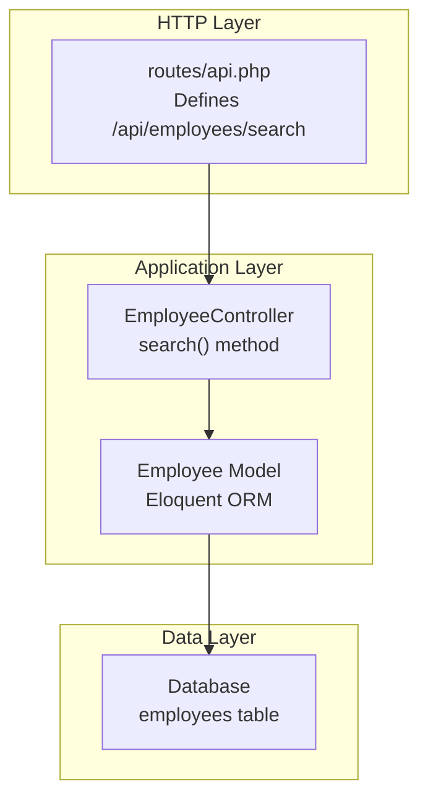
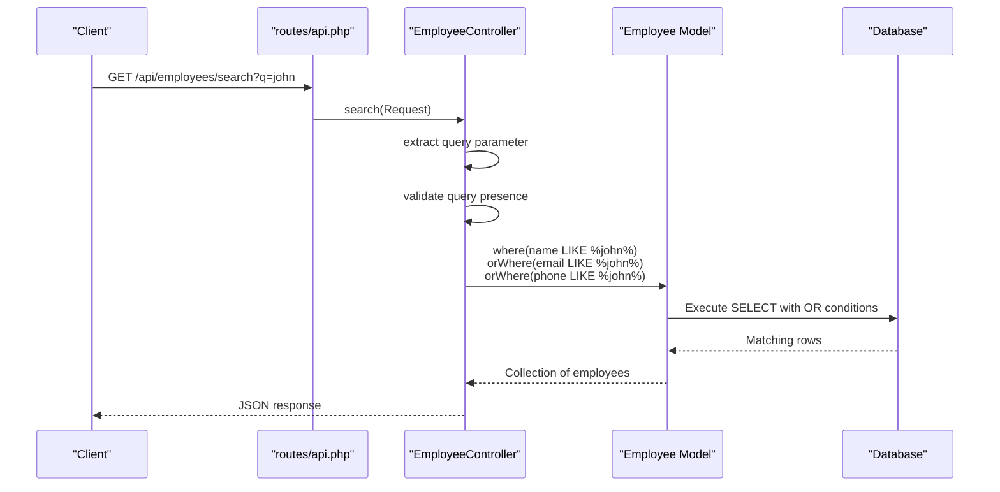
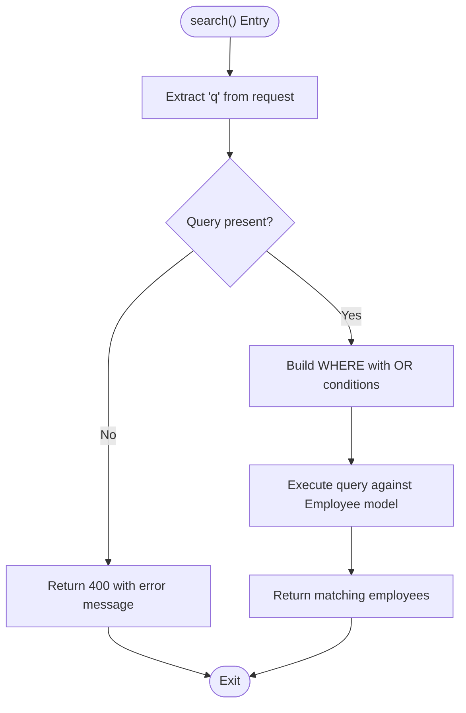
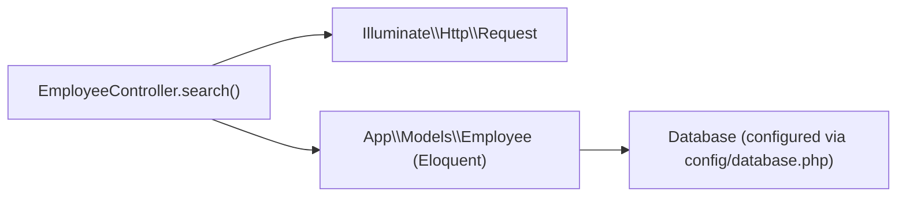

# Advanced Search Implementation

<cite>
**Referenced Files in This Document**
- [EmployeeController.php](file://app/Http/Controllers/EmployeeController.php)
- [Employee.php](file://app/Models/Employee.php)
- [api.php](file://routes/api.php)
- [2026_04_11_134759_create_employees_table.php](file://database/migrations/2026_04_11_134759_create_employees_table.php)
- [database.php](file://config/database.php)
- [BACKEND_ROADMAP.md](file://BACKEND_ROADMAP.md)
</cite>

## Table of Contents
1. [Introduction](#introduction)
2. [Project Structure](#project-structure)
3. [Core Components](#core-components)
4. [Architecture Overview](#architecture-overview)
5. [Detailed Component Analysis](#detailed-component-analysis)
6. [Dependency Analysis](#dependency-analysis)
7. [Performance Considerations](#performance-considerations)
8. [Troubleshooting Guide](#troubleshooting-guide)
9. [Conclusion](#conclusion)

## Introduction
This document provides comprehensive technical documentation for the search functionality implemented in the EmployeeController. It focuses on the search() method implementation, covering query parameter handling, multi-field search logic across name, email, and phone fields, LIKE operator usage for partial string matching, case-insensitive search behavior, OR logic between search fields, search query construction, parameter validation, and response formatting. It also includes practical examples, edge cases, and performance considerations for optimizing search operations in larger datasets.

## Project Structure
The search functionality is implemented within the Laravel application stack:
- Routes define the endpoint for search
- Controller handles request processing and delegates to the model
- Model encapsulates data access and query building
- Database configuration determines collation and character set behavior

**Diagram sources**
- [api.php:6-6](file://routes/api.php#L6-L6)
- [EmployeeController.php:78-92](file://app/Http/Controllers/EmployeeController.php#L78-L92)
- [Employee.php:1-18](file://app/Models/Employee.php#L1-L18)

**Section sources**
- [api.php:1-7](file://routes/api.php#L1-L7)
- [EmployeeController.php:78-92](file://app/Http/Controllers/EmployeeController.php#L78-L92)
- [Employee.php:1-18](file://app/Models/Employee.php#L1-L18)

## Core Components
The search functionality centers around a single method in the EmployeeController that:
- Extracts the query parameter from the request
- Validates that a query was provided
- Constructs a multi-field search using OR logic across name, email, and phone
- Executes the query and returns results

Key implementation details:
- Query parameter extraction: retrieves the 'q' parameter from the request
- Parameter validation: returns a 400 error if the query is empty
- Multi-field search: applies LIKE operator with wildcards to three fields
- Response: returns the collection of matching employees

**Section sources**
- [EmployeeController.php:78-92](file://app/Http/Controllers/EmployeeController.php#L78-L92)

## Architecture Overview
The search operation follows a straightforward request-response flow:
1. HTTP GET request to /api/employees/search?q={term}
2. Route resolves to EmployeeController::search()
3. Controller validates and processes the query
4. Model executes the database query with OR conditions
5. Results are returned as JSON

**Diagram sources**
- [api.php:6-6](file://routes/api.php#L6-L6)
- [EmployeeController.php:78-92](file://app/Http/Controllers/EmployeeController.php#L78-L92)
- [Employee.php:1-18](file://app/Models/Employee.php#L1-L18)

## Detailed Component Analysis

### Search Method Implementation
The search() method performs the following steps:
1. Extracts the query parameter using request->get('q')
2. Validates that the query is not empty; returns 400 if missing
3. Builds a query with three OR conditions:
   - name LIKE %query%
   - email LIKE %query%
   - phone LIKE %query%
4. Executes the query and returns the results

**Diagram sources**
- [EmployeeController.php:78-92](file://app/Http/Controllers/EmployeeController.php#L78-L92)

**Section sources**
- [EmployeeController.php:78-92](file://app/Http/Controllers/EmployeeController.php#L78-L92)

### Query Parameter Handling
- Parameter name: q
- Extraction method: request->get('q')
- Validation: empty check with 400 response
- Behavior: case-sensitive LIKE matching by default

**Section sources**
- [EmployeeController.php:80-84](file://app/Http/Controllers/EmployeeController.php#L80-L84)

### Multi-Field Search Logic
The search spans three fields using OR logic:
- name: partial match anywhere in the string
- email: partial match anywhere in the string  
- phone: partial match anywhere in the string

All three conditions are combined with OR, so a match in any field returns the record.

**Section sources**
- [EmployeeController.php:86-89](file://app/Http/Controllers/EmployeeController.php#L86-L89)

### LIKE Operator and Pattern Matching
- Pattern format: %query%
- Positioning: wildcard at both ends enables substring matching
- Effect: matches any occurrence of the query within the field
- Case sensitivity: determined by database collation

**Section sources**
- [EmployeeController.php:86-89](file://app/Http/Controllers/EmployeeController.php#L86-L89)

### Case-Insensitive Search Behavior
The search behavior depends on the database collation setting:
- MySQL/MariaDB default collation: utf8mb4_unicode_ci
- PostgreSQL default collation: C or POSIX
- SQLite default: case-sensitive binary comparison

To achieve case-insensitive matching, consider:
- Using LOWER() function in queries
- Adjusting database collation settings
- Using database-specific case-insensitive operators

**Section sources**
- [database.php:57-57](file://config/database.php#L57-L57)
- [database.php:77-77](file://config/database.php#L77-L77)

### Response Formatting
The search method returns the raw Eloquent collection. In professional implementations, this would be wrapped in an API resource for consistent formatting and controlled serialization.

Current behavior:
- Returns Employee model instances
- JSON serialization handled by Laravel automatically

Recommended improvements (from roadmap):
- Wrap results in EmployeeResource
- Standardized response envelope
- Consistent pagination

**Section sources**
- [EmployeeController.php:89-91](file://app/Http/Controllers/EmployeeController.php#L89-L91)
- [BACKEND_ROADMAP.md:247-330](file://BACKEND_ROADMAP.md#L247-L330)

### Database Schema Considerations
The employees table includes the fields searched:
- name: string
- email: string (unique)
- phone: string

These fields support the LIKE pattern matching used by the search.

**Section sources**
- [2026_04_11_134759_create_employees_table.php:14-22](file://database/migrations/2026_04_11_134759_create_employees_table.php#L14-L22)

## Dependency Analysis
The search functionality has minimal external dependencies:
- Uses Laravel's Request object for parameter extraction
- Uses Eloquent ORM for query building and execution
- Depends on database configuration for collation behavior

**Diagram sources**
- [EmployeeController.php:78-92](file://app/Http/Controllers/EmployeeController.php#L78-L92)
- [Employee.php:1-18](file://app/Models/Employee.php#L1-L18)
- [database.php:1-185](file://config/database.php#L1-L185)

**Section sources**
- [EmployeeController.php:78-92](file://app/Http/Controllers/EmployeeController.php#L78-L92)
- [Employee.php:1-18](file://app/Models/Employee.php#L1-L18)
- [database.php:1-185](file://config/database.php#L1-L185)

## Performance Considerations
Current implementation characteristics:
- Linear scan across all records
- No pagination for search results
- Full table scans for each query
- Memory usage proportional to result set size

Performance optimization strategies:
1. **Indexing**
   - Create indexes on frequently searched columns
   - Consider composite indexes for multi-column searches
   - Evaluate trade-offs between write performance and read performance

2. **Pagination**
   - Implement pagination for search results
   - Limit page sizes (e.g., 15-50 records per page)
   - Add cursor-based pagination for large datasets

3. **Query Optimization**
   - Consider full-text search capabilities
   - Implement query result caching for common searches
   - Use database-specific optimizations (MySQL FULLTEXT, PostgreSQL trigram indexes)

4. **Case-Insensitive Optimization**
   - Use database collation that supports case-insensitive comparisons
   - Consider storing normalized versions of searchable fields
   - Implement query transformations that leverage indexes

5. **Caching Strategy**
   - Cache frequent search terms
   - Implement cache invalidation on data changes
   - Use distributed caching for multi-instance deployments

6. **Asynchronous Processing**
   - Offload heavy searches to background jobs
   - Implement search result precomputation
   - Use search-as-you-type with debouncing

## Troubleshooting Guide

### Common Issues and Solutions

**Empty Query Parameter**
- Symptom: 400 Bad Request with "Search query required"
- Cause: Missing or empty 'q' parameter
- Solution: Ensure client sends proper query parameter

**Case Sensitivity Issues**
- Symptom: Search returns unexpected results
- Cause: Database collation affects LIKE matching
- Solution: 
  - Use LOWER() function for case-insensitive matching
  - Adjust database collation settings
  - Consider database-specific case-insensitive operators

**Performance Degradation**
- Symptom: Slow response times with large datasets
- Causes:
  - Full table scans for each query
  - No pagination
  - Missing indexes
- Solutions:
  - Add appropriate database indexes
  - Implement pagination
  - Consider full-text search engines
  - Use query result caching

**Unexpected Results**
- Symptom: Matches appear in unexpected positions
- Cause: LIKE pattern matching behavior
- Explanation: %query% matches anywhere in the string
- Solution: Consider exact word boundaries or phrase matching

**Section sources**
- [EmployeeController.php:82-84](file://app/Http/Controllers/EmployeeController.php#L82-L84)
- [database.php:57-57](file://config/database.php#L57-L57)

## Conclusion
The current search implementation provides a functional foundation for multi-field partial matching across name, email, and phone fields. While it correctly implements the core search logic, several enhancements would improve production readiness:

1. **Add pagination** to handle large result sets efficiently
2. **Implement proper indexing** to optimize query performance
3. **Consider case-insensitive matching** based on application requirements
4. **Standardize response formatting** using API resources
5. **Add comprehensive error handling** and validation
6. **Implement caching strategies** for frequently accessed searches

The roadmap document outlines a comprehensive refactoring path that addresses these concerns while maintaining backward compatibility. The search functionality serves as a good starting point for exploring more advanced search capabilities such as faceted search, autocomplete, and full-text search engines.