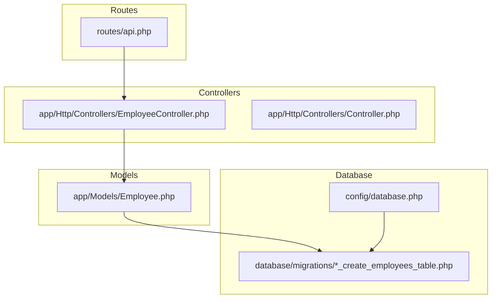
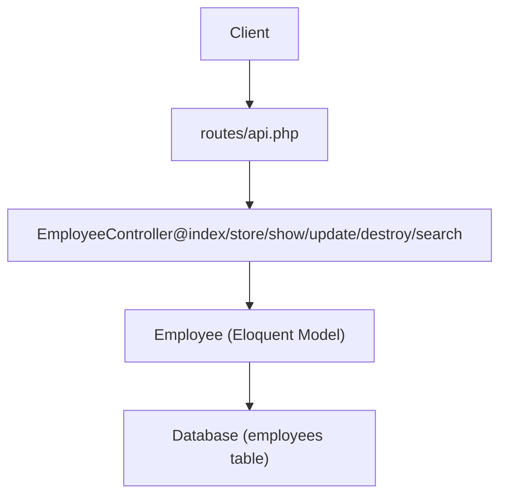
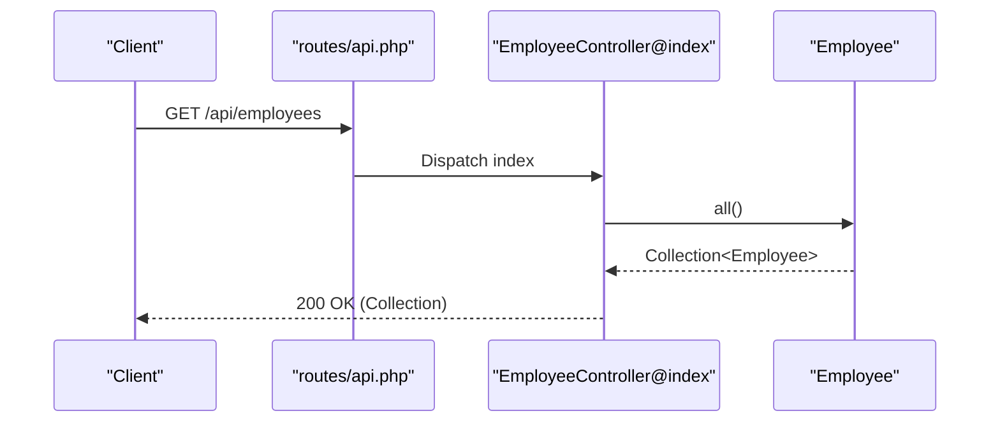
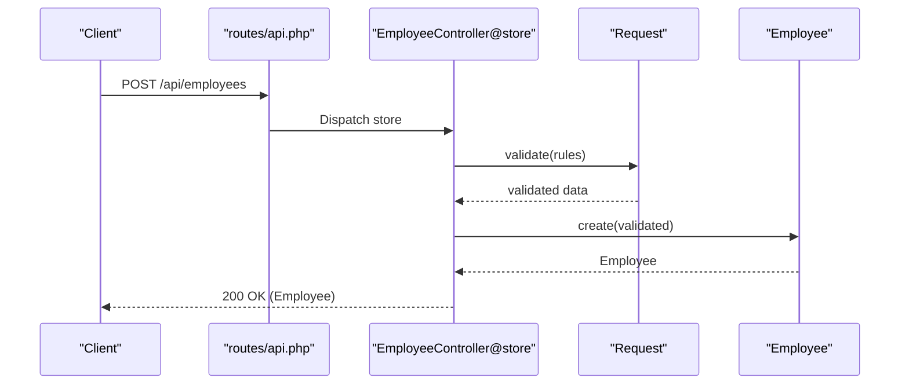
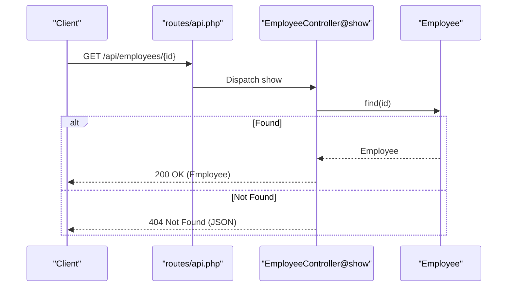
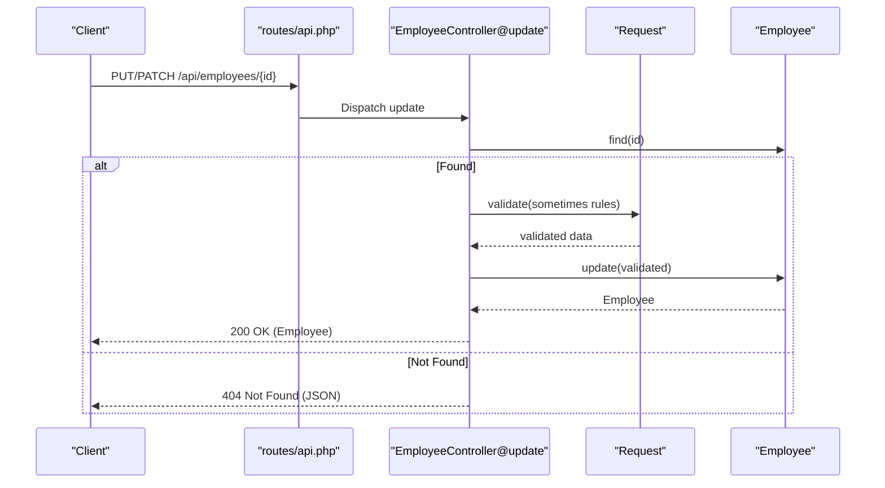
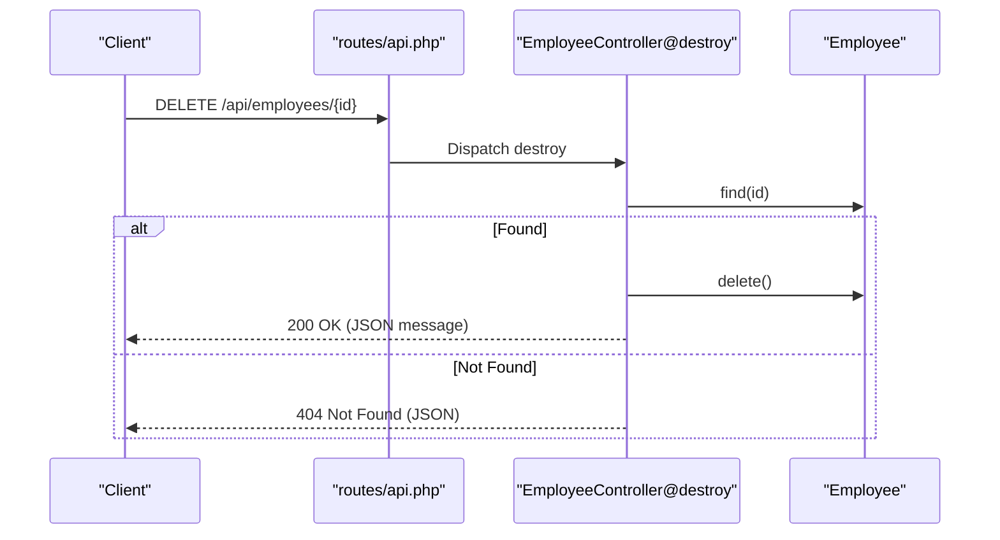
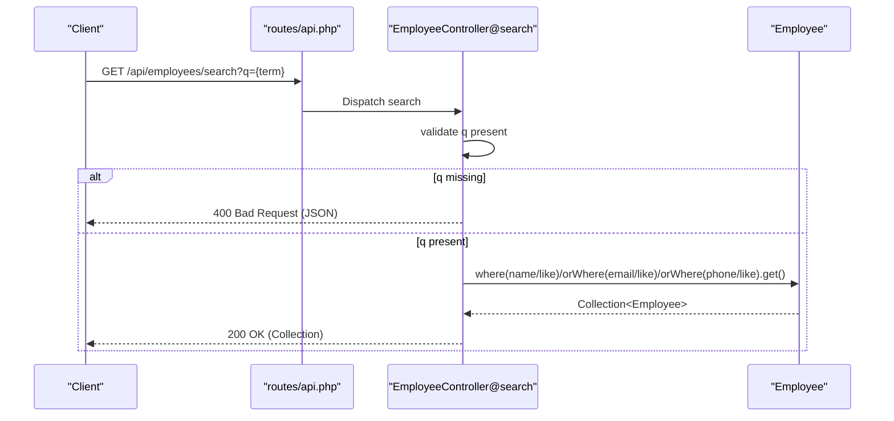
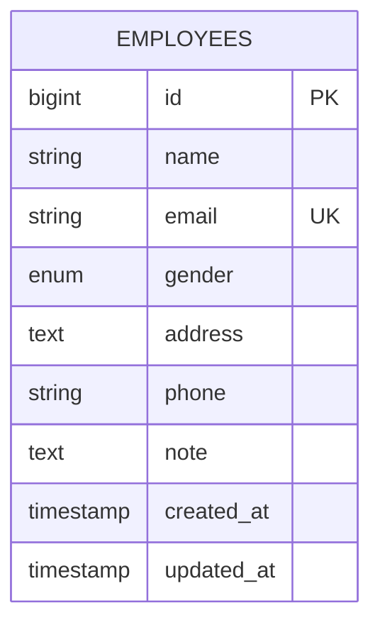
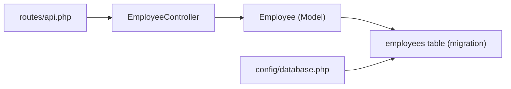

# Business Logic & Controllers

<cite>
**Referenced Files in This Document**
- [EmployeeController.php](file://app/Http/Controllers/EmployeeController.php)
- [Employee.php](file://app/Models/Employee.php)
- [api.php](file://routes/api.php)
- [2026_04_11_134759_create_employees_table.php](file://database/migrations/2026_04_11_134759_create_employees_table.php)
- [Controller.php](file://app/Http/Controllers/Controller.php)
- [database.php](file://config/database.php)
- [composer.json](file://composer.json)
- [ExampleTest.php](file://tests/Feature/ExampleTest.php)
- [ExampleTest.php](file://tests/Unit/ExampleTest.php)
</cite>

## Table of Contents
1. [Introduction](#introduction)
2. [Project Structure](#project-structure)
3. [Core Components](#core-components)
4. [Architecture Overview](#architecture-overview)
5. [Detailed Component Analysis](#detailed-component-analysis)
6. [Dependency Analysis](#dependency-analysis)
7. [Performance Considerations](#performance-considerations)
8. [Troubleshooting Guide](#troubleshooting-guide)
9. [Conclusion](#conclusion)

## Introduction
This document provides comprehensive business logic documentation for the EmployeeController and associated processes. It explains CRUD operations, request validation, error handling, response formatting, and the controller methods index, store, show, update, destroy, and search. It also details validation rules, data sanitization, business logic patterns, and HTTP status code usage. Where applicable, it references the actual source files and highlights areas for improvement aligned with professional Laravel practices.

## Project Structure
The application follows a standard Laravel structure with a focus on a single domain: employees. The relevant components are:
- Routes: Define API endpoints for employees and a dedicated search endpoint.
- Controller: Implements all employee-related actions.
- Model: Defines the Employee entity and fillable attributes.
- Migration: Creates the employees table with appropriate columns and constraints.
- Configuration: Database connection defaults and framework requirements.

**Diagram sources**
- [api.php:1-8](file://routes/api.php#L1-L8)
- [EmployeeController.php:1-95](file://app/Http/Controllers/EmployeeController.php#L1-L95)
- [Employee.php:1-18](file://app/Models/Employee.php#L1-L18)
- [2026_04_11_134759_create_employees_table.php:1-34](file://database/migrations/2026_04_11_134759_create_employees_table.php#L1-L34)
- [database.php:1-185](file://config/database.php#L1-L185)

**Section sources**
- [api.php:1-8](file://routes/api.php#L1-L8)
- [EmployeeController.php:1-95](file://app/Http/Controllers/EmployeeController.php#L1-L95)
- [Employee.php:1-18](file://app/Models/Employee.php#L1-L18)
- [2026_04_11_134759_create_employees_table.php:1-34](file://database/migrations/2026_04_11_134759_create_employees_table.php#L1-L34)
- [database.php:1-185](file://config/database.php#L1-L185)

## Core Components
- EmployeeController: Implements REST endpoints for employees and a custom search endpoint. It performs validation via the request object, queries the Employee model, and returns Eloquent models or JSON responses.
- Employee Model: Defines fillable attributes and maps to the employees table.
- Routes: Declares the standard REST resource routes for employees and a separate GET route for search.

Key behaviors:
- Validation occurs inline within controller actions using the request validator.
- Responses are either raw Eloquent models or JSON error/status objects.
- The search endpoint accepts a query parameter and returns filtered results.

**Section sources**
- [EmployeeController.php:13-92](file://app/Http/Controllers/EmployeeController.php#L13-L92)
- [Employee.php:9-16](file://app/Models/Employee.php#L9-L16)
- [api.php:6-7](file://routes/api.php#L6-L7)

## Architecture Overview
The system follows a layered architecture:
- HTTP Layer: Routes map to controller actions.
- Application Layer: Controller actions orchestrate validation, persistence, and response formatting.
- Domain Layer: Eloquent model encapsulates data access and persistence.
- Persistence Layer: Database schema defined by migration.

**Diagram sources**
- [api.php:6-7](file://routes/api.php#L6-L7)
- [EmployeeController.php:13-92](file://app/Http/Controllers/EmployeeController.php#L13-L92)
- [Employee.php:7-16](file://app/Models/Employee.php#L7-L16)
- [2026_04_11_134759_create_employees_table.php:14-23](file://database/migrations/2026_04_11_134759_create_employees_table.php#L14-L23)

## Detailed Component Analysis

### EmployeeController Methods and Business Logic

#### Index: Retrieve all employees
- Purpose: Return a collection of all employees.
- Implementation: Calls the model’s all method and returns the result.
- Response: Raw collection of models.
- Notes: No pagination; consider adding pagination for large datasets.

**Diagram sources**
- [api.php:7](file://routes/api.php#L7)
- [EmployeeController.php:13-16](file://app/Http/Controllers/EmployeeController.php#L13-L16)
- [Employee.php:7-16](file://app/Models/Employee.php#L7-L16)

**Section sources**
- [EmployeeController.php:13-16](file://app/Http/Controllers/EmployeeController.php#L13-L16)

#### Store: Create a new employee
- Purpose: Persist a new employee record.
- Validation: Validates presence and types of name, email, gender, phone, note (nullable), and address.
- Uniqueness: Email must be unique across employees.
- Persistence: Creates a new Employee with validated data.
- Response: Returns the created model; no explicit 201 status code.

**Diagram sources**
- [api.php:7](file://routes/api.php#L7)
- [EmployeeController.php:21-33](file://app/Http/Controllers/EmployeeController.php#L21-L33)
- [Employee.php:9-16](file://app/Models/Employee.php#L9-L16)

**Section sources**
- [EmployeeController.php:21-33](file://app/Http/Controllers/EmployeeController.php#L21-L33)

#### Show: Retrieve a specific employee
- Purpose: Return a single employee by ID.
- Lookup: Finds the employee by ID; returns 404 with JSON error if not found.
- Response: Returns the model or a JSON error object.

**Diagram sources**
- [api.php:7](file://routes/api.php#L7)
- [EmployeeController.php:34-41](file://app/Http/Controllers/EmployeeController.php#L34-L41)
- [Employee.php:7-16](file://app/Models/Employee.php#L7-L16)

**Section sources**
- [EmployeeController.php:34-41](file://app/Http/Controllers/EmployeeController.php#L34-L41)

#### Update: Modify an existing employee
- Purpose: Update fields for an existing employee.
- Lookup: Finds the employee by ID; returns 404 with JSON error if not found.
- Validation: Uses “sometimes” rules so only provided fields are validated; email uniqueness excludes the current record’s ID.
- Persistence: Updates the model with validated data.
- Response: Returns the updated model.

**Diagram sources**
- [api.php:7](file://routes/api.php#L7)
- [EmployeeController.php:46-64](file://app/Http/Controllers/EmployeeController.php#L46-L64)
- [Employee.php:7-16](file://app/Models/Employee.php#L7-L16)

**Section sources**
- [EmployeeController.php:46-64](file://app/Http/Controllers/EmployeeController.php#L46-L64)

#### Destroy: Delete an employee
- Purpose: Remove an employee by ID.
- Lookup: Finds the employee by ID; returns 404 with JSON error if not found.
- Persistence: Deletes the model.
- Response: Returns a JSON success message.

**Diagram sources**
- [api.php:7](file://routes/api.php#L7)
- [EmployeeController.php:69-77](file://app/Http/Controllers/EmployeeController.php#L69-L77)
- [Employee.php:7-16](file://app/Models/Employee.php#L7-L16)

**Section sources**
- [EmployeeController.php:69-77](file://app/Http/Controllers/EmployeeController.php#L69-L77)

#### Search: Find employees by query
- Purpose: Search employees by name, email, or phone using a query parameter.
- Validation: Requires a non-empty query parameter; returns 400 with JSON error if missing.
- Persistence: Performs OR-like searches on name, email, and phone.
- Response: Returns a collection of matching employees.

**Diagram sources**
- [api.php:6](file://routes/api.php#L6)
- [EmployeeController.php:78-92](file://app/Http/Controllers/EmployeeController.php#L78-L92)
- [Employee.php:7-16](file://app/Models/Employee.php#L7-L16)

**Section sources**
- [EmployeeController.php:78-92](file://app/Http/Controllers/EmployeeController.php#L78-L92)

### Validation Rules and Data Sanitization
- Store validation enforces:
  - name: required, string
  - email: required, string, valid email, unique across employees
  - gender: required, enum among male, female, other
  - phone: required, string
  - note: nullable, string
  - address: required, string
- Update validation uses “sometimes” so only provided fields are validated; email uniqueness excludes the current employee’s ID.
- Data sanitization: Laravel’s request validator coerces and filters input according to the specified rules.

**Section sources**
- [EmployeeController.php:23-30](file://app/Http/Controllers/EmployeeController.php#L23-L30)
- [EmployeeController.php:52-60](file://app/Http/Controllers/EmployeeController.php#L52-L60)

### Response Formatting and HTTP Status Codes
- Index: Returns a collection; no explicit status code set.
- Store: Returns the created model; no explicit 201 status code set.
- Show: Returns the model or a JSON error object with 404.
- Update: Returns the updated model or a JSON error object with 404.
- Destroy: Returns a JSON success message or a JSON error object with 404.
- Search: Returns a collection or a JSON error object with 400.

Recommendations for improvement:
- Use consistent response envelopes and explicit status codes (e.g., 201 for creation).
- Consider returning API resources for normalized output.

**Section sources**
- [EmployeeController.php:15](file://app/Http/Controllers/EmployeeController.php#L15)
- [EmployeeController.php:31](file://app/Http/Controllers/EmployeeController.php#L31)
- [EmployeeController.php:38](file://app/Http/Controllers/EmployeeController.php#L38)
- [EmployeeController.php:50](file://app/Http/Controllers/EmployeeController.php#L50)
- [EmployeeController.php:76](file://app/Http/Controllers/EmployeeController.php#L76)
- [EmployeeController.php:83](file://app/Http/Controllers/EmployeeController.php#L83)
- [EmployeeController.php:91](file://app/Http/Controllers/EmployeeController.php#L91)

### Data Model and Database Schema
- Employee model defines fillable attributes: name, email, gender, phone, note, address.
- Migration creates the employees table with:
  - id (auto-increment)
  - name (string)
  - email (string, unique)
  - gender (enum: male, female, other)
  - address (text)
  - phone (string)
  - note (text, nullable)
  - timestamps

**Diagram sources**
- [Employee.php:9-16](file://app/Models/Employee.php#L9-L16)
- [2026_04_11_134759_create_employees_table.php:14-23](file://database/migrations/2026_04_11_134759_create_employees_table.php#L14-L23)

**Section sources**
- [Employee.php:9-16](file://app/Models/Employee.php#L9-L16)
- [2026_04_11_134759_create_employees_table.php:14-23](file://database/migrations/2026_04_11_134759_create_employees_table.php#L14-L23)

### Request/Response Transformation Patterns
- Incoming requests are validated via the request object, producing a validated dataset.
- Outgoing responses are either raw Eloquent models or JSON objects with messages and status codes.
- There is no explicit resource transformation layer; consider adopting API resources for consistent serialization.

**Section sources**
- [EmployeeController.php:23-30](file://app/Http/Controllers/EmployeeController.php#L23-L30)
- [EmployeeController.php:52-60](file://app/Http/Controllers/EmployeeController.php#L52-L60)
- [EmployeeController.php:38](file://app/Http/Controllers/EmployeeController.php#L38)
- [EmployeeController.php:50](file://app/Http/Controllers/EmployeeController.php#L50)
- [EmployeeController.php:76](file://app/Http/Controllers/EmployeeController.php#L76)
- [EmployeeController.php:83](file://app/Http/Controllers/EmployeeController.php#L83)
- [EmployeeController.php:91](file://app/Http/Controllers/EmployeeController.php#L91)

## Dependency Analysis
- Routes depend on EmployeeController methods.
- EmployeeController depends on the Employee model for persistence.
- The Employee model depends on the employees table schema.
- Database configuration determines the underlying connection used by migrations and models.

**Diagram sources**
- [api.php:6-7](file://routes/api.php#L6-L7)
- [EmployeeController.php:13-92](file://app/Http/Controllers/EmployeeController.php#L13-L92)
- [Employee.php:7-16](file://app/Models/Employee.php#L7-L16)
- [2026_04_11_134759_create_employees_table.php:14-23](file://database/migrations/2026_04_11_134759_create_employees_table.php#L14-L23)
- [database.php:20](file://config/database.php#L20)

**Section sources**
- [api.php:6-7](file://routes/api.php#L6-L7)
- [EmployeeController.php:13-92](file://app/Http/Controllers/EmployeeController.php#L13-L92)
- [Employee.php:7-16](file://app/Models/Employee.php#L7-L16)
- [2026_04_11_134759_create_employees_table.php:14-23](file://database/migrations/2026_04_11_134759_create_employees_table.php#L14-L23)
- [database.php:20](file://config/database.php#L20)

## Performance Considerations
- Index returns all records without pagination; consider adding pagination for scalability.
- Search performs OR conditions across three columns; ensure appropriate indexing exists on name, email, and phone.
- Validation occurs per request; keep rules minimal and efficient.

[No sources needed since this section provides general guidance]

## Troubleshooting Guide
Common issues and resolutions:
- Not found scenarios:
  - Show, update, and destroy return 404 with a JSON message when the employee ID does not exist.
  - Resolution: Ensure the client passes a valid ID or handles 404 responses gracefully.
- Validation failures:
  - Store and update enforce strict validation rules; invalid inputs will cause validation exceptions.
  - Resolution: Verify payload fields match the documented rules before sending requests.
- Search query errors:
  - Search requires a non-empty query parameter; missing or empty query returns 400.
  - Resolution: Always provide a non-empty q parameter for search requests.
- Response inconsistencies:
  - Responses vary between raw models and JSON objects; consider adopting a unified response envelope.
  - Resolution: Introduce API resources and standardized status codes.

**Section sources**
- [EmployeeController.php:38](file://app/Http/Controllers/EmployeeController.php#L38)
- [EmployeeController.php:50](file://app/Http/Controllers/EmployeeController.php#L50)
- [EmployeeController.php:76](file://app/Http/Controllers/EmployeeController.php#L76)
- [EmployeeController.php:83](file://app/Http/Controllers/EmployeeController.php#L83)
- [EmployeeController.php:23-30](file://app/Http/Controllers/EmployeeController.php#L23-L30)
- [EmployeeController.php:52-60](file://app/Http/Controllers/EmployeeController.php#L52-L60)

## Conclusion
The EmployeeController provides a functional baseline for managing employees with straightforward validation and persistence. To align with professional standards, consider:
- Extracting validation into Form Request classes.
- Adopting Route Model Binding to simplify ID resolution and reduce duplication.
- Implementing API resources for consistent response formatting.
- Standardizing HTTP status codes and response envelopes.
- Adding pagination to index endpoints and optimizing search queries.

These improvements will enhance maintainability, testability, and API consistency while preserving current functionality.