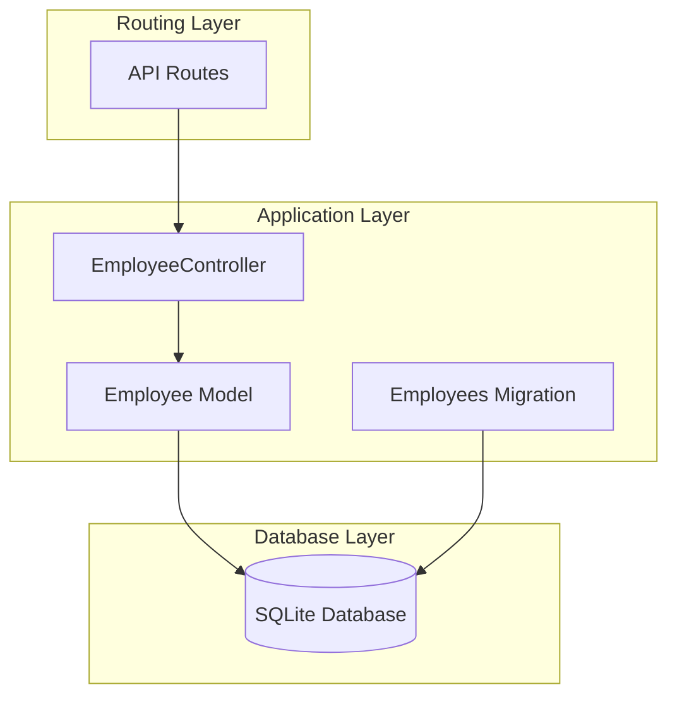
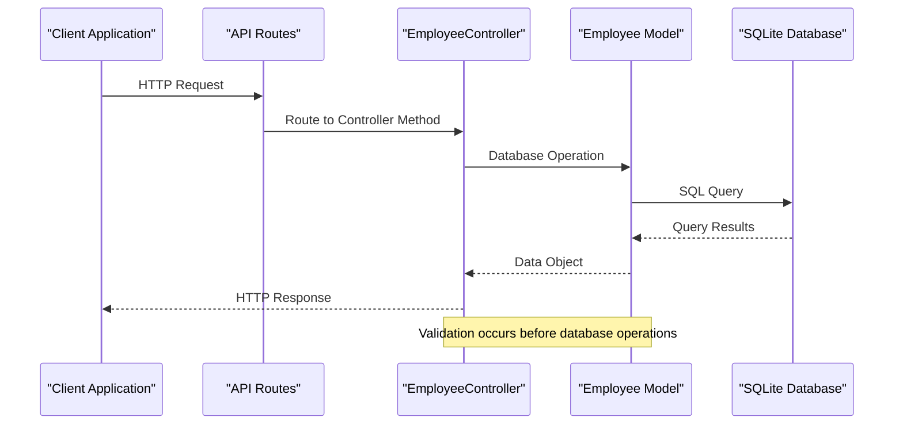
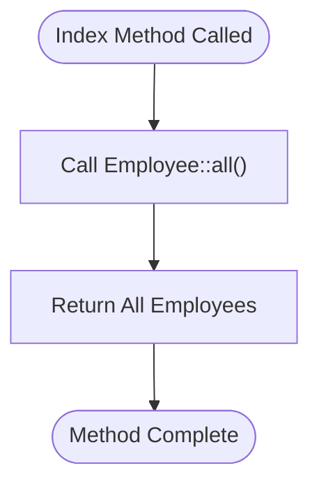
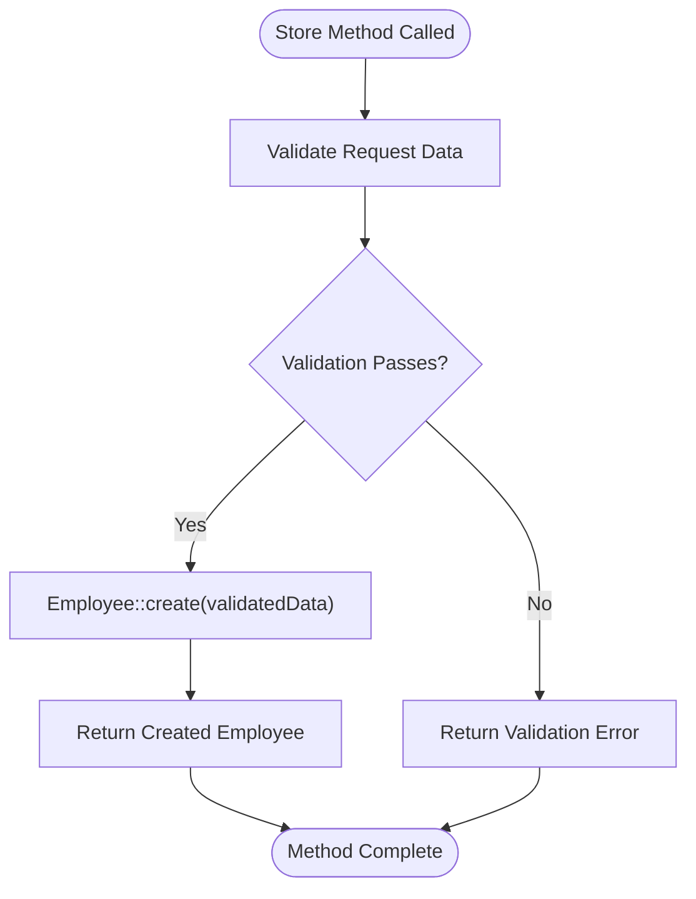
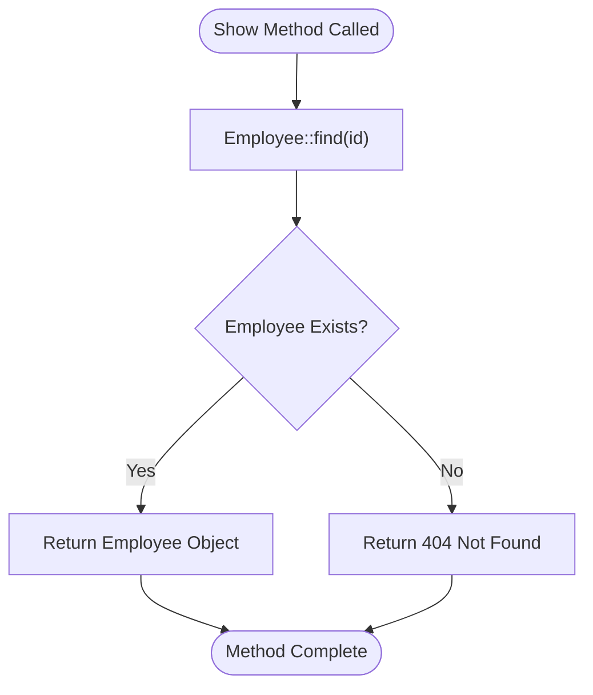
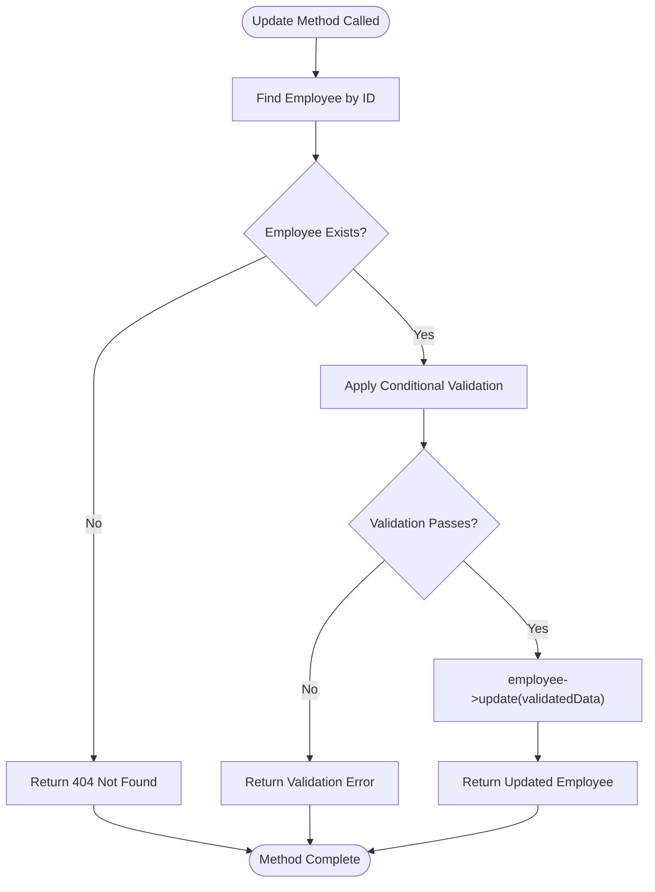
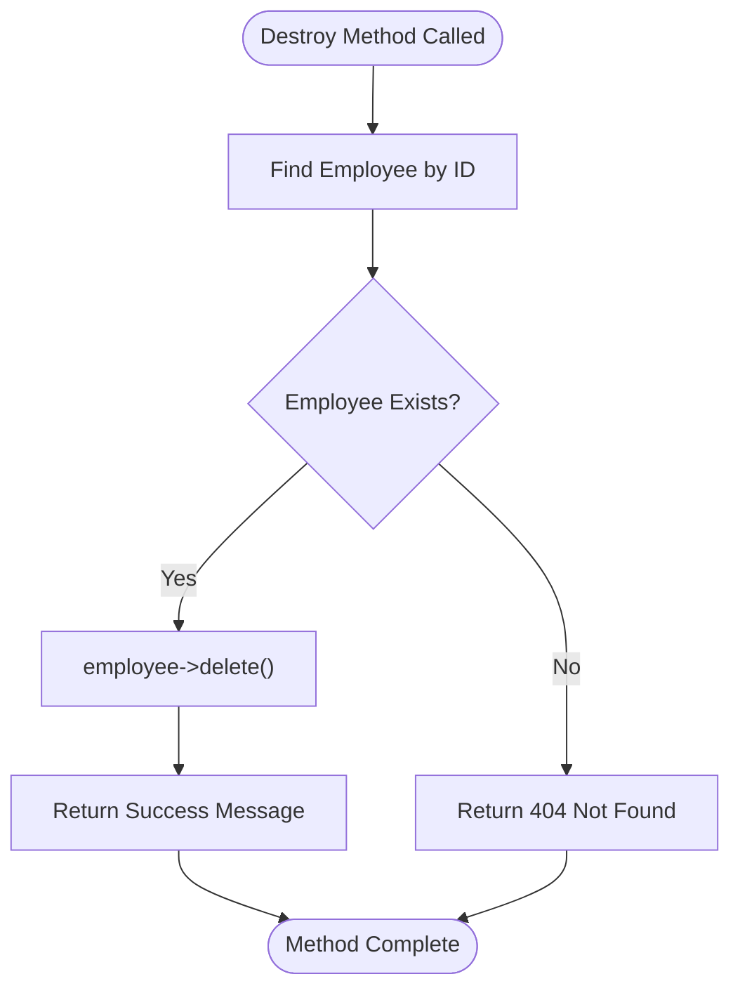
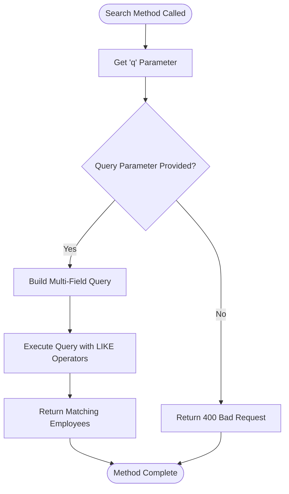
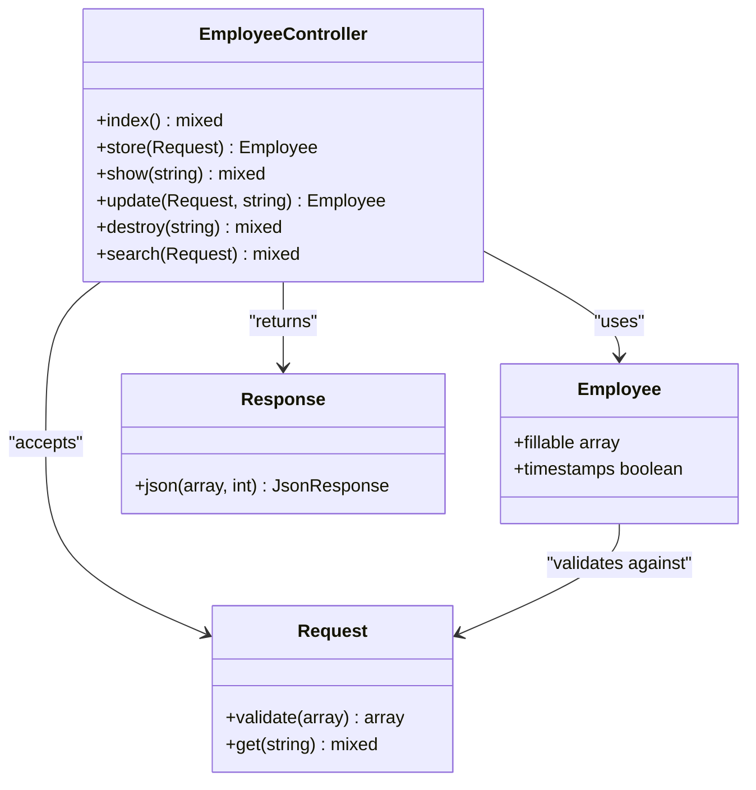

# CRUD Operations Implementation

<cite>
**Referenced Files in This Document**
- [EmployeeController.php](file://app/Http/Controllers/EmployeeController.php)
- [Employee.php](file://app/Models/Employee.php)
- [2026_04_11_134759_create_employees_table.php](file://database/migrations/2026_04_11_134759_create_employees_table.php)
- [api.php](file://routes/api.php)
- [Controller.php](file://app/Http/Controllers/Controller.php)
</cite>

## Table of Contents
1. [Introduction](#introduction)
2. [Project Structure](#project-structure)
3. [Core Components](#core-components)
4. [Architecture Overview](#architecture-overview)
5. [Detailed Component Analysis](#detailed-component-analysis)
6. [Dependency Analysis](#dependency-analysis)
7. [Performance Considerations](#performance-considerations)
8. [Troubleshooting Guide](#troubleshooting-guide)
9. [Conclusion](#conclusion)

## Introduction
This document provides comprehensive documentation for the CRUD operations implemented in the EmployeeController. The EmployeeController handles five primary operations: listing employees (index), creating new employees (store), retrieving individual employees (show), updating existing employees (update), and deleting employees (destroy). The implementation follows Laravel conventions and demonstrates practical approaches to database operations, validation processes, and response handling.

## Project Structure
The Employee Management API follows a standard Laravel application structure with clear separation of concerns:

**Diagram sources**
- [EmployeeController.php:1-95](file://app/Http/Controllers/EmployeeController.php#L1-L95)
- [Employee.php:1-18](file://app/Models/Employee.php#L1-L18)
- [2026_04_11_134759_create_employees_table.php:1-34](file://database/migrations/2026_04_11_134759_create_employees_table.php#L1-L34)

**Section sources**
- [EmployeeController.php:1-95](file://app/Http/Controllers/EmployeeController.php#L1-L95)
- [Employee.php:1-18](file://app/Models/Employee.php#L1-L18)
- [2026_04_11_134759_create_employees_table.php:1-34](file://database/migrations/2026_04_11_134759_create_employees_table.php#L1-L34)

## Core Components
The EmployeeController implements five essential CRUD operations with clear separation of concerns:

### Database Schema
The employees table is designed with the following structure:
- Primary identifier (auto-incrementing integer)
- Personal information fields (name, email, gender)
- Contact information (phone, address)
- Additional notes field
- Timestamps for creation and updates

**Section sources**
- [2026_04_11_134759_create_employees_table.php:14-23](file://database/migrations/2026_04_11_134759_create_employees_table.php#L14-L23)

## Architecture Overview
The EmployeeController follows a layered architecture pattern with clear separation between presentation, business logic, and data access layers:

**Diagram sources**
- [EmployeeController.php:13-77](file://app/Http/Controllers/EmployeeController.php#L13-L77)
- [Employee.php:9-16](file://app/Models/Employee.php#L9-L16)

## Detailed Component Analysis

### Index Method - Listing Employees
The index method provides a straightforward implementation for retrieving all employees from the database.

**Implementation Details:**
- Uses `Employee::all()` to fetch all records
- Returns complete employee collection
- No pagination implemented (returns all records)

**Processing Logic:**

**Diagram sources**
- [EmployeeController.php:13-16](file://app/Http/Controllers/EmployeeController.php#L13-L16)

**HTTP Response:** Returns 200 OK with complete employee collection

**Section sources**
- [EmployeeController.php:13-16](file://app/Http/Controllers/EmployeeController.php#L13-L16)

### Store Method - Creating New Employees
The store method handles employee creation with comprehensive validation and database persistence.

**Validation Process:**
- Validates required fields: name, email, gender, phone, address
- Email validation includes uniqueness constraint
- Gender restricted to predefined enum values
- Optional note field allows null values

**Database Operations:**
- Creates new employee record using validated data
- Returns created employee object

**Processing Logic:**

**Diagram sources**
- [EmployeeController.php:21-33](file://app/Http/Controllers/EmployeeController.php#L21-L33)

**HTTP Response:** Returns 200 OK with created employee object

**Section sources**
- [EmployeeController.php:21-33](file://app/Http/Controllers/EmployeeController.php#L21-L33)

### Show Method - Retrieving Individual Employees
The show method implements individual employee retrieval with proper error handling.

**Implementation Details:**
- Attempts to find employee by ID
- Returns 404 Not Found if employee doesn't exist
- Returns employee object if found

**Processing Logic:**

**Diagram sources**
- [EmployeeController.php:34-41](file://app/Http/Controllers/EmployeeController.php#L34-L41)

**HTTP Response:** Returns 200 OK with employee data or 404 Not Found

**Section sources**
- [EmployeeController.php:34-41](file://app/Http/Controllers/EmployeeController.php#L34-L41)

### Update Method - Modifying Existing Employees
The update method implements conditional validation for partial updates, distinguishing it from the store method.

**Key Differences from Store Method:**
- Uses `sometimes` validation rule for all fields
- Email validation excludes current employee from uniqueness check
- Maintains existing values when fields are not provided

**Conditional Validation Rules:**
- All fields marked as `sometimes` - validation only applies if field is present
- Email validation uses unique constraint with current employee exclusion
- Maintains backward compatibility with partial updates

**Processing Logic:**

**Diagram sources**
- [EmployeeController.php:46-64](file://app/Http/Controllers/EmployeeController.php#L46-L64)

**HTTP Response:** Returns 200 OK with updated employee data or 404 Not Found

**Section sources**
- [EmployeeController.php:46-64](file://app/Http/Controllers/EmployeeController.php#L46-L64)

### Destroy Method - Deleting Employees
The destroy method implements employee deletion with proper error handling and confirmation response.

**Implementation Details:**
- Attempts to find employee by ID
- Returns 404 Not Found if employee doesn't exist
- Deletes employee record if found
- Returns success message

**Processing Logic:**

**Diagram sources**
- [EmployeeController.php:69-77](file://app/Http/Controllers/EmployeeController.php#L69-L77)

**HTTP Response:** Returns 200 OK with success message or 404 Not Found

**Section sources**
- [EmployeeController.php:69-77](file://app/Http/Controllers/EmployeeController.php#L69-L77)

### Search Method - Advanced Querying
The search method provides flexible employee filtering across multiple fields.

**Implementation Details:**
- Requires query parameter 'q'
- Searches across name, email, and phone fields
- Uses LIKE operator for pattern matching
- Returns matching employee records

**Processing Logic:**

**Diagram sources**
- [EmployeeController.php:78-92](file://app/Http/Controllers/EmployeeController.php#L78-L92)

**HTTP Response:** Returns 200 OK with search results or 400 Bad Request

**Section sources**
- [EmployeeController.php:78-92](file://app/Http/Controllers/EmployeeController.php#L78-L92)

## Dependency Analysis
The EmployeeController has clear dependency relationships that demonstrate good separation of concerns:

**Diagram sources**
- [EmployeeController.php:8-95](file://app/Http/Controllers/EmployeeController.php#L8-L95)
- [Employee.php:7-17](file://app/Models/Employee.php#L7-L17)

**Section sources**
- [EmployeeController.php:5-6](file://app/Http/Controllers/EmployeeController.php#L5-L6)
- [Employee.php:5-16](file://app/Models/Employee.php#L5-L16)

## Performance Considerations
Several optimization opportunities exist in the current implementation:

### Current Performance Characteristics:
- **Index Method:** Returns all records without pagination, potentially causing memory issues with large datasets
- **Database Queries:** Each operation performs separate database calls
- **Response Handling:** Direct model returns without resource transformation

### Recommended Optimizations:
- Implement pagination for index method using `Employee::paginate(15)`
- Add database indexing on frequently queried fields (email, phone)
- Consider implementing caching for frequently accessed employee data
- Use eager loading for related data if relationships are established

## Troubleshooting Guide

### Common Issues and Solutions:

**1. Validation Errors:**
- **Issue:** Email uniqueness violations
- **Solution:** Ensure unique email addresses are used during creation/update

**2. Record Not Found Errors:**
- **Issue:** 404 responses when accessing non-existent employees
- **Solution:** Verify ID values and ensure employees exist before performing operations

**3. Database Connection Issues:**
- **Issue:** SQLite connection problems
- **Solution:** Verify database file permissions and migration completion

**4. Search Query Problems:**
- **Issue:** Empty search results
- **Solution:** Ensure query parameter 'q' is provided and contains valid search terms

**Section sources**
- [EmployeeController.php:37-39](file://app/Http/Controllers/EmployeeController.php#L37-L39)
- [EmployeeController.php:72-74](file://app/Http/Controllers/EmployeeController.php#L72-L74)
- [EmployeeController.php:82-84](file://app/Http/Controllers/EmployeeController.php#L82-L84)

## Conclusion
The EmployeeController provides a solid foundation for employee management operations with clear implementation patterns. The code demonstrates proper Laravel conventions while maintaining simplicity. Key strengths include comprehensive validation, proper error handling, and straightforward database operations. The implementation serves as an excellent starting point for building more sophisticated employee management systems with enhanced features like pagination, resource transformation, and advanced search capabilities.

Future enhancements should focus on implementing form request classes for validation, adopting API resources for consistent response formatting, implementing route model binding, and adding proper HTTP status codes for different scenarios.