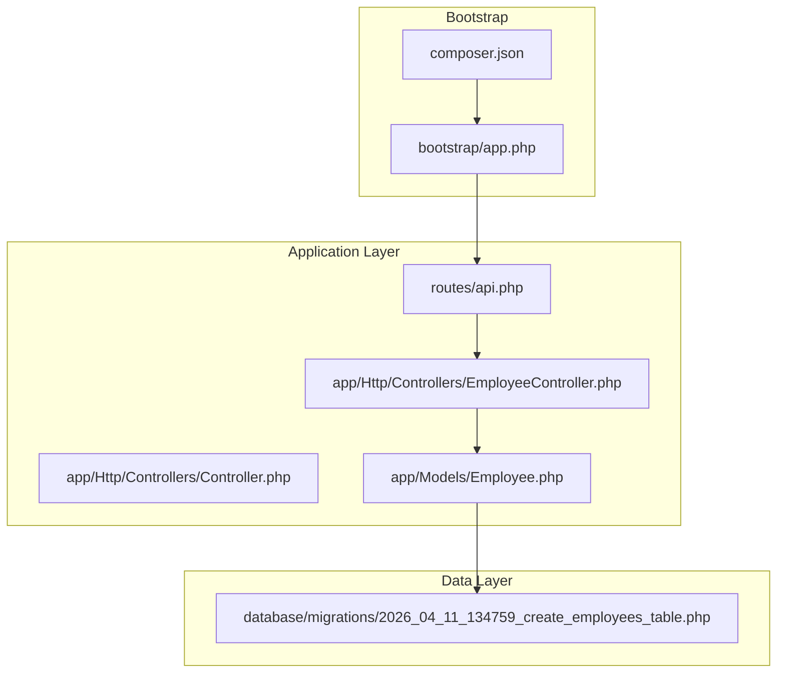
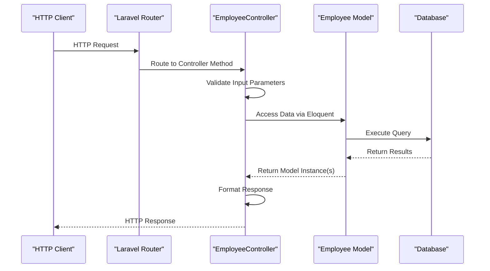
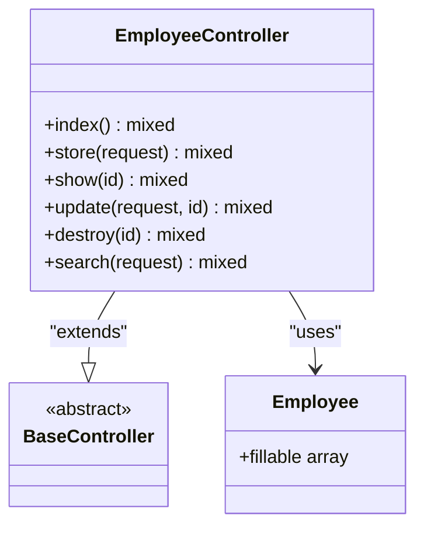
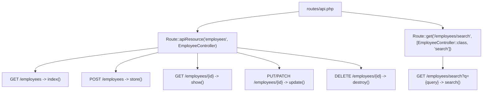
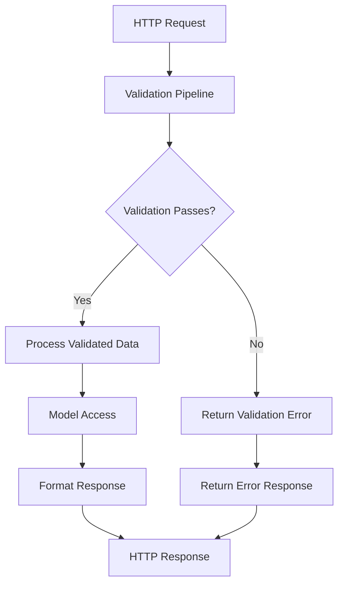
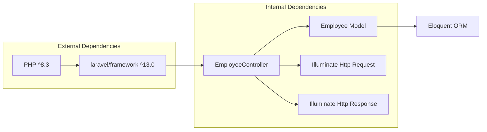

# Controller Overview & Architecture

<cite>
**Referenced Files in This Document**
- [Controller.php](file://app/Http/Controllers/Controller.php)
- [EmployeeController.php](file://app/Http/Controllers/EmployeeController.php)
- [Employee.php](file://app/Models/Employee.php)
- [api.php](file://routes/api.php)
- [2026_04_11_134759_create_employees_table.php](file://database/migrations/2026_04_11_134759_create_employees_table.php)
- [app.php](file://bootstrap/app.php)
- [composer.json](file://composer.json)
</cite>

## Table of Contents
1. [Introduction](#introduction)
2. [Project Structure](#project-structure)
3. [Core Components](#core-components)
4. [Architecture Overview](#architecture-overview)
5. [Detailed Component Analysis](#detailed-component-analysis)
6. [Dependency Analysis](#dependency-analysis)
7. [Performance Considerations](#performance-considerations)
8. [Troubleshooting Guide](#troubleshooting-guide)
9. [Conclusion](#conclusion)

## Introduction
This document provides comprehensive documentation for the EmployeeController architecture and overall design patterns within the Laravel application. It explains the controller's role in the Model-View-Controller (MVC) pattern, its inheritance from the base Controller class, and how it handles HTTP requests and responses. The documentation covers method structures, parameter handling, return value patterns, architectural decisions, design patterns used, and integration with Laravel's routing system. It also addresses error handling strategies at the controller level and response formatting conventions, while clarifying the separation of concerns between controllers, models, and views.

## Project Structure
The application follows Laravel's conventional structure with clear separation of concerns:
- Controllers: Handle HTTP requests and orchestrate responses
- Models: Represent business entities and data access
- Routes: Define URL-to-controller mappings
- Migrations: Define database schema for models
- Bootstrap: Configure application services and middleware

**Diagram sources**
- [api.php:1-8](file://routes/api.php#L1-L8)
- [Controller.php:1-9](file://app/Http/Controllers/Controller.php#L1-L9)
- [EmployeeController.php:1-95](file://app/Http/Controllers/EmployeeController.php#L1-L95)
- [Employee.php:1-18](file://app/Models/Employee.php#L1-L18)
- [2026_04_11_134759_create_employees_table.php:1-34](file://database/migrations/2026_04_11_134759_create_employees_table.php#L1-L34)
- [app.php:1-19](file://bootstrap/app.php#L1-L19)
- [composer.json:1-86](file://composer.json#L1-L86)

**Section sources**
- [api.php:1-8](file://routes/api.php#L1-L8)
- [composer.json:1-86](file://composer.json#L1-L86)

## Core Components
The EmployeeController implements a RESTful API for employee management with the following core methods:

### Base Controller Class
The base Controller class serves as an abstract foundation for all application controllers. While minimal in this project, it establishes a consistent inheritance pattern and provides a central extension point for shared controller functionality.

### EmployeeController Methods
The controller implements standard CRUD operations plus specialized search functionality:

- **index()**: Returns all employees
- **store(Request $request)**: Creates new employees with validation
- **show(string $id)**: Retrieves a specific employee by ID
- **update(Request $request, string $id)**: Updates existing employees with validation
- **destroy(string $id)**: Deletes employees by ID
- **search(Request $request)**: Performs flexible text-based searches across multiple fields

Each method follows Laravel conventions for parameter handling, validation, and response formatting.

**Section sources**
- [Controller.php:1-9](file://app/Http/Controllers/Controller.php#L1-L9)
- [EmployeeController.php:1-95](file://app/Http/Controllers/EmployeeController.php#L1-L95)

## Architecture Overview
The EmployeeController follows the MVC pattern with clear separation of concerns:

**Diagram sources**
- [EmployeeController.php:13-16](file://app/Http/Controllers/EmployeeController.php#L13-L16)
- [EmployeeController.php:21-32](file://app/Http/Controllers/EmployeeController.php#L21-L32)
- [EmployeeController.php:34-41](file://app/Http/Controllers/EmployeeController.php#L34-L41)
- [EmployeeController.php:46-63](file://app/Http/Controllers/EmployeeController.php#L46-L63)
- [EmployeeController.php:69-77](file://app/Http/Controllers/EmployeeController.php#L69-L77)
- [EmployeeController.php:78-92](file://app/Http/Controllers/EmployeeController.php#L78-L92)

The architecture demonstrates several key design patterns:
- **RESTful API Pattern**: Standard HTTP verbs mapped to CRUD operations
- **Repository Pattern**: Eloquent ORM abstracts database operations
- **Validation Pattern**: Built-in Laravel validation pipeline
- **Response Formatting Pattern**: Consistent JSON response structure

## Detailed Component Analysis

### Controller Class Hierarchy

**Diagram sources**
- [Controller.php:5-8](file://app/Http/Controllers/Controller.php#L5-L8)
- [EmployeeController.php:8-94](file://app/Http/Controllers/EmployeeController.php#L8-L94)
- [Employee.php:7-17](file://app/Models/Employee.php#L7-L17)

### Routing Integration
The controller integrates with Laravel's routing system through declarative route definitions:

**Diagram sources**
- [api.php:6-7](file://routes/api.php#L6-L7)

### Parameter Handling and Validation
The controller implements robust parameter handling through Laravel's Request object and validation system:

**Diagram sources**
- [EmployeeController.php:23-30](file://app/Http/Controllers/EmployeeController.php#L23-L30)
- [EmployeeController.php:52-60](file://app/Http/Controllers/EmployeeController.php#L52-L60)

### Response Formatting Conventions
The controller maintains consistent response formatting patterns:
- Successful operations return model instances or collections
- Error responses use JSON with appropriate HTTP status codes
- Search operations return filtered collections
- Deletion operations return confirmation messages

**Section sources**
- [EmployeeController.php:13-16](file://app/Http/Controllers/EmployeeController.php#L13-L16)
- [EmployeeController.php:21-32](file://app/Http/Controllers/EmployeeController.php#L21-L32)
- [EmployeeController.php:34-41](file://app/Http/Controllers/EmployeeController.php#L34-L41)
- [EmployeeController.php:46-63](file://app/Http/Controllers/EmployeeController.php#L46-L63)
- [EmployeeController.php:69-77](file://app/Http/Controllers/EmployeeController.php#L69-L77)
- [EmployeeController.php:78-92](file://app/Http/Controllers/EmployeeController.php#L78-L92)

## Dependency Analysis
The controller exhibits clean dependency relationships with clear separation of concerns:

**Diagram sources**
- [composer.json:8-11](file://composer.json#L8-L11)
- [EmployeeController.php:5-6](file://app/Http/Controllers/EmployeeController.php#L5-L6)

Key architectural decisions and their implications:
- **Minimal Base Controller**: Provides extensibility without imposing unnecessary complexity
- **Direct Model Access**: Uses Eloquent ORM for data persistence, simplifying CRUD operations
- **JSON Responses**: Consistent API response format for frontend consumption
- **Validation Integration**: Leverages Laravel's built-in validation system
- **RESTful Design**: Aligns with standard HTTP conventions for API development

**Section sources**
- [composer.json:1-86](file://composer.json#L1-L86)
- [EmployeeController.php:1-95](file://app/Http/Controllers/EmployeeController.php#L1-L95)

## Performance Considerations
The controller architecture incorporates several performance considerations:
- **Lazy Loading**: Eloquent models support lazy loading of relationships
- **Query Efficiency**: Direct model access avoids unnecessary abstraction layers
- **Validation Performance**: Built-in validation minimizes error-prone manual checks
- **Response Optimization**: JSON serialization handled efficiently by Laravel's response system

## Troubleshooting Guide
Common issues and their resolution strategies:

### Validation Errors
- **Issue**: Validation failures return 422 Unprocessable Entity
- **Resolution**: Check validation rules in controller methods and ensure request data matches expected formats

### Resource Not Found
- **Issue**: Operations on missing resources return 404 Not Found
- **Resolution**: Verify resource existence before operations and handle gracefully

### Database Constraints
- **Issue**: Unique constraint violations on email field
- **Resolution**: Ensure unique email validation and handle duplicate entries appropriately

**Section sources**
- [EmployeeController.php:37-40](file://app/Http/Controllers/EmployeeController.php#L37-L40)
- [EmployeeController.php:49-51](file://app/Http/Controllers/EmployeeController.php#L49-L51)
- [EmployeeController.php:72-74](file://app/Http/Controllers/EmployeeController.php#L72-L74)

## Conclusion
The EmployeeController demonstrates a well-architected implementation of Laravel's MVC pattern with clear separation of concerns. The controller inherits from a minimal base class, implements standard RESTful operations, and integrates seamlessly with Laravel's routing and validation systems. The design emphasizes simplicity, maintainability, and consistency through standardized response patterns and validation approaches. The architecture provides a solid foundation for API development while maintaining flexibility for future enhancements.