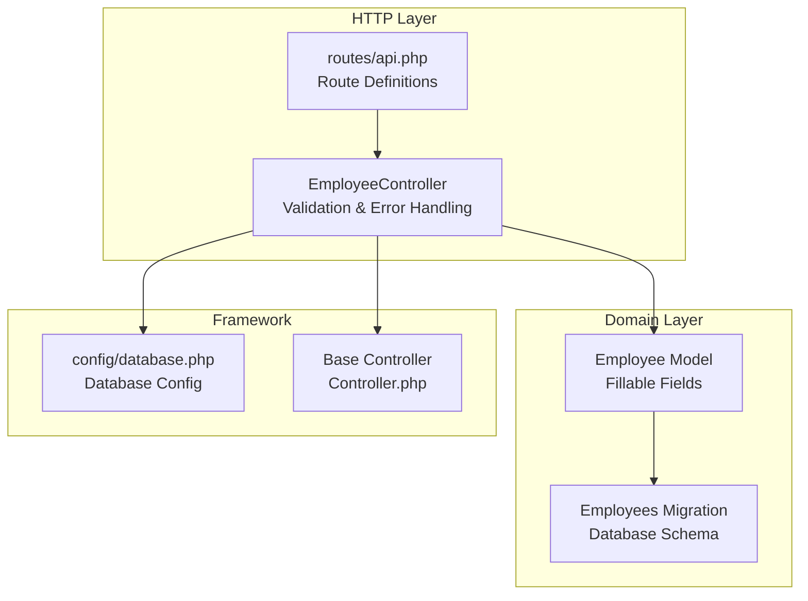
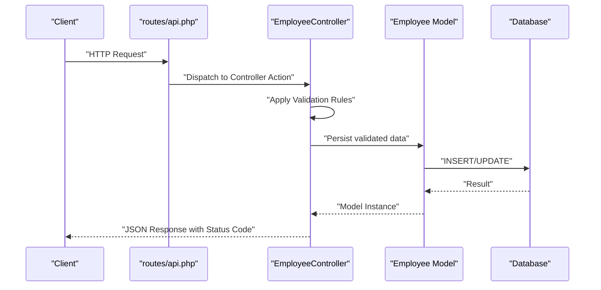
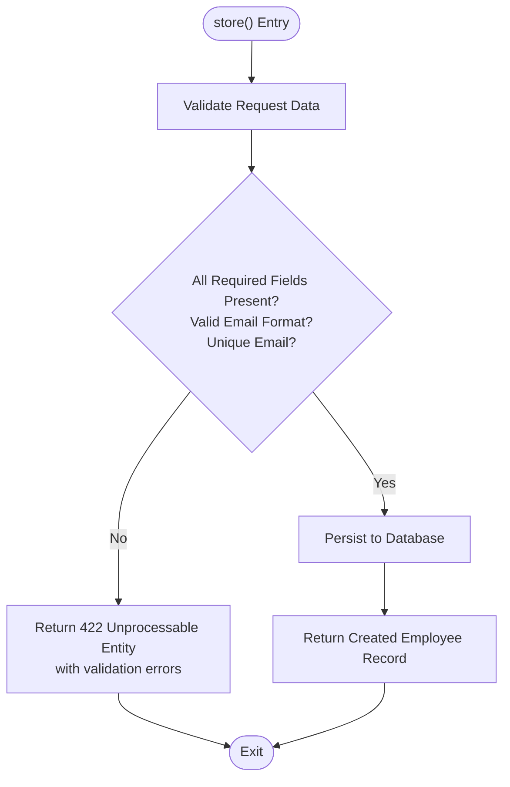
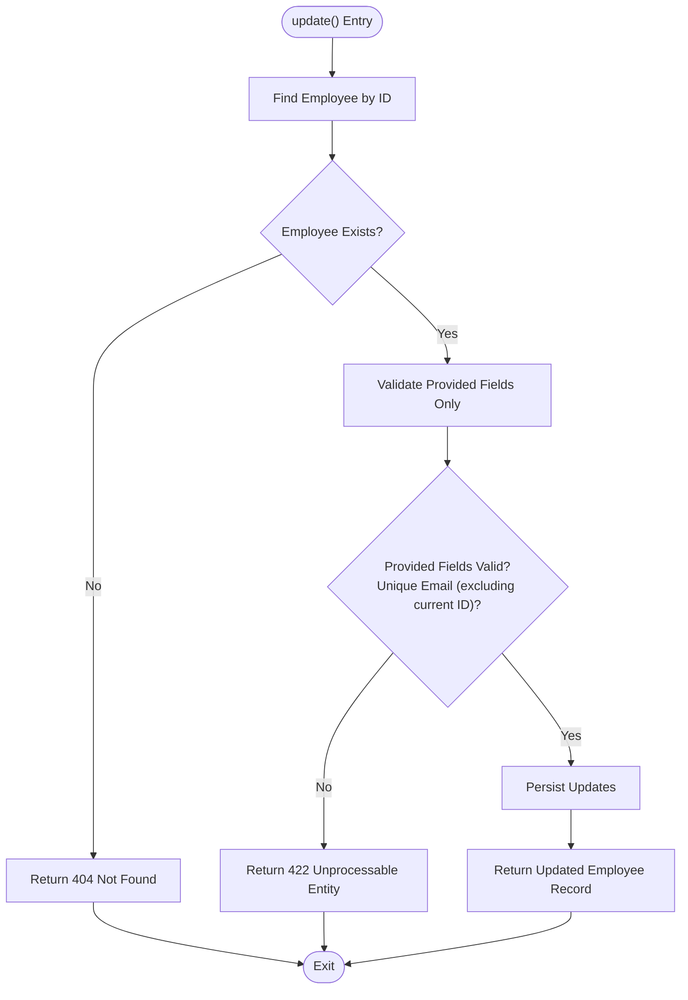
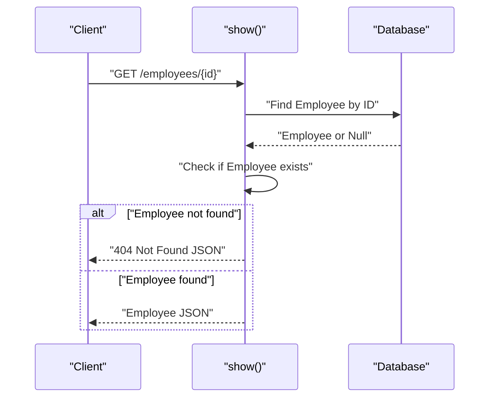
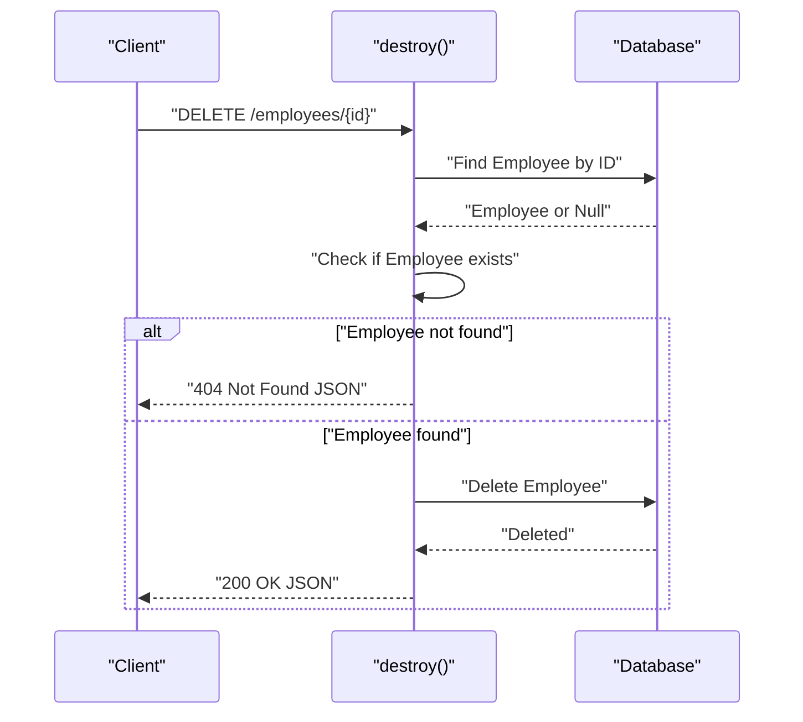
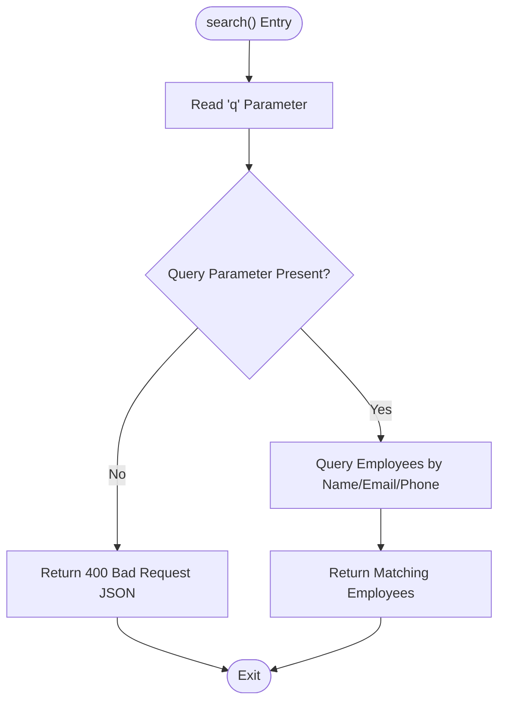
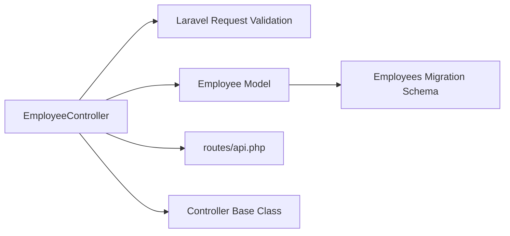

# Request Validation & Error Handling

<cite>
**Referenced Files in This Document**
- [EmployeeController.php](file://app/Http/Controllers/EmployeeController.php)
- [Employee.php](file://app/Models/Employee.php)
- [api.php](file://routes/api.php)
- [2026_04_11_134759_create_employees_table.php](file://database/migrations/2026_04_11_134759_create_employees_table.php)
- [Controller.php](file://app/Http/Controllers/Controller.php)
- [database.php](file://config/database.php)
</cite>

## Table of Contents
1. [Introduction](#introduction)
2. [Project Structure](#project-structure)
3. [Core Components](#core-components)
4. [Architecture Overview](#architecture-overview)
5. [Detailed Component Analysis](#detailed-component-analysis)
6. [Dependency Analysis](#dependency-analysis)
7. [Performance Considerations](#performance-considerations)
8. [Troubleshooting Guide](#troubleshooting-guide)
9. [Conclusion](#conclusion)

## Introduction
This document provides comprehensive documentation for the request validation and error handling mechanisms implemented in the EmployeeController. It explains the validation rules applied to each endpoint, the differences between strict validation during creation and conditional validation during updates, and the error handling strategies used for not found, validation, and malformed requests. It also covers edge cases, troubleshooting guidance, and recommended improvements for production readiness.

## Project Structure
The validation and error handling logic resides primarily in the EmployeeController, with supporting model and migration definitions. Routes are defined in the API routes file.

**Diagram sources**
- [EmployeeController.php:1-95](file://app/Http/Controllers/EmployeeController.php#L1-L95)
- [api.php:1-8](file://routes/api.php#L1-L8)
- [Employee.php:1-18](file://app/Models/Employee.php#L1-L18)
- [2026_04_11_134759_create_employees_table.php:1-34](file://database/migrations/2026_04_11_134759_create_employees_table.php#L1-L34)
- [database.php:1-185](file://config/database.php#L1-L185)
- [Controller.php:1-9](file://app/Http/Controllers/Controller.php#L1-L9)

**Section sources**
- [EmployeeController.php:1-95](file://app/Http/Controllers/EmployeeController.php#L1-L95)
- [api.php:1-8](file://routes/api.php#L1-L8)
- [Employee.php:1-18](file://app/Models/Employee.php#L1-L18)
- [2026_04_11_134759_create_employees_table.php:1-34](file://database/migrations/2026_04_11_134759_create_employees_table.php#L1-L34)
- [database.php:1-185](file://config/database.php#L1-L185)
- [Controller.php:1-9](file://app/Http/Controllers/Controller.php#L1-L9)

## Core Components
- EmployeeController: Implements validation rules for store and update operations, handles not found scenarios, and manages basic error responses for invalid requests.
- Employee Model: Defines fillable attributes that correspond to validated input.
- Employees Migration: Defines database schema including unique constraints and data types.
- Routes: Expose the EmployeeController actions via RESTful endpoints and a dedicated search endpoint.

Key responsibilities:
- Validation: Uses Laravel's request validation to enforce required fields, data types, formats, and uniqueness constraints.
- Error Handling: Returns appropriate HTTP status codes (404 for not found, 422 for validation errors, 400 for invalid requests) with structured JSON responses.
- Search: Validates presence of a query parameter and performs flexible text-based searches across multiple fields.

**Section sources**
- [EmployeeController.php:13-92](file://app/Http/Controllers/EmployeeController.php#L13-L92)
- [Employee.php:9-16](file://app/Models/Employee.php#L9-L16)
- [2026_04_11_134759_create_employees_table.php:14-23](file://database/migrations/2026_04_11_134759_create_employees_table.php#L14-L23)
- [api.php:6-7](file://routes/api.php#L6-L7)

## Architecture Overview
The validation and error handling flow follows a straightforward pipeline: incoming HTTP requests are processed by the EmployeeController, validated against predefined rules, persisted to the database, and returned with appropriate HTTP status codes and JSON bodies.

**Diagram sources**
- [EmployeeController.php:21-62](file://app/Http/Controllers/EmployeeController.php#L21-L62)
- [Employee.php:9-16](file://app/Models/Employee.php#L9-L16)
- [2026_04_11_134759_create_employees_table.php:14-23](file://database/migrations/2026_04_11_134759_create_employees_table.php#L14-L23)

## Detailed Component Analysis

### Validation Rules by Endpoint

#### Store Endpoint (Strict Validation)
- Purpose: Create a new employee record with strict validation.
- Validation rules applied:
  - name: required, string
  - email: required, string, email format, unique across employees
  - gender: required, must be one of male, female, other
  - phone: required, string
  - note: optional, string
  - address: required, string
- Behavior: All fields are mandatory. Uniqueness constraint on email is enforced at the database level via migration and leveraged by the validation rule.

**Diagram sources**
- [EmployeeController.php:21-33](file://app/Http/Controllers/EmployeeController.php#L21-L33)
- [2026_04_11_134759_create_employees_table.php:17](file://database/migrations/2026_04_11_134759_create_employees_table.php#L17)

**Section sources**
- [EmployeeController.php:21-33](file://app/Http/Controllers/EmployeeController.php#L21-L33)
- [2026_04_11_134759_create_employees_table.php:17](file://database/migrations/2026_04_11_134759_create_employees_table.php#L17)

#### Update Endpoint (Conditional Validation)
- Purpose: Update an existing employee record with conditional validation.
- Validation rules applied:
  - name: optional, but if present, required and must be a string
  - email: optional, but if present, required, must be a valid email, and must be unique excluding the current employee's ID
  - gender: optional, but if present, required and must be one of male, female, other
  - phone: optional, but if present, required and must be a string
  - note: optional, string if provided
  - address: optional, but if present, required and must be a string
- Behavior: Fields are optional unless provided; when provided, they must satisfy their respective constraints. The uniqueness rule for email excludes the current record's ID.

**Diagram sources**
- [EmployeeController.php:46-64](file://app/Http/Controllers/EmployeeController.php#L46-L64)

**Section sources**
- [EmployeeController.php:46-64](file://app/Http/Controllers/EmployeeController.php#L46-L64)

#### Show Endpoint (Not Found Handling)
- Purpose: Retrieve a single employee by ID.
- Error Handling:
  - If the employee is not found, returns a 404 Not Found with a JSON message.
- Notes: The current implementation performs a manual lookup and null check. Route model binding could simplify this.

**Diagram sources**
- [EmployeeController.php:34-41](file://app/Http/Controllers/EmployeeController.php#L34-L41)

**Section sources**
- [EmployeeController.php:34-41](file://app/Http/Controllers/EmployeeController.php#L34-L41)

#### Destroy Endpoint (Not Found Handling)
- Purpose: Delete an employee by ID.
- Error Handling:
  - If the employee is not found, returns a 404 Not Found with a JSON message.
  - On successful deletion, returns a 200 OK with a success message.

**Diagram sources**
- [EmployeeController.php:69-77](file://app/Http/Controllers/EmployeeController.php#L69-L77)

**Section sources**
- [EmployeeController.php:69-77](file://app/Http/Controllers/EmployeeController.php#L69-L77)

#### Search Endpoint (Invalid Request Handling)
- Purpose: Search employees by a query parameter across name, email, and phone.
- Validation:
  - Requires a non-empty query parameter q.
  - Returns 400 Bad Request if the query is missing.
- Behavior: Performs a case-insensitive partial match search across specified fields.

**Diagram sources**
- [EmployeeController.php:78-92](file://app/Http/Controllers/EmployeeController.php#L78-L92)

**Section sources**
- [EmployeeController.php:78-92](file://app/Http/Controllers/EmployeeController.php#L78-L92)

### Data Types and Constraints
- Database schema defines:
  - Unique constraint on email.
  - Enum for gender with allowed values: male, female, other.
  - String/text fields for name, email, phone, address, and optional note.
- Model fillable attributes align with validation rules, ensuring only permitted fields are mass-assigned.

**Section sources**
- [2026_04_11_134759_create_employees_table.php:14-23](file://database/migrations/2026_04_11_134759_create_employees_table.php#L14-L23)
- [Employee.php:9-16](file://app/Models/Employee.php#L9-L16)

### Differences Between Strict and Conditional Validation
- Strict validation (store):
  - All fields are required.
  - Enforces uniqueness on email globally.
- Conditional validation (update):
  - Only provided fields are validated.
  - Uniqueness on email excludes the current employee's ID to avoid false positives.

**Section sources**
- [EmployeeController.php:23-30](file://app/Http/Controllers/EmployeeController.php#L23-L30)
- [EmployeeController.php:52-60](file://app/Http/Controllers/EmployeeController.php#L52-L60)

### Error Handling Strategies
- 404 Not Found: Returned when an employee is not found in show, update, and destroy operations.
- 422 Unprocessable Entity: Returned when validation fails in store and update operations.
- 400 Bad Request: Returned when the search endpoint receives a missing query parameter.
- Response Format: JSON messages for error responses; raw model instances for successful operations.

**Section sources**
- [EmployeeController.php:37-40](file://app/Http/Controllers/EmployeeController.php#L37-L40)
- [EmployeeController.php:49-51](file://app/Http/Controllers/EmployeeController.php#L49-L51)
- [EmployeeController.php:72-76](file://app/Http/Controllers/EmployeeController.php#L72-L76)
- [EmployeeController.php:82-84](file://app/Http/Controllers/EmployeeController.php#L82-L84)

## Dependency Analysis
The EmployeeController depends on:
- Laravel's Request validation service for enforcing rules.
- The Employee model for persistence.
- The database schema for enforcing uniqueness and data types.
- Route definitions for exposing endpoints.

**Diagram sources**
- [EmployeeController.php:1-95](file://app/Http/Controllers/EmployeeController.php#L1-L95)
- [Employee.php:1-18](file://app/Models/Employee.php#L1-L18)
- [2026_04_11_134759_create_employees_table.php:1-34](file://database/migrations/2026_04_11_134759_create_employees_table.php#L1-L34)
- [api.php:1-8](file://routes/api.php#L1-L8)
- [Controller.php:1-9](file://app/Http/Controllers/Controller.php#L1-L9)

**Section sources**
- [EmployeeController.php:1-95](file://app/Http/Controllers/EmployeeController.php#L1-L95)
- [Employee.php:1-18](file://app/Models/Employee.php#L1-L18)
- [2026_04_11_134759_create_employees_table.php:1-34](file://database/migrations/2026_04_11_134759_create_employees_table.php#L1-L34)
- [api.php:1-8](file://routes/api.php#L1-L8)
- [Controller.php:1-9](file://app/Http/Controllers/Controller.php#L1-L9)

## Performance Considerations
- Validation overhead: Validation occurs per request; keep rules minimal and targeted.
- Database constraints: The unique email constraint reduces duplicate entries at the database level.
- Search performance: The search endpoint uses multiple OR LIKE conditions; consider indexing and pagination for large datasets.
- Response size: Returning raw model instances can be heavy; consider implementing API resources for consistent envelopes and controlled field exposure.

## Troubleshooting Guide
Common validation issues and resolutions:
- Missing required fields:
  - Symptom: 422 Unprocessable Entity with validation errors.
  - Resolution: Ensure all required fields (name, email, gender, phone, address for store; provided fields for update) are included.
- Invalid email format:
  - Symptom: 422 Unprocessable Entity for email validation failure.
  - Resolution: Provide a properly formatted email address.
- Duplicate email:
  - Symptom: 422 Unprocessable Entity indicating email uniqueness violation.
  - Resolution: Use a unique email address; for updates, ensure the email is unique excluding the current record's ID.
- Not found scenarios:
  - Symptom: 404 Not Found when retrieving, updating, or deleting a non-existent employee.
  - Resolution: Verify the employee ID exists before performing operations.
- Missing search query:
  - Symptom: 400 Bad Request when calling the search endpoint without a query parameter.
  - Resolution: Provide a non-empty q parameter.

Edge cases:
- Partial updates: Only include fields you intend to change; optional fields are validated only when provided.
- Gender enum mismatch: Ensure gender is one of male, female, other; otherwise validation fails.
- Phone number format: While not explicitly validated for format, ensure it is a string as required.

**Section sources**
- [EmployeeController.php:23-30](file://app/Http/Controllers/EmployeeController.php#L23-L30)
- [EmployeeController.php:52-60](file://app/Http/Controllers/EmployeeController.php#L52-L60)
- [EmployeeController.php:37-40](file://app/Http/Controllers/EmployeeController.php#L37-L40)
- [EmployeeController.php:49-51](file://app/Http/Controllers/EmployeeController.php#L49-L51)
- [EmployeeController.php:82-84](file://app/Http/Controllers/EmployeeController.php#L82-L84)

## Conclusion
The EmployeeController implements straightforward yet effective validation and error handling mechanisms. Strict validation ensures data integrity during creation, while conditional validation supports flexible updates. Error responses are appropriately categorized with 404, 422, and 400 status codes. For production environments, consider adopting form requests for cleaner separation of concerns, route model binding for simplified ID resolution, and API resources for consistent response formatting.