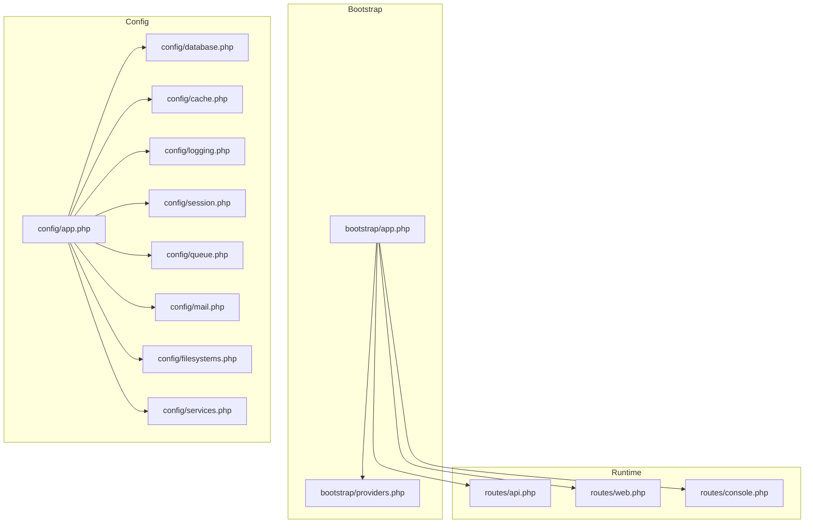
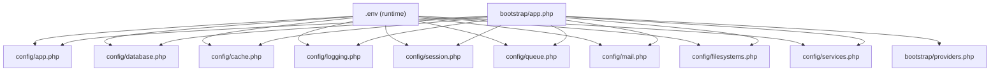
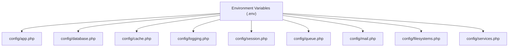

# Configuration & Environment

<cite>
**Referenced Files in This Document**
- [config/app.php](file://config/app.php)
- [config/database.php](file://config/database.php)
- [config/cache.php](file://config/cache.php)
- [config/logging.php](file://config/logging.php)
- [config/session.php](file://config/session.php)
- [config/queue.php](file://config/queue.php)
- [config/mail.php](file://config/mail.php)
- [config/filesystems.php](file://config/filesystems.php)
- [config/services.php](file://config/services.php)
- [bootstrap/app.php](file://bootstrap/app.php)
- [bootstrap/providers.php](file://bootstrap/providers.php)
- [composer.json](file://composer.json)
- [routes/api.php](file://routes/api.php)
- [routes/web.php](file://routes/web.php)
- [routes/console.php](file://routes/console.php)
- [app/Http/Controllers/EmployeeController.php](file://app/Http/Controllers/EmployeeController.php)
- [app/Models/Employee.php](file://app/Models/Employee.php)
- [database/migrations/2026_04_11_134759_create_employees_table.php](file://database/migrations/2026_04_11_134759_create_employees_table.php)
</cite>

## Table of Contents
1. [Introduction](#introduction)
2. [Project Structure](#project-structure)
3. [Core Components](#core-components)
4. [Architecture Overview](#architecture-overview)
5. [Detailed Component Analysis](#detailed-component-analysis)
6. [Dependency Analysis](#dependency-analysis)
7. [Performance Considerations](#performance-considerations)
8. [Troubleshooting Guide](#troubleshooting-guide)
9. [Conclusion](#conclusion)
10. [Appendices](#appendices)

## Introduction
This document provides comprehensive configuration and environment documentation for the employees API application. It explains how application settings, database connections, cache, logging, sessions, queues, mailers, and filesystems are configured. It also covers environment variable management, development versus production differences, security considerations for sensitive data, deployment-specific settings, configuration best practices, and common troubleshooting steps.

## Project Structure
The configuration system centers around the config directory, with environment variables supplied via .env files and runtime configuration via bootstrap/app.php. Routes and providers are registered in bootstrap/app.php and bootstrap/providers.php respectively. Composer scripts orchestrate setup and development tasks.

**Diagram sources**
- [bootstrap/app.php:1-19](file://bootstrap/app.php#L1-L19)
- [bootstrap/providers.php:1-8](file://bootstrap/providers.php#L1-L8)
- [config/app.php:1-127](file://config/app.php#L1-L127)
- [config/database.php:1-185](file://config/database.php#L1-L185)
- [config/cache.php:1-131](file://config/cache.php#L1-L131)
- [config/logging.php:1-133](file://config/logging.php#L1-L133)
- [config/session.php:1-234](file://config/session.php#L1-L234)
- [config/queue.php:1-130](file://config/queue.php#L1-L130)
- [config/mail.php:1-119](file://config/mail.php#L1-L119)
- [config/filesystems.php:1-81](file://config/filesystems.php#L1-L81)
- [config/services.php:1-39](file://config/services.php#L1-L39)
- [routes/api.php](file://routes/api.php)
- [routes/web.php](file://routes/web.php)
- [routes/console.php](file://routes/console.php)

**Section sources**
- [bootstrap/app.php:1-19](file://bootstrap/app.php#L1-L19)
- [bootstrap/providers.php:1-8](file://bootstrap/providers.php#L1-L8)
- [composer.json:1-86](file://composer.json#L1-L86)

## Core Components
This section documents the primary configuration areas and their roles.

- Application settings (config/app.php)
  - Controls application name, environment, debug mode, URL, timezone, locales, encryption key, and maintenance mode driver/store.
  - Security-sensitive values include cipher and key; maintenance driver/store selection affects centralized maintenance handling.

- Database connections (config/database.php)
  - Defines default connection and supports sqlite, mysql, mariadb, pgsql, sqlsrv.
  - Includes migration repository table configuration and Redis client options with clustering, prefixing, persistence, and retry/backoff settings.

- Cache configuration (config/cache.php)
  - Sets default cache store and supports array, database, file, memcached, redis, dynamodb, octane, failover, and null.
  - Provides cache key prefixing and serializable classes policy for safety against gadget chain attacks.

- Logging setup (config/logging.php)
  - Defines default log channel, deprecation logging channel and tracing, and multiple channels including stack, single, daily, slack, papertrail, stderr, syslog, errorlog, null, and emergency.
  - Supports environment-driven log level and retention policies.

- Session configuration (config/session.php)
  - Selects default driver (file, cookie, database, memcached, redis, dynamodb, array), lifetime, encryption, file location, database connection/table, cache store, cookie attributes (path, domain, secure, http_only, same_site, partitioned), and serialization strategy.

- Queue configuration (config/queue.php)
  - Sets default connection and supports sync, database, beanstalkd, sqs, redis, deferred, background, failover, null.
  - Includes job batching configuration and failed job storage driver/connection/table.

- Mail configuration (config/mail.php)
  - Sets default mailer and supports smtp, sendmail, mailgun, ses, ses-v2, postmark, resend, log, array, failover, roundrobin.
  - Defines global From address/name and transport-specific settings.

- Filesystems (config/filesystems.php)
  - Defines default disk (local, ftp, sftp, s3) and symbolic links for public storage.

- Third-party services (config/services.php)
  - Centralized credentials for Postmark, Resend, SES, and Slack notifications.

**Section sources**
- [config/app.php:1-127](file://config/app.php#L1-L127)
- [config/database.php:1-185](file://config/database.php#L1-L185)
- [config/cache.php:1-131](file://config/cache.php#L1-L131)
- [config/logging.php:1-133](file://config/logging.php#L1-L133)
- [config/session.php:1-234](file://config/session.php#L1-L234)
- [config/queue.php:1-130](file://config/queue.php#L1-L130)
- [config/mail.php:1-119](file://config/mail.php#L1-L119)
- [config/filesystems.php:1-81](file://config/filesystems.php#L1-L81)
- [config/services.php:1-39](file://config/services.php#L1-L39)

## Architecture Overview
The configuration architecture ties together environment variables, configuration files, and runtime registration. The bootstrap process wires routing, middleware, and exception handling, while config files define services and their behavior.

**Diagram sources**
- [bootstrap/app.php:1-19](file://bootstrap/app.php#L1-L19)
- [bootstrap/providers.php:1-8](file://bootstrap/providers.php#L1-L8)
- [config/app.php:1-127](file://config/app.php#L1-L127)
- [config/database.php:1-185](file://config/database.php#L1-L185)
- [config/cache.php:1-131](file://config/cache.php#L1-L131)
- [config/logging.php:1-133](file://config/logging.php#L1-L133)
- [config/session.php:1-234](file://config/session.php#L1-L234)
- [config/queue.php:1-130](file://config/queue.php#L1-L130)
- [config/mail.php:1-119](file://config/mail.php#L1-L119)
- [config/filesystems.php:1-81](file://config/filesystems.php#L1-L81)
- [config/services.php:1-39](file://config/services.php#L1-L39)

## Detailed Component Analysis

### Application Settings (config/app.php)
- Purpose: Centralizes application-wide settings including environment, debug mode, URL, timezone, locales, encryption key, and maintenance mode.
- Key environment variables:
  - APP_NAME, APP_ENV, APP_DEBUG, APP_URL, APP_LOCALE, APP_FALLBACK_LOCALE, APP_FAKER_LOCALE, APP_KEY, APP_PREVIOUS_KEYS, APP_MAINTENANCE_DRIVER, APP_MAINTENANCE_STORE.
- Security considerations:
  - APP_KEY must be a 32-character random string; maintain previous keys for seamless rotation.
  - APP_DEBUG should be false in production to avoid leaking sensitive error details.
- Maintenance mode:
  - Driver can be file or cache; store selection influences distributed maintenance coordination.

**Section sources**
- [config/app.php:1-127](file://config/app.php#L1-L127)

### Database Configuration (config/database.php)
- Purpose: Defines default connection, per-driver settings, migration table, and Redis options.
- Supported drivers: sqlite, mysql, mariadb, pgsql, sqlsrv.
- Environment variables:
  - DB_CONNECTION, DB_URL, DB_HOST, DB_PORT, DB_DATABASE, DB_USERNAME, DB_PASSWORD, DB_SOCKET, DB_CHARSET, DB_COLLATION, DB_SSLMODE, MYSQL_ATTR_SSL_CA, DB_CACHE_CONNECTION, DB_CACHE_TABLE, DB_CACHE_LOCK_CONNECTION, DB_CACHE_LOCK_TABLE, DB_QUEUE_CONNECTION, DB_QUEUE_TABLE, DB_QUEUE, DB_QUEUE_RETRY_AFTER, REDIS_* family, DB_ENCRYPT (commented), DB_TRUST_SERVER_CERTIFICATE (commented).
- Redis options:
  - Client, cluster, prefix, persistent, max retries, backoff algorithm/base/cap.
- Notes:
  - SQLite defaults to a local database file; foreign key constraints can be toggled.
  - SSL/TLS options for MySQL/MariaDB via PDO attributes.

**Section sources**
- [config/database.php:1-185](file://config/database.php#L1-L185)

### Cache Configuration (config/cache.php)
- Purpose: Selects and configures cache stores and sets cache key prefixing and serialization policy.
- Stores: array, database, file, memcached, redis, dynamodb, octane, failover, null.
- Environment variables:
  - CACHE_STORE, DB_CACHE_CONNECTION, DB_CACHE_TABLE, DB_CACHE_LOCK_CONNECTION, DB_CACHE_LOCK_TABLE, MEMCACHED_* family, REDIS_CACHE_CONNECTION, REDIS_CACHE_LOCK_CONNECTION, AWS_* family, DYNAMODB_* family, CACHE_PREFIX.
- Security:
  - serializable_classes is disabled to prevent gadget chain attacks if APP_KEY is compromised.

**Section sources**
- [config/cache.php:1-131](file://config/cache.php#L1-L131)

### Logging Setup (config/logging.php)
- Purpose: Defines default channel, deprecation logging, and multiple channels for different outputs.
- Channels: stack, single, daily, slack, papertrail, stderr, syslog, errorlog, null, emergency.
- Environment variables:
  - LOG_CHANNEL, LOG_DEPRECATIONS_CHANNEL, LOG_DEPRECATIONS_TRACE, LOG_LEVEL, LOG_STACK, LOG_DAILY_DAYS, LOG_SLACK_WEBHOOK_URL, LOG_SLACK_USERNAME, LOG_SLACK_EMOJI, LOG_PAPERTRAIL_HANDLER, PAPERTRAIL_URL, PAPERTRAIL_PORT, LOG_STDERR_FORMATTER, LOG_SYSLOG_FACILITY.
- Best practices:
  - Use daily rotation with appropriate retention.
  - Route critical alerts to Slack or Papertrail in production.

**Section sources**
- [config/logging.php:1-133](file://config/logging.php#L1-L133)

### Session Configuration (config/session.php)
- Purpose: Manages session lifecycle, storage, encryption, cookie attributes, and serialization.
- Drivers: file, cookie, database, memcached, redis, dynamodb, array.
- Environment variables:
  - SESSION_DRIVER, SESSION_LIFETIME, SESSION_EXPIRE_ON_CLOSE, SESSION_ENCRYPT, SESSION_CONNECTION, SESSION_TABLE, SESSION_STORE, SESSION_COOKIE, SESSION_PATH, SESSION_DOMAIN, SESSION_SECURE_COOKIE, SESSION_HTTP_ONLY, SESSION_SAME_SITE, SESSION_PARTITIONED_COOKIE.
- Security:
  - Enable SESSION_SECURE_COOKIE and appropriate SESSION_SAME_SITE for HTTPS deployments.
  - Use database or redis-backed sessions for multi-node deployments.

**Section sources**
- [config/session.php:1-234](file://config/session.php#L1-L234)

### Queue Configuration (config/queue.php)
- Purpose: Configures default queue backend and per-driver settings, job batching, and failed job storage.
- Connections: sync, database, beanstalkd, sqs, redis, deferred, background, failover, null.
- Environment variables:
  - QUEUE_CONNECTION, DB_QUEUE_CONNECTION, DB_QUEUE_TABLE, DB_QUEUE, DB_QUEUE_RETRY_AFTER, BEANSTALKD_QUEUE_HOST, SQS_* family, REDIS_QUEUE_CONNECTION, REDIS_QUEUE, REDIS_QUEUE_RETRY_AFTER, QUEUE_FAILED_DRIVER, DB_CONNECTION, DB_TABLES.
- Best practices:
  - Use database or redis for production scalability.
  - Configure failed job storage and appropriate retry windows.

**Section sources**
- [config/queue.php:1-130](file://config/queue.php#L1-L130)

### Mail Configuration (config/mail.php)
- Purpose: Defines default mailer and transport-specific settings, and global sender identity.
- Mailers: smtp, sendmail, mailgun, ses, ses-v2, postmark, resend, log, array, failover, roundrobin.
- Environment variables:
  - MAIL_MAILER, MAIL_URL, MAIL_SCHEME, MAIL_HOST, MAIL_PORT, MAIL_USERNAME, MAIL_PASSWORD, MAIL_EHLO_DOMAIN, MAIL_SENDMAIL_PATH, MAIL_LOG_CHANNEL, MAIL_FROM_ADDRESS, MAIL_FROM_NAME.
- Recommendations:
  - Use log mailer during development; switch to SMTP or cloud providers in production.
  - Set MAIL_FROM_ADDRESS and MAIL_FROM_NAME consistently.

**Section sources**
- [config/mail.php:1-119](file://config/mail.php#L1-L119)

### Filesystems (config/filesystems.php)
- Purpose: Configures default disk and available disks (local, ftp, sftp, s3).
- Environment variables:
  - FILESYSTEM_DISK, AWS_ACCESS_KEY_ID, AWS_SECRET_ACCESS_KEY, AWS_DEFAULT_REGION, AWS_BUCKET, AWS_URL, AWS_ENDPOINT, AWS_USE_PATH_STYLE_ENDPOINT.
- Public storage:
  - Symbolic link from public/storage to storage/app/public is managed by the framework.

**Section sources**
- [config/filesystems.php:1-81](file://config/filesystems.php#L1-L81)

### Third-Party Services (config/services.php)
- Purpose: Centralizes credentials for Postmark, Resend, SES, and Slack notifications.
- Environment variables:
  - POSTMARK_API_KEY, RESEND_API_KEY, AWS_ACCESS_KEY_ID, AWS_SECRET_ACCESS_KEY, AWS_DEFAULT_REGION, SLACK_BOT_USER_OAUTH_TOKEN, SLACK_BOT_USER_DEFAULT_CHANNEL.

**Section sources**
- [config/services.php:1-39](file://config/services.php#L1-L39)

### Bootstrap and Routing Registration
- bootstrap/app.php registers routing for web, API, console, and health checks, and creates the Application instance.
- bootstrap/providers.php lists application service providers.

**Section sources**
- [bootstrap/app.php:1-19](file://bootstrap/app.php#L1-L19)
- [bootstrap/providers.php:1-8](file://bootstrap/providers.php#L1-L8)

## Dependency Analysis
Configuration dependencies illustrate how environment variables feed into configuration arrays and how services depend on each other.

**Diagram sources**
- [config/app.php:1-127](file://config/app.php#L1-L127)
- [config/database.php:1-185](file://config/database.php#L1-L185)
- [config/cache.php:1-131](file://config/cache.php#L1-L131)
- [config/logging.php:1-133](file://config/logging.php#L1-L133)
- [config/session.php:1-234](file://config/session.php#L1-L234)
- [config/queue.php:1-130](file://config/queue.php#L1-L130)
- [config/mail.php:1-119](file://config/mail.php#L1-L119)
- [config/filesystems.php:1-81](file://config/filesystems.php#L1-L81)
- [config/services.php:1-39](file://config/services.php#L1-L39)

**Section sources**
- [config/app.php:1-127](file://config/app.php#L1-L127)
- [config/database.php:1-185](file://config/database.php#L1-L185)
- [config/cache.php:1-131](file://config/cache.php#L1-L131)
- [config/logging.php:1-133](file://config/logging.php#L1-L133)
- [config/session.php:1-234](file://config/session.php#L1-L234)
- [config/queue.php:1-130](file://config/queue.php#L1-L130)
- [config/mail.php:1-119](file://config/mail.php#L1-L119)
- [config/filesystems.php:1-81](file://config/filesystems.php#L1-L81)
- [config/services.php:1-39](file://config/services.php#L1-L39)

## Performance Considerations
- Cache store selection:
  - Prefer redis or database cache for production to reduce memory overhead and enable distributed caching.
  - Use failover cache store to improve resilience.
- Database:
  - Use mysql/mariadb or pgsql in production; configure connection pooling and SSL/TLS appropriately.
  - Enable foreign key constraints for data integrity where applicable.
- Sessions:
  - Use database or redis-backed sessions for horizontal scaling.
  - Tune session lifetime and cookie attributes for optimal UX and security.
- Queues:
  - Use database or redis for reliable job processing; configure retry and backoff policies.
  - Separate queues for different job priorities.
- Logging:
  - Use daily rotation and appropriate retention; offload to external systems (Papertrail, Slack) for critical alerts.
- Mail:
  - Use SMTP or cloud providers for deliverability; avoid heavy synchronous transports in production.

[No sources needed since this section provides general guidance]

## Troubleshooting Guide
Common configuration issues and resolutions:

- Application key missing or invalid
  - Symptom: Application fails to boot or encrypt/decrypt operations fail.
  - Resolution: Generate and set APP_KEY to a 32-character random string; rotate APP_PREVIOUS_KEYS safely.

- Database connectivity errors
  - Symptom: SQLSTATE connection failures or driver-specific errors.
  - Resolution: Verify DB_CONNECTION, DB_HOST, DB_PORT, DB_DATABASE, DB_USERNAME, DB_PASSWORD; confirm driver availability and SSL/TLS settings.

- Cache store misconfiguration
  - Symptom: Cache misses or errors when using redis/database stores.
  - Resolution: Confirm CACHE_STORE and related connection/table variables; ensure redis is reachable and credentials are correct.

- Logging channel not producing output
  - Symptom: No logs in expected channel.
  - Resolution: Set LOG_CHANNEL and LOG_LEVEL; verify stack composition via LOG_STACK; check file permissions for daily/single logs.

- Session not persisting across requests
  - Symptom: Users appear logged out unexpectedly.
  - Resolution: Use database or redis sessions; ensure SESSION_SECURE_COOKIE and SESSION_SAME_SITE align with deployment; verify session cookie domain/path.

- Queue jobs not processed
  - Symptom: Jobs remain pending.
  - Resolution: Set QUEUE_CONNECTION and ensure worker is running; verify database or redis connectivity; check failed job storage configuration.

- Mail not delivered
  - Symptom: Emails not sent.
  - Resolution: Set MAIL_MAILER and transport-specific variables; use log mailer during development; configure SMTP/cloud provider credentials.

- Filesystem storage issues
  - Symptom: Cannot access public storage or upload files.
  - Resolution: Confirm FILESYSTEM_DISK and S3 credentials; run storage symlink if using public disk.

**Section sources**
- [config/app.php:1-127](file://config/app.php#L1-L127)
- [config/database.php:1-185](file://config/database.php#L1-L185)
- [config/cache.php:1-131](file://config/cache.php#L1-L131)
- [config/logging.php:1-133](file://config/logging.php#L1-L133)
- [config/session.php:1-234](file://config/session.php#L1-L234)
- [config/queue.php:1-130](file://config/queue.php#L1-L130)
- [config/mail.php:1-119](file://config/mail.php#L1-L119)
- [config/filesystems.php:1-81](file://config/filesystems.php#L1-L81)

## Conclusion
The employees API leverages a robust configuration system centered on environment variables and modular config files. Correctly setting environment variables, selecting appropriate drivers for production, and applying security hardening measures are essential for reliable operation. Use the provided troubleshooting steps to diagnose and resolve common issues across development and production environments.

[No sources needed since this section summarizes without analyzing specific files]

## Appendices

### Environment Variables Reference
- Application
  - APP_NAME, APP_ENV, APP_DEBUG, APP_URL, APP_LOCALE, APP_FALLBACK_LOCALE, APP_FAKER_LOCALE, APP_KEY, APP_PREVIOUS_KEYS, APP_MAINTENANCE_DRIVER, APP_MAINTENANCE_STORE.
- Database
  - DB_CONNECTION, DB_URL, DB_HOST, DB_PORT, DB_DATABASE, DB_USERNAME, DB_PASSWORD, DB_SOCKET, DB_CHARSET, DB_COLLATION, DB_SSLMODE, MYSQL_ATTR_SSL_CA, DB_CACHE_CONNECTION, DB_CACHE_TABLE, DB_CACHE_LOCK_CONNECTION, DB_CACHE_LOCK_TABLE, DB_QUEUE_CONNECTION, DB_QUEUE_TABLE, DB_QUEUE, DB_QUEUE_RETRY_AFTER.
- Cache
  - CACHE_STORE, DB_CACHE_CONNECTION, DB_CACHE_TABLE, DB_CACHE_LOCK_CONNECTION, DB_CACHE_LOCK_TABLE, MEMCACHED_* family, REDIS_CACHE_CONNECTION, REDIS_CACHE_LOCK_CONNECTION, AWS_* family, DYNAMODB_* family, CACHE_PREFIX.
- Logging
  - LOG_CHANNEL, LOG_DEPRECATIONS_CHANNEL, LOG_DEPRECATIONS_TRACE, LOG_LEVEL, LOG_STACK, LOG_DAILY_DAYS, LOG_SLACK_WEBHOOK_URL, LOG_SLACK_USERNAME, LOG_SLACK_EMOJI, LOG_PAPERTRAIL_HANDLER, PAPERTRAIL_URL, PAPERTRAIL_PORT, LOG_STDERR_FORMATTER, LOG_SYSLOG_FACILITY.
- Sessions
  - SESSION_DRIVER, SESSION_LIFETIME, SESSION_EXPIRE_ON_CLOSE, SESSION_ENCRYPT, SESSION_CONNECTION, SESSION_TABLE, SESSION_STORE, SESSION_COOKIE, SESSION_PATH, SESSION_DOMAIN, SESSION_SECURE_COOKIE, SESSION_HTTP_ONLY, SESSION_SAME_SITE, SESSION_PARTITIONED_COOKIE.
- Queues
  - QUEUE_CONNECTION, DB_QUEUE_CONNECTION, DB_QUEUE_TABLE, DB_QUEUE, DB_QUEUE_RETRY_AFTER, BEANSTALKD_QUEUE_HOST, SQS_* family, REDIS_QUEUE_CONNECTION, REDIS_QUEUE, REDIS_QUEUE_RETRY_AFTER, QUEUE_FAILED_DRIVER, DB_CONNECTION, DB_TABLES.
- Mail
  - MAIL_MAILER, MAIL_URL, MAIL_SCHEME, MAIL_HOST, MAIL_PORT, MAIL_USERNAME, MAIL_PASSWORD, MAIL_EHLO_DOMAIN, MAIL_SENDMAIL_PATH, MAIL_LOG_CHANNEL, MAIL_FROM_ADDRESS, MAIL_FROM_NAME.
- Filesystems
  - FILESYSTEM_DISK, AWS_ACCESS_KEY_ID, AWS_SECRET_ACCESS_KEY, AWS_DEFAULT_REGION, AWS_BUCKET, AWS_URL, AWS_ENDPOINT, AWS_USE_PATH_STYLE_ENDPOINT.
- Services
  - POSTMARK_API_KEY, RESEND_API_KEY, AWS_ACCESS_KEY_ID, AWS_SECRET_ACCESS_KEY, AWS_DEFAULT_REGION, SLACK_BOT_USER_OAUTH_TOKEN, SLACK_BOT_USER_DEFAULT_CHANNEL.

**Section sources**
- [config/app.php:1-127](file://config/app.php#L1-L127)
- [config/database.php:1-185](file://config/database.php#L1-L185)
- [config/cache.php:1-131](file://config/cache.php#L1-L131)
- [config/logging.php:1-133](file://config/logging.php#L1-L133)
- [config/session.php:1-234](file://config/session.php#L1-L234)
- [config/queue.php:1-130](file://config/queue.php#L1-L130)
- [config/mail.php:1-119](file://config/mail.php#L1-L119)
- [config/filesystems.php:1-81](file://config/filesystems.php#L1-L81)
- [config/services.php:1-39](file://config/services.php#L1-L39)

### Development vs Production Checklist
- Development
  - APP_ENV=development, APP_DEBUG=true, LOG_LEVEL=debug, LOG_CHANNEL=single.
  - Use sqlite for DB_CONNECTION, file cache, log mailer, local filesystem.
  - Run php artisan serve and queue workers locally.
- Production
  - APP_ENV=production, APP_DEBUG=false, LOG_LEVEL=info or higher.
  - Use mysql/mariadb/pgsql/sqlsrv for DB_CONNECTION, redis or database cache, SMTP/cloud mailer, S3 filesystem.
  - Configure HTTPS, secure cookies, and proper session handling.

**Section sources**
- [config/app.php:1-127](file://config/app.php#L1-L127)
- [config/database.php:1-185](file://config/database.php#L1-L185)
- [config/cache.php:1-131](file://config/cache.php#L1-L131)
- [config/logging.php:1-133](file://config/logging.php#L1-L133)
- [config/session.php:1-234](file://config/session.php#L1-L234)
- [config/queue.php:1-130](file://config/queue.php#L1-L130)
- [config/mail.php:1-119](file://config/mail.php#L1-L119)
- [config/filesystems.php:1-81](file://config/filesystems.php#L1-L81)

### Configuration Caching Strategies
- Artisan commands for cache management:
  - Clear configuration cache before testing new settings.
  - Use configuration cache in production to speed up boot time after freezing settings.
- Best practices:
  - Keep environment variables distinct per environment.
  - Avoid committing secrets to version control; use .env.example for reference.
  - Rotate APP_KEY and APP_PREVIOUS_KEYS during deployments with careful coordination.

**Section sources**
- [composer.json:1-86](file://composer.json#L1-L86)