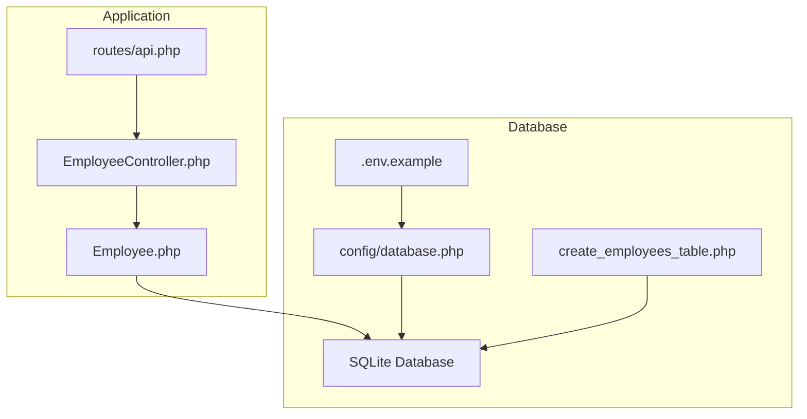
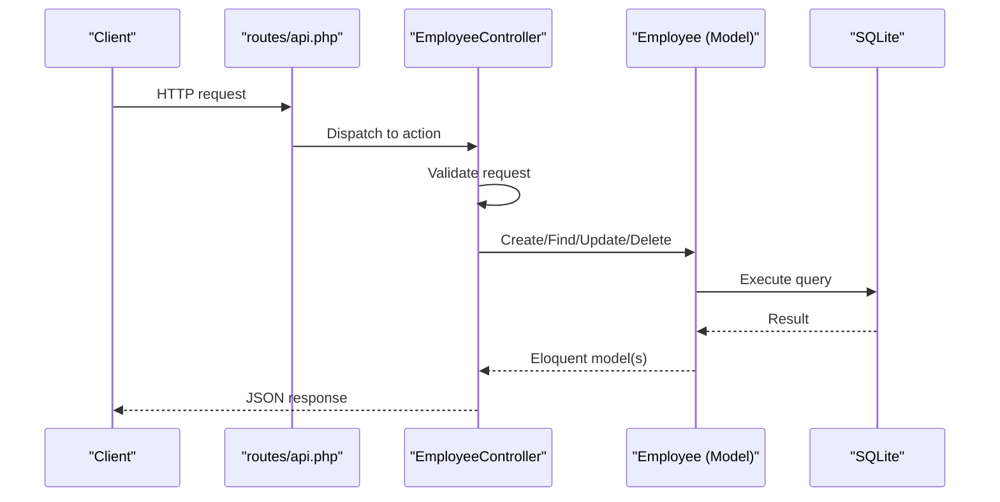
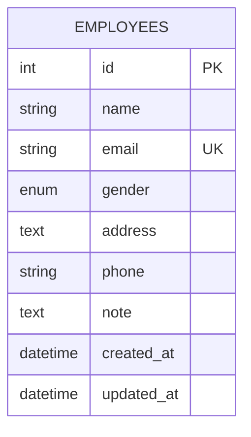
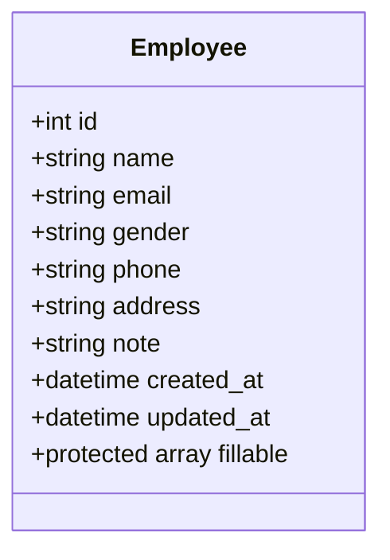
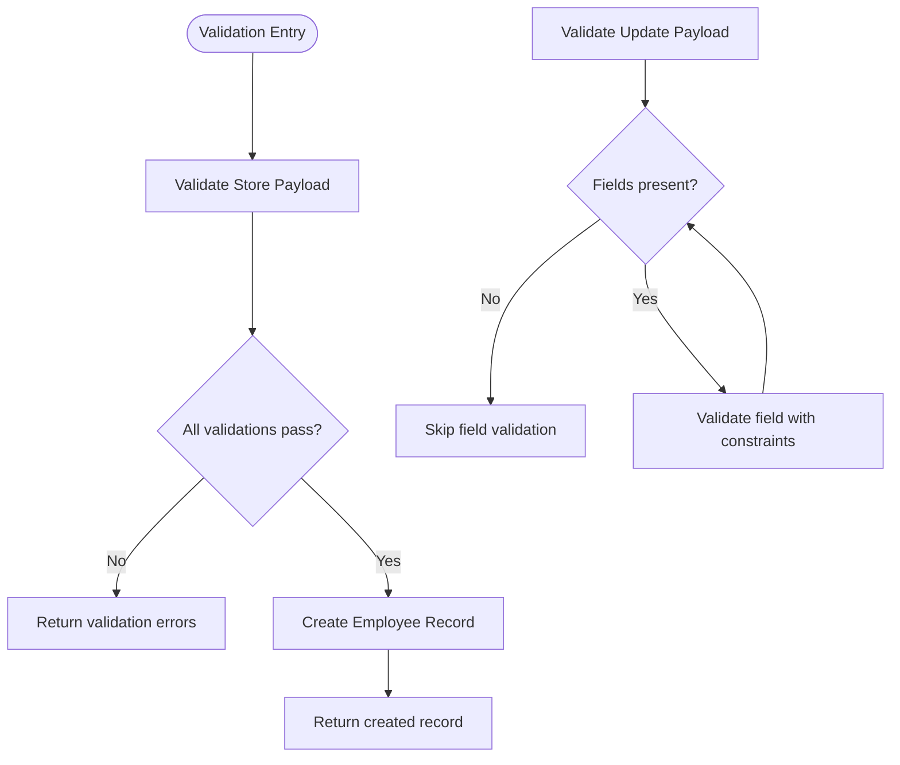
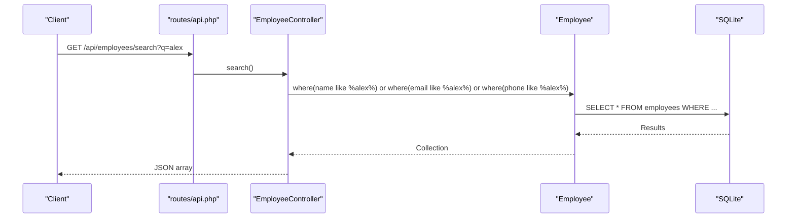
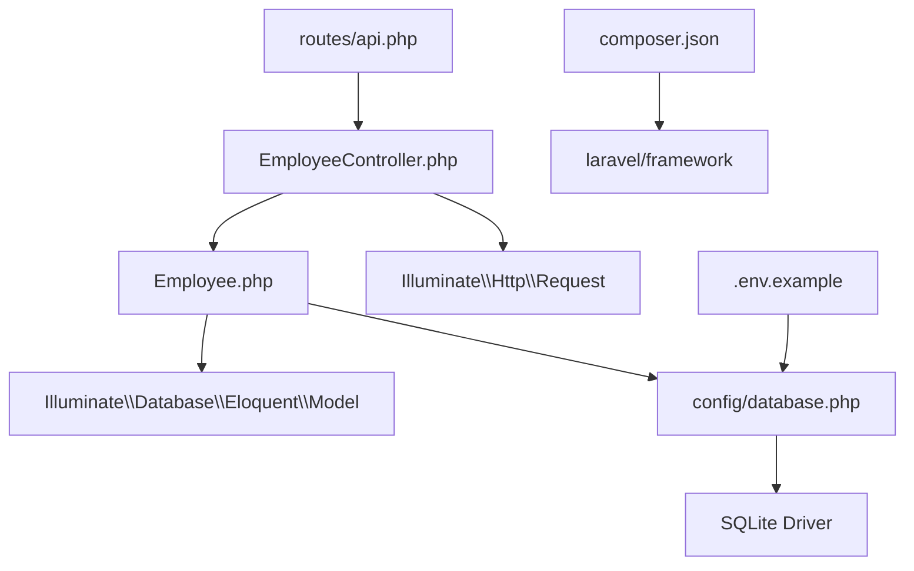

# Data Models & Database Schema

<cite>
**Referenced Files in This Document**
- [Employee.php](file://app/Models/Employee.php)
- [EmployeeController.php](file://app/Http/Controllers/EmployeeController.php)
- [create_employees_table.php](file://database/migrations/2026_04_11_134759_create_employees_table.php)
- [api.php](file://routes/api.php)
- [database.php](file://config/database.php)
- [.env.example](file://.env.example)
- [composer.json](file://composer.json)
- [BACKEND_ROADMAP.md](file://BACKEND_ROADMAP.md)
</cite>

## Table of Contents
1. [Introduction](#introduction)
2. [Project Structure](#project-structure)
3. [Core Components](#core-components)
4. [Architecture Overview](#architecture-overview)
5. [Detailed Component Analysis](#detailed-component-analysis)
6. [Dependency Analysis](#dependency-analysis)
7. [Performance Considerations](#performance-considerations)
8. [Troubleshooting Guide](#troubleshooting-guide)
9. [Conclusion](#conclusion)
10. [Appendices](#appendices)

## Introduction
This document provides comprehensive data model documentation for the Employee entity and its database schema. It covers the Eloquent model definition, database migration, validation rules, relationships, constraints, and operational patterns. It also includes diagrams, sample data examples, and guidance for performance optimization and data lifecycle management.

## Project Structure
The Employee data model and schema are organized around Laravel conventions:
- Eloquent model: app/Models/Employee.php
- Database migration: database/migrations/2026_04_11_134759_create_employees_table.php
- HTTP controller: app/Http/Controllers/EmployeeController.php
- API routes: routes/api.php
- Database configuration: config/database.php
- Environment configuration: .env.example
- Composer dependencies: composer.json

**Diagram sources**
- [api.php:1-8](file://routes/api.php#L1-L8)
- [EmployeeController.php:1-95](file://app/Http/Controllers/EmployeeController.php#L1-L95)
- [Employee.php:1-18](file://app/Models/Employee.php#L1-L18)
- [database.php:1-185](file://config/database.php#L1-L185)
- [.env.example:1-66](file://.env.example#L1-L66)
- [create_employees_table.php:1-34](file://database/migrations/2026_04_11_134759_create_employees_table.php#L1-L34)

**Section sources**
- [api.php:1-8](file://routes/api.php#L1-L8)
- [EmployeeController.php:1-95](file://app/Http/Controllers/EmployeeController.php#L1-L95)
- [Employee.php:1-18](file://app/Models/Employee.php#L1-L18)
- [database.php:1-185](file://config/database.php#L1-L185)
- [.env.example:1-66](file://.env.example#L1-L66)
- [create_employees_table.php:1-34](file://database/migrations/2026_04_11_134759_create_employees_table.php#L1-L34)

## Core Components
This section documents the Employee entity structure, validation rules, and model configuration.

- Entity fields and types
  - id: integer (auto-incrementing primary key)
  - name: string
  - email: string (unique)
  - gender: enum with values male, female, other
  - phone: string
  - address: text
  - note: text (nullable)
  - timestamps: created_at, updated_at

- Validation rules (controller-level)
  - name: required, string
  - email: required, string, email, unique to employees
  - gender: required, in:male,female,other
  - phone: required, string
  - note: nullable, string
  - address: required, string

- Mass assignment protection
  - $fillable lists permitted attributes for bulk assignment

- Attribute casting
  - Current model does not define $casts; recommended to add salary decimal casting when adding numeric field

- Business logic constraints
  - Unique email constraint enforced at database level
  - Enum gender constraint enforced at database level
  - Nullable note field allows empty notes

**Section sources**
- [create_employees_table.php:14-22](file://database/migrations/2026_04_11_134759_create_employees_table.php#L14-L22)
- [EmployeeController.php:23-30](file://app/Http/Controllers/EmployeeController.php#L23-L30)
- [Employee.php:9-16](file://app/Models/Employee.php#L9-L16)

## Architecture Overview
The Employee data flow follows a standard Laravel pattern: routes trigger controller actions, which validate requests, interact with the Eloquent model, and return responses.

**Diagram sources**
- [api.php:6-7](file://routes/api.php#L6-L7)
- [EmployeeController.php:13-31](file://app/Http/Controllers/EmployeeController.php#L13-L31)
- [Employee.php:1-18](file://app/Models/Employee.php#L1-L18)
- [database.php:35-45](file://config/database.php#L35-L45)

## Detailed Component Analysis

### Database Schema Design
The employees table is defined in a single migration with explicit constraints and indexes.

- Primary key
  - id: auto-incrementing integer primary key

- Unique constraints
  - email: unique index enforced at database level

- Enum constraints
  - gender: enum with values male, female, other

- Nullable fields
  - note: nullable text

- Timestamps
  - created_at, updated_at: automatic timestamp management

- Indexes
  - Primary key index on id
  - Unique index on email
  - Implicit indexes on timestamps

**Diagram sources**
- [create_employees_table.php:14-22](file://database/migrations/2026_04_11_134759_create_employees_table.php#L14-L22)

**Section sources**
- [create_employees_table.php:14-22](file://database/migrations/2026_04_11_134759_create_employees_table.php#L14-L22)

### Eloquent Model Configuration
The Employee model defines mass assignment protection and inherits standard Eloquent behavior.

- Fillable attributes
  - name, email, gender, phone, note, address

- Relationships
  - No explicit relationships defined in current model

- Casting
  - No $casts defined; recommended to add when introducing numeric fields

**Diagram sources**
- [Employee.php:7-17](file://app/Models/Employee.php#L7-L17)

**Section sources**
- [Employee.php:7-17](file://app/Models/Employee.php#L7-L17)

### Data Validation Rules
Validation is performed in the controller using Laravel's request validation. Rules ensure data integrity and enforce business constraints.

- Store operation
  - name: required, string
  - email: required, string, email, unique:employees
  - gender: required, in:male,female,other
  - phone: required, string
  - note: nullable, string
  - address: required, string

- Update operation
  - Applies "sometimes" modifier to make fields conditionally required
  - Email uniqueness excludes current employee id to prevent false positives

**Diagram sources**
- [EmployeeController.php:23-30](file://app/Http/Controllers/EmployeeController.php#L23-L30)
- [EmployeeController.php:52-62](file://app/Http/Controllers/EmployeeController.php#L52-L62)

**Section sources**
- [EmployeeController.php:23-30](file://app/Http/Controllers/EmployeeController.php#L23-L30)
- [EmployeeController.php:52-62](file://app/Http/Controllers/EmployeeController.php#L52-L62)

### API Endpoints and Data Access Patterns
The routes expose standard CRUD operations plus a custom search endpoint.

- Standard CRUD
  - GET /api/employees (index)
  - POST /api/employees (store)
  - GET /api/employees/{id} (show)
  - PUT/PATCH /api/employees/{id} (update)
  - DELETE /api/employees/{id} (destroy)

- Custom search
  - GET /api/employees/search?q={query}

- Data access patterns
  - Controller methods handle validation, persistence, and response formatting
  - Search uses OR conditions across name, email, and phone fields

**Diagram sources**
- [api.php:6-7](file://routes/api.php#L6-L7)
- [EmployeeController.php:78-92](file://app/Http/Controllers/EmployeeController.php#L78-L92)

**Section sources**
- [api.php:6-7](file://routes/api.php#L6-L7)
- [EmployeeController.php:78-92](file://app/Http/Controllers/EmployeeController.php#L78-L92)

### Sample Data Examples
Below are representative rows illustrating the schema and constraints.

- Minimal employee record
  - Fields: id, name, email, gender, phone, address, timestamps
  - Note: null

- Employee with optional note
  - Fields: id, name, email, gender, phone, address, note, timestamps

Constraints to observe:
- email must be unique
- gender must be one of male, female, other
- name, phone, address are required
- note is optional

**Section sources**
- [create_employees_table.php:14-22](file://database/migrations/2026_04_11_134759_create_employees_table.php#L14-L22)

## Dependency Analysis
This section maps dependencies between components and highlights external integrations.

**Diagram sources**
- [EmployeeController.php:5-6](file://app/Http/Controllers/EmployeeController.php#L5-L6)
- [Employee.php:5](file://app/Models/Employee.php#L5)
- [database.php:20](file://config/database.php#L20)
- [api.php:4](file://routes/api.php#L4)
- [.env.example:23](file://.env.example#L23)
- [composer.json:10](file://composer.json#L10)

**Section sources**
- [EmployeeController.php:5-6](file://app/Http/Controllers/EmployeeController.php#L5-L6)
- [Employee.php:5](file://app/Models/Employee.php#L5)
- [database.php:20](file://config/database.php#L20)
- [api.php:4](file://routes/api.php#L4)
- [.env.example:23](file://.env.example#L23)
- [composer.json:10](file://composer.json#L10)

## Performance Considerations
- Indexing strategy
  - Primary key index on id (implicit)
  - Unique index on email (implicit)
  - Consider adding indexes on frequently filtered fields (e.g., phone, gender) if query patterns expand

- Query patterns
  - Current search uses OR conditions across multiple fields; consider limiting search scope or adding dedicated indexes
  - Avoid loading all records with Employee::all(); use pagination for large datasets

- Data types
  - String fields for identifiers (e.g., phone) may benefit from normalization or separate numeric fields for precise operations

- Caching
  - Consider caching frequently accessed employee lists or search results

[No sources needed since this section provides general guidance]

## Troubleshooting Guide
Common issues and resolutions:

- Unique constraint violations
  - Symptom: Validation fails on email uniqueness
  - Resolution: Ensure email is unique; adjust uniqueness rule to exclude current record during updates

- Missing numeric attribute
  - Symptom: Professor requirement for numeric field
  - Resolution: Add salary decimal field via migration and update model with $casts

- Inconsistent response formats
  - Symptom: Mixed response styles across endpoints
  - Resolution: Implement API resources for consistent envelopes

- Manual find + null checks
  - Symptom: Repeated find() and manual 404 handling
  - Resolution: Use route model binding to leverage automatic 404 behavior

- No HTTP status codes
  - Symptom: Create operations return 200 instead of 201
  - Resolution: Set appropriate status codes in responses

**Section sources**
- [EmployeeController.php:48-50](file://app/Http/Controllers/EmployeeController.php#L48-L50)
- [EmployeeController.php:69-76](file://app/Http/Controllers/EmployeeController.php#L69-L76)
- [BACKEND_ROADMAP.md:43-52](file://BACKEND_ROADMAP.md#L43-L52)
- [BACKEND_ROADMAP.md:96-113](file://BACKEND_ROADMAP.md#L96-L113)
- [BACKEND_ROADMAP.md:135-141](file://BACKEND_ROADMAP.md#L135-L141)

## Conclusion
The Employee model and schema provide a solid foundation for managing employee records with strong constraints on identity and gender fields, and a unique email requirement. Validation rules ensure data integrity at the API boundary. For production readiness, consider adding a numeric field (e.g., salary) with proper casting, implementing API resources for consistent responses, adopting route model binding, and establishing pagination and targeted indexing strategies.

[No sources needed since this section summarizes without analyzing specific files]

## Appendices

### Appendix A: Migration Details
- Migration file: database/migrations/2026_04_11_134759_create_employees_table.php
- Creates table employees with id, name, email, gender, address, phone, note, timestamps
- Enforces unique index on email and enum constraint on gender

**Section sources**
- [create_employees_table.php:12-23](file://database/migrations/2026_04_11_134759_create_employees_table.php#L12-L23)

### Appendix B: Environment Configuration
- Default database connection: sqlite
- Database file location: database/database.sqlite
- Foreign key constraints enabled by default

**Section sources**
- [.env.example:23](file://.env.example#L23)
- [database.php:35-45](file://config/database.php#L35-L45)