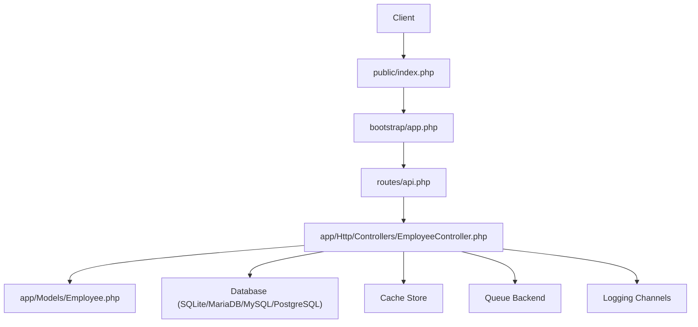
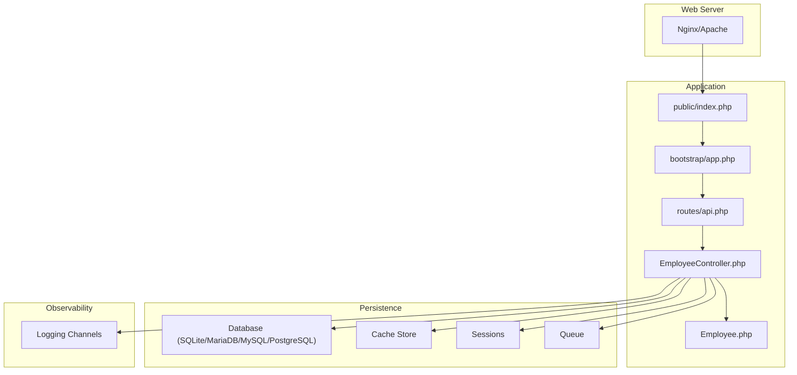
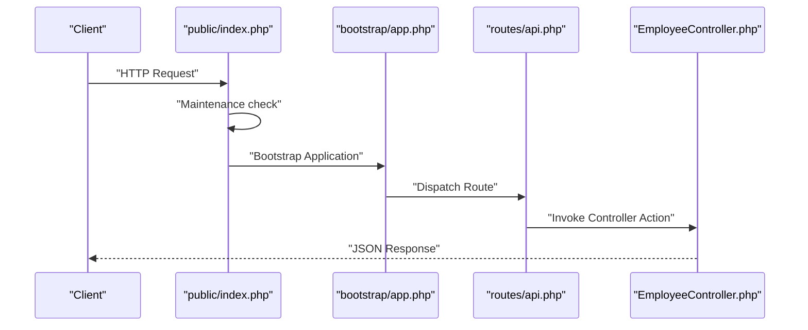
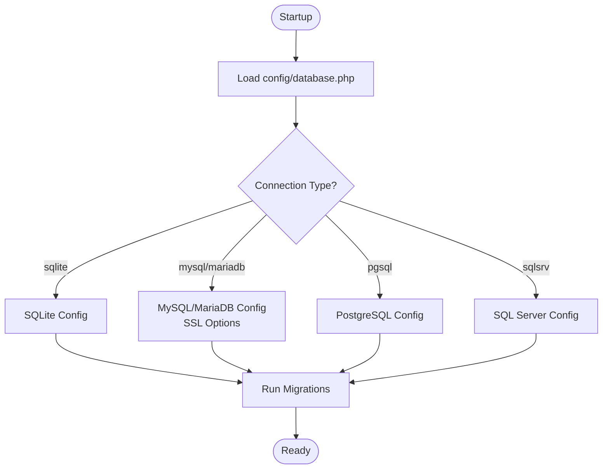
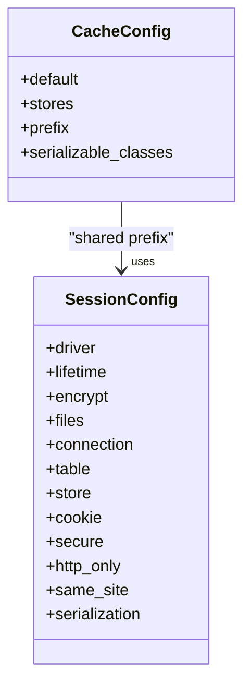
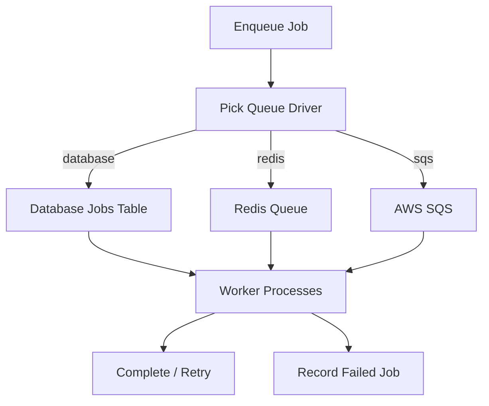
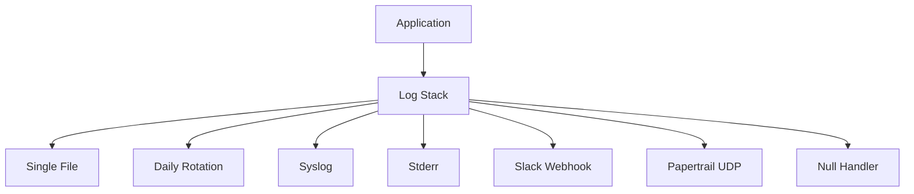
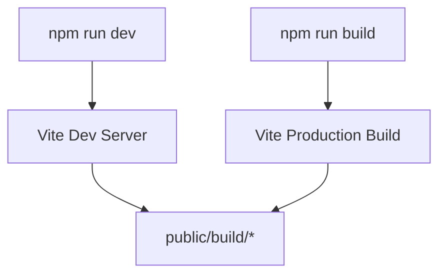
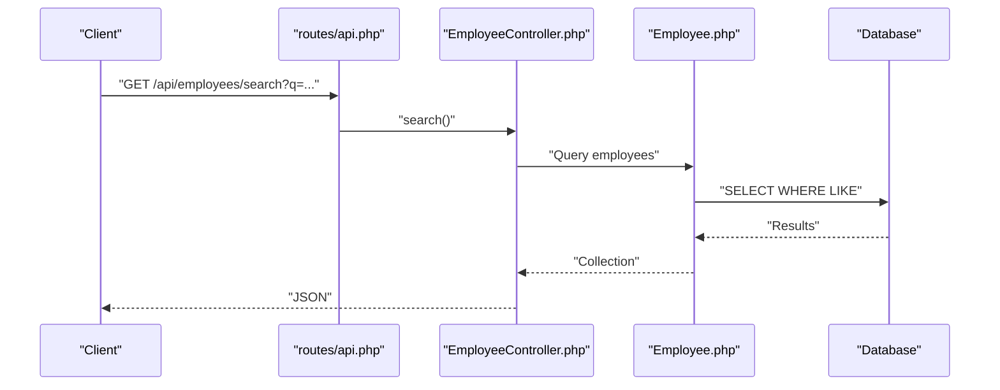
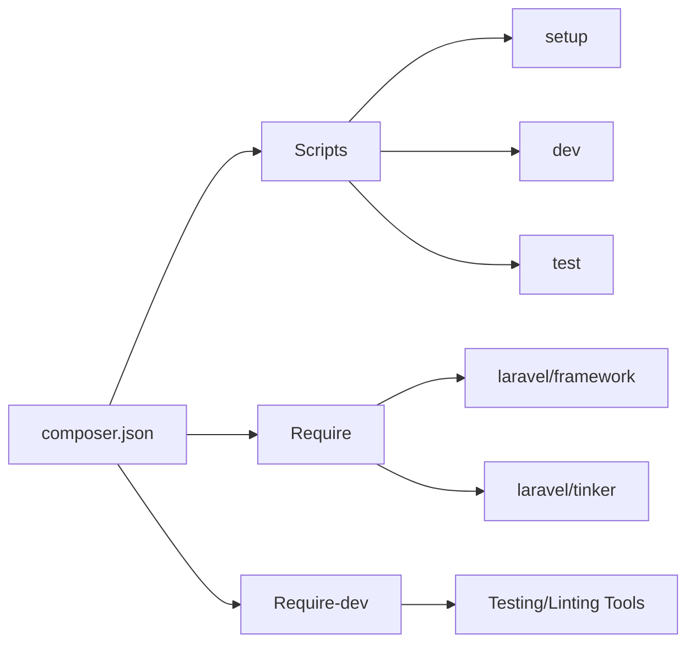

# Deployment & Production

<cite>
**Referenced Files in This Document**
- [composer.json](file://composer.json)
- [.env.example](file://.env.example)
- [config/app.php](file://config/app.php)
- [config/database.php](file://config/database.php)
- [config/cache.php](file://config/cache.php)
- [config/session.php](file://config/session.php)
- [config/queue.php](file://config/queue.php)
- [config/logging.php](file://config/logging.php)
- [bootstrap/app.php](file://bootstrap/app.php)
- [public/index.php](file://public/index.php)
- [routes/api.php](file://routes/api.php)
- [database/migrations/2026_04_11_134759_create_employees_table.php](file://database/migrations/2026_04_11_134759_create_employees_table.php)
- [package.json](file://package.json)
- [vite.config.js](file://vite.config.js)
- [app/Http/Controllers/EmployeeController.php](file://app/Http/Controllers/EmployeeController.php)
</cite>

## Table of Contents
1. [Introduction](#introduction)
2. [Project Structure](#project-structure)
3. [Core Components](#core-components)
4. [Architecture Overview](#architecture-overview)
5. [Detailed Component Analysis](#detailed-component-analysis)
6. [Dependency Analysis](#dependency-analysis)
7. [Performance Considerations](#performance-considerations)
8. [Troubleshooting Guide](#troubleshooting-guide)
9. [Conclusion](#conclusion)
10. [Appendices](#appendices)

## Introduction
This document provides comprehensive deployment guidance for the employees API project. It covers production server requirements, environment configuration, security hardening, deployment pipeline from code preparation to release, environment-specific configurations, database migration strategies, rollback procedures, performance optimization, monitoring and logging, SSL/TLS and access control, and practical checklists and troubleshooting.

## Project Structure
The project follows a standard Laravel application layout with a focus on an API surface:
- HTTP entrypoint via public/index.php
- Application bootstrap via bootstrap/app.php
- API routes defined under routes/api.php
- Controllers under app/Http/Controllers
- Models under app/Models
- Configuration under config/*
- Database migrations under database/migrations
- Asset pipeline managed by Vite and configured via vite.config.js and package.json

**Diagram sources**
- [public/index.php:1-21](file://public/index.php#L1-L21)
- [bootstrap/app.php:1-19](file://bootstrap/app.php#L1-L19)
- [routes/api.php:1-8](file://routes/api.php#L1-L8)
- [app/Http/Controllers/EmployeeController.php:1-95](file://app/Http/Controllers/EmployeeController.php#L1-L95)

**Section sources**
- [public/index.php:1-21](file://public/index.php#L1-L21)
- [bootstrap/app.php:1-19](file://bootstrap/app.php#L1-L19)
- [routes/api.php:1-8](file://routes/api.php#L1-L8)

## Core Components
Key production components and their roles:
- Application bootstrap and routing configuration
- Database connectivity and migrations
- Cache and session stores
- Queue backends for asynchronous tasks
- Logging channels for observability
- Asset build pipeline for frontend resources

**Section sources**
- [bootstrap/app.php:1-19](file://bootstrap/app.php#L1-L19)
- [config/database.php:1-185](file://config/database.php#L1-L185)
- [config/cache.php:1-131](file://config/cache.php#L1-L131)
- [config/session.php:1-234](file://config/session.php#L1-L234)
- [config/queue.php:1-130](file://config/queue.php#L1-L130)
- [config/logging.php:1-133](file://config/logging.php#L1-L133)
- [vite.config.js:1-19](file://vite.config.js#L1-L19)
- [package.json:1-18](file://package.json#L1-L18)

## Architecture Overview
Production runtime architecture integrates the HTTP entrypoint, routing, controller logic, persistence, caching, queuing, and logging.

**Diagram sources**
- [public/index.php:1-21](file://public/index.php#L1-L21)
- [bootstrap/app.php:1-19](file://bootstrap/app.php#L1-L19)
- [routes/api.php:1-8](file://routes/api.php#L1-L8)
- [app/Http/Controllers/EmployeeController.php:1-95](file://app/Http/Controllers/EmployeeController.php#L1-L95)
- [config/database.php:1-185](file://config/database.php#L1-L185)
- [config/cache.php:1-131](file://config/cache.php#L1-L131)
- [config/session.php:1-234](file://config/session.php#L1-L234)
- [config/queue.php:1-130](file://config/queue.php#L1-L130)
- [config/logging.php:1-133](file://config/logging.php#L1-L133)

## Detailed Component Analysis

### HTTP Entry and Bootstrap
- The public/index.php file initializes maintenance mode checks, Composer autoloading, and boots the Laravel application to handle the current request.
- bootstrap/app.php configures routing for web, console, and health checks.

**Diagram sources**
- [public/index.php:1-21](file://public/index.php#L1-L21)
- [bootstrap/app.php:1-19](file://bootstrap/app.php#L1-L19)
- [routes/api.php:1-8](file://routes/api.php#L1-L8)
- [app/Http/Controllers/EmployeeController.php:1-95](file://app/Http/Controllers/EmployeeController.php#L1-L95)

**Section sources**
- [public/index.php:1-21](file://public/index.php#L1-L21)
- [bootstrap/app.php:1-19](file://bootstrap/app.php#L1-L19)

### Database Connectivity and Migrations
- Default connection is SQLite for development, with support for MySQL, MariaDB, PostgreSQL, and SQL Server.
- SSL/TLS options are configurable for MySQL/MariaDB via PDO attributes.
- Migrations table is configurable and defaults to a dedicated table.
- Redis client and options are configurable for queues, cache, and general store usage.

**Diagram sources**
- [config/database.php:1-185](file://config/database.php#L1-L185)
- [database/migrations/2026_04_11_134759_create_employees_table.php:1-34](file://database/migrations/2026_04_11_134759_create_employees_table.php#L1-L34)

**Section sources**
- [config/database.php:1-185](file://config/database.php#L1-L185)
- [database/migrations/2026_04_11_134759_create_employees_table.php:1-34](file://database/migrations/2026_04_11_134759_create_employees_table.php#L1-L34)

### Cache and Sessions
- Default cache store is database; file, Redis, DynamoDB, and others are supported.
- Session driver defaults to database with configurable lifetime, encryption, cookie policies, and serialization.
- Cache key prefixing helps isolate environments.

**Diagram sources**
- [config/cache.php:1-131](file://config/cache.php#L1-L131)
- [config/session.php:1-234](file://config/session.php#L1-L234)

**Section sources**
- [config/cache.php:1-131](file://config/cache.php#L1-L131)
- [config/session.php:1-234](file://config/session.php#L1-L234)

### Queues and Background Jobs
- Default queue connection is database; Redis, SQS, and others are supported.
- Failed job storage is configurable with UUID support for database.

**Diagram sources**
- [config/queue.php:1-130](file://config/queue.php#L1-L130)

**Section sources**
- [config/queue.php:1-130](file://config/queue.php#L1-L130)

### Logging and Observability
- Default stack includes a single channel; daily rotation, syslog, stderr, Slack, and Papertrail integrations are available.
- Deprecation logging can be configured independently.

**Diagram sources**
- [config/logging.php:1-133](file://config/logging.php#L1-L133)

**Section sources**
- [config/logging.php:1-133](file://config/logging.php#L1-L133)

### Asset Pipeline (Vite)
- Build assets via Vite; development and production builds are supported.
- Tailwind CSS integration is configured.

**Diagram sources**
- [package.json:1-18](file://package.json#L1-L18)
- [vite.config.js:1-19](file://vite.config.js#L1-L19)

**Section sources**
- [package.json:1-18](file://package.json#L1-L18)
- [vite.config.js:1-19](file://vite.config.js#L1-L19)

### API Surface and Data Model
- API routes expose CRUD operations for employees and a search endpoint.
- Validation ensures data integrity; search spans name, email, and phone.

**Diagram sources**
- [routes/api.php:1-8](file://routes/api.php#L1-L8)
- [app/Http/Controllers/EmployeeController.php:78-92](file://app/Http/Controllers/EmployeeController.php#L78-L92)

**Section sources**
- [routes/api.php:1-8](file://routes/api.php#L1-L8)
- [app/Http/Controllers/EmployeeController.php:1-95](file://app/Http/Controllers/EmployeeController.php#L1-L95)

## Dependency Analysis
- Composer scripts orchestrate setup, dev, and build tasks.
- Application depends on Laravel framework and Tinker for REPL.
- Development dependencies include tooling for linting, testing, and local logging.

**Diagram sources**
- [composer.json:1-86](file://composer.json#L1-L86)

**Section sources**
- [composer.json:1-86](file://composer.json#L1-L86)

## Performance Considerations
- Use production-ready PHP-FPM with OPcache enabled.
- Enable Redis or database cache stores and configure cache prefixes per environment.
- Tune queue workers and retry policies for background tasks.
- Serve static assets via CDN or reverse proxy with long-lived caching headers.
- Minimize model hydration and use eager loading where appropriate.
- Monitor slow queries and enable query logging in staging for profiling.

[No sources needed since this section provides general guidance]

## Troubleshooting Guide
Common production issues and resolutions:
- Application not starting or blank pages:
  - Verify APP_KEY is generated and set.
  - Confirm APP_ENV is production and APP_DEBUG is false.
  - Check file permissions for storage and bootstrap/cache.
- Database connectivity errors:
  - Validate DB_* environment variables and connection type.
  - For MySQL/MariaDB, confirm SSL CA path if required.
- Cache and session failures:
  - Ensure cache store is reachable (Redis/DB) and credentials are correct.
  - Verify cache prefix uniqueness across environments.
- Queue not processing:
  - Confirm QUEUE_CONNECTION and worker processes are running.
  - Check failed jobs table for errors.
- Logging not appearing:
  - Set LOG_CHANNEL and LOG_LEVEL appropriately.
  - For syslog or remote targets, verify network and credentials.
- Asset build issues:
  - Run npm ci and npm run build in CI/CD.
  - Ensure public/build exists and is served by the web server.

**Section sources**
- [.env.example:1-66](file://.env.example#L1-L66)
- [config/app.php:1-127](file://config/app.php#L1-L127)
- [config/database.php:1-185](file://config/database.php#L1-L185)
- [config/cache.php:1-131](file://config/cache.php#L1-L131)
- [config/session.php:1-234](file://config/session.php#L1-L234)
- [config/queue.php:1-130](file://config/queue.php#L1-L130)
- [config/logging.php:1-133](file://config/logging.php#L1-L133)
- [package.json:1-18](file://package.json#L1-L18)

## Conclusion
Deploying the employees API to production requires careful attention to environment configuration, database migrations, caching, queues, logging, and security. Use the provided checklists and troubleshooting steps to ensure a smooth rollout and ongoing reliability.

[No sources needed since this section summarizes without analyzing specific files]

## Appendices

### A. Production Deployment Checklist
- Pre-deployment
  - Freeze feature branch and tag release.
  - Back up production database and storage.
  - Prepare environment variables (.env) with production values.
- Server prerequisites
  - Install PHP 8.3+ with required extensions.
  - Configure web server (Nginx/Apache) and PHP-FPM.
  - Provision database and Redis (if used).
  - Set file permissions for storage and bootstrap/cache.
- Build and deploy
  - Run Composer install with optimized autoloader.
  - Generate APP_KEY if missing.
  - Run database migrations with force flag.
  - Publish assets and build frontend.
  - Warm caches (config, routes, views).
- Post-deploy verification
  - Health check endpoint (/up).
  - API smoke tests for CRUD and search.
  - Queue workers status and failed jobs review.
  - Review logs for errors.
- Rollback plan
  - Keep previous artifact and database backup.
  - Revert code and restore DB snapshot if needed.
  - Switch off new cache keys and revert cache prefix if applicable.

**Section sources**
- [composer.json:1-86](file://composer.json#L1-L86)
- [config/app.php:1-127](file://config/app.php#L1-L127)
- [config/database.php:1-185](file://config/database.php#L1-L185)
- [config/cache.php:1-131](file://config/cache.php#L1-L131)
- [config/session.php:1-234](file://config/session.php#L1-L234)
- [config/queue.php:1-130](file://config/queue.php#L1-L130)
- [config/logging.php:1-133](file://config/logging.php#L1-L133)
- [routes/api.php:1-8](file://routes/api.php#L1-L8)
- [app/Http/Controllers/EmployeeController.php:1-95](file://app/Http/Controllers/EmployeeController.php#L1-L95)

### B. Environment Variables Reference
- Application
  - APP_NAME, APP_ENV, APP_KEY, APP_DEBUG, APP_URL
  - LOG_CHANNEL, LOG_LEVEL, LOG_STACK
- Database
  - DB_CONNECTION, DB_HOST, DB_PORT, DB_DATABASE, DB_USERNAME, DB_PASSWORD
  - DB_URL, DB_CHARSET, DB_COLLATION, DB_SSLMODE, MYSQL_ATTR_SSL_CA
- Cache and Sessions
  - CACHE_STORE, CACHE_PREFIX
  - SESSION_DRIVER, SESSION_LIFETIME, SESSION_ENCRYPT, SESSION_SECURE_COOKIE, SESSION_SAME_SITE
- Queues
  - QUEUE_CONNECTION, QUEUE_FAILED_DRIVER
- Redis
  - REDIS_CLIENT, REDIS_HOST, REDIS_PASSWORD, REDIS_PORT, REDIS_DB, REDIS_CACHE_DB
- Maintenance
  - APP_MAINTENANCE_DRIVER, APP_MAINTENANCE_STORE

**Section sources**
- [.env.example:1-66](file://.env.example#L1-L66)
- [config/app.php:1-127](file://config/app.php#L1-L127)
- [config/database.php:1-185](file://config/database.php#L1-L185)
- [config/cache.php:1-131](file://config/cache.php#L1-L131)
- [config/session.php:1-234](file://config/session.php#L1-L234)
- [config/queue.php:1-130](file://config/queue.php#L1-L130)

### C. Database Migration and Rollback Strategy
- Migrations
  - Use the migration table to track applied migrations.
  - Run migrations with force in production deployments.
- Rollback
  - Down migrations are available for reversible changes.
  - Prefer safe down operations; test rollback scenarios in staging.

**Section sources**
- [config/database.php:130-133](file://config/database.php#L130-L133)
- [database/migrations/2026_04_11_134759_create_employees_table.php:1-34](file://database/migrations/2026_04_11_134759_create_employees_table.php#L1-L34)

### D. Security Hardening Guidelines
- TLS/SSL
  - Terminate TLS at the load balancer or web server; enforce HTTPS redirects.
  - Use strong ciphers and modern protocols.
- Secrets and keys
  - Store APP_KEY and database credentials outside version control.
  - Rotate keys periodically and leverage previous keys during key rotation.
- Access control
  - Restrict administrative endpoints and use API tokens or OAuth if applicable.
  - Harden file permissions and restrict writable paths to necessary directories.
- Logging and monitoring
  - Ship logs to centralized systems; avoid logging sensitive data.
  - Set up alerts for error spikes and latency.

**Section sources**
- [config/app.php:100-106](file://config/app.php#L100-L106)
- [config/database.php:62-64](file://config/database.php#L62-L64)
- [config/logging.php:1-133](file://config/logging.php#L1-L133)

### E. Monitoring and Logging Configuration
- Channels
  - Use stack to combine multiple handlers.
  - Daily rotation for long-term retention.
  - Syslog or stderr for containerized environments.
  - Slack/Papertrail for operational notifications.
- Levels
  - Set LOG_LEVEL to appropriate severity in production.

**Section sources**
- [config/logging.php:1-133](file://config/logging.php#L1-L133)

### F. Asset Compilation and Delivery
- Build
  - Run npm ci and npm run build in CI/CD pipelines.
- Delivery
  - Serve built assets from public/build via the web server.
  - Configure long cache headers for static assets.

**Section sources**
- [package.json:1-18](file://package.json#L1-L18)
- [vite.config.js:1-19](file://vite.config.js#L1-L19)