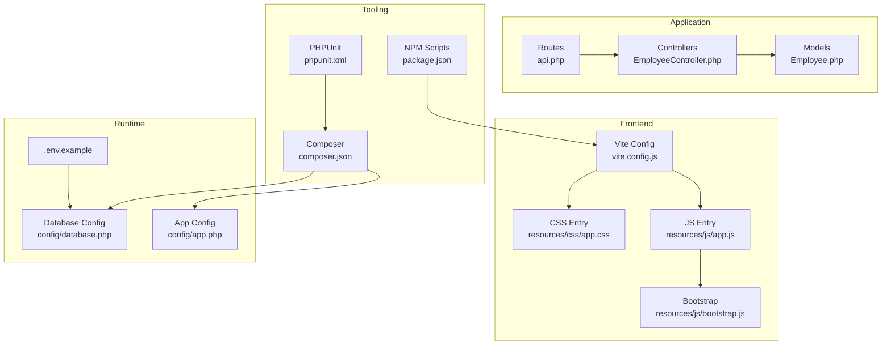
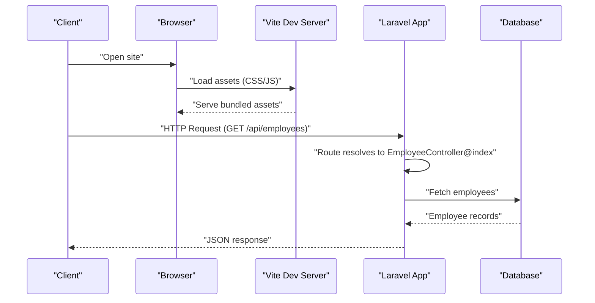
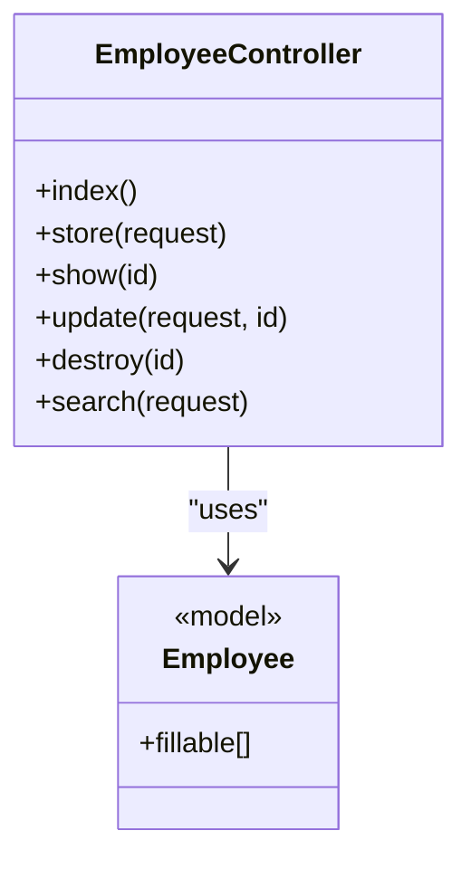
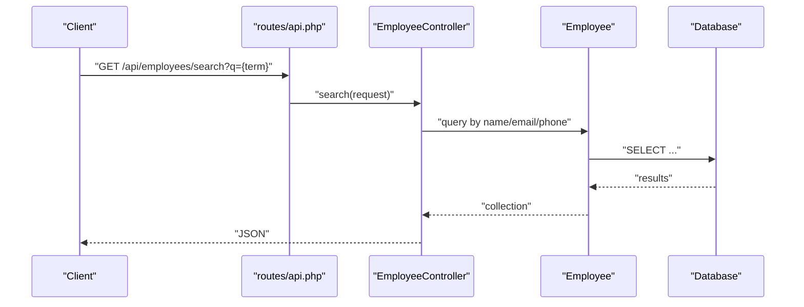
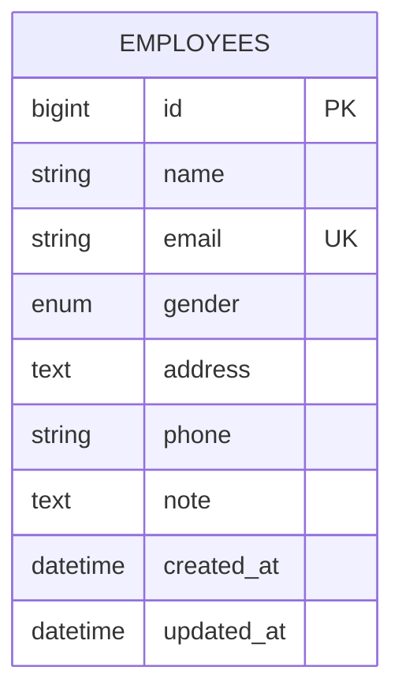
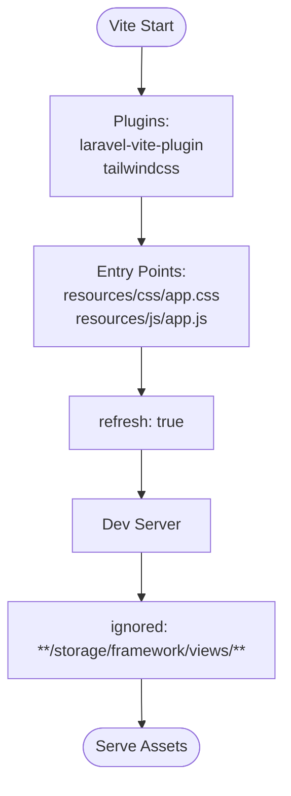
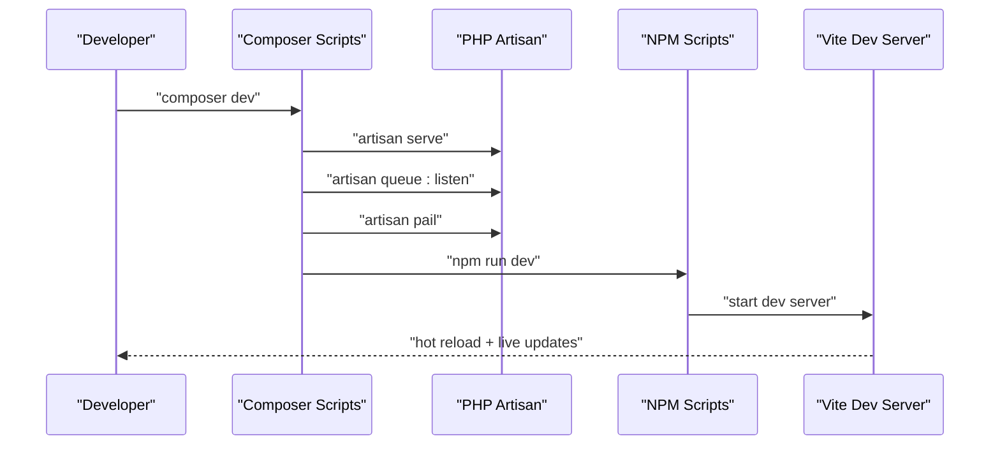
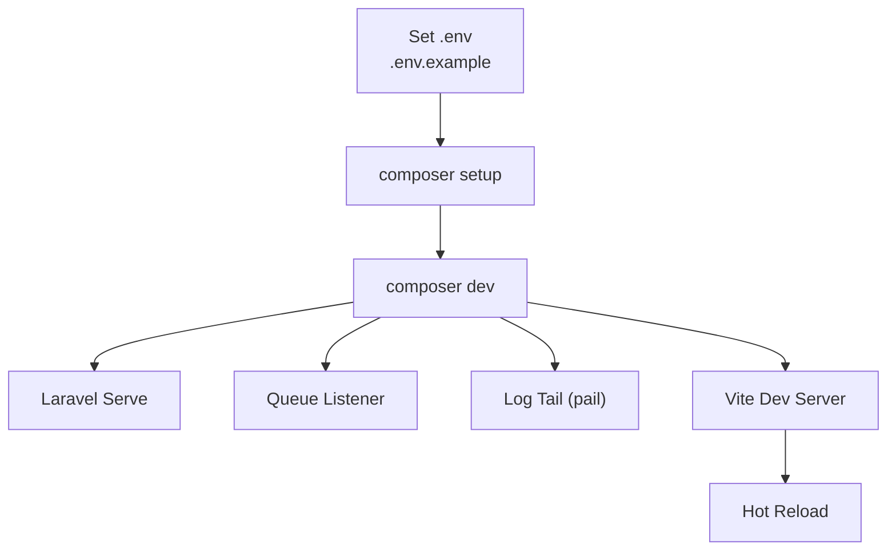
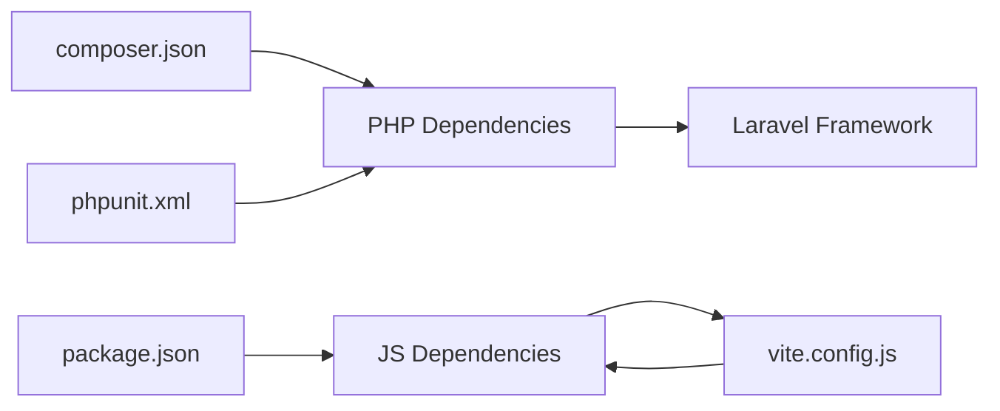

# Development Workflow

<cite>
**Referenced Files in This Document**
- [composer.json](file://composer.json)
- [package.json](file://package.json)
- [vite.config.js](file://vite.config.js)
- [README.md](file://README.md)
- [routes/api.php](file://routes/api.php)
- [app/Http/Controllers/EmployeeController.php](file://app/Http/Controllers/EmployeeController.php)
- [app/Models/Employee.php](file://app/Models/Employee.php)
- [database/migrations/2026_04_11_134759_create_employees_table.php](file://database/migrations/2026_04_11_134759_create_employees_table.php)
- [config/app.php](file://config/app.php)
- [config/database.php](file://config/database.php)
- [phpunit.xml](file://phpunit.xml)
- [.env.example](file://.env.example)
- [resources/css/app.css](file://resources/css/app.css)
- [resources/js/app.js](file://resources/js/app.js)
- [resources/js/bootstrap.js](file://resources/js/bootstrap.js)
- [tests/TestCase.php](file://tests/TestCase.php)
- [tests/Feature/ExampleTest.php](file://tests/Feature/ExampleTest.php)
- [tests/Unit/ExampleTest.php](file://tests/Unit/ExampleTest.php)
</cite>

## Table of Contents
1. [Introduction](#introduction)
2. [Project Structure](#project-structure)
3. [Core Components](#core-components)
4. [Architecture Overview](#architecture-overview)
5. [Detailed Component Analysis](#detailed-component-analysis)
6. [Dependency Analysis](#dependency-analysis)
7. [Performance Considerations](#performance-considerations)
8. [Troubleshooting Guide](#troubleshooting-guide)
9. [Conclusion](#conclusion)
10. [Appendices](#appendices)

## Introduction
This document describes the development workflow for the employees API project. It covers environment setup, code organization, build and development tooling, quality standards, debugging, local development, hot reload, project conventions, and collaboration practices. The project is a Laravel application with a simple employee resource API backed by a relational database and a Vite-powered frontend asset pipeline.

## Project Structure
The project follows Laravel’s conventional structure with clear separation of concerns:
- app: Application code including controllers, models, and service providers
- config: Environment and framework configuration
- database: Migrations, seeders, and factories
- public: Web server entry point and static assets
- resources: Frontend assets (CSS/JS) and Blade templates
- routes: Route definitions for web and API
- storage: Runtime generated files (cache, logs, sessions, compiled views)
- tests: Unit and feature tests
- Tooling configs: composer.json, package.json, vite.config.js, phpunit.xml

**Diagram sources**
- [routes/api.php:1-8](file://routes/api.php#L1-L8)
- [app/Http/Controllers/EmployeeController.php:1-95](file://app/Http/Controllers/EmployeeController.php#L1-L95)
- [app/Models/Employee.php:1-18](file://app/Models/Employee.php#L1-L18)
- [vite.config.js:1-19](file://vite.config.js#L1-L19)
- [resources/css/app.css:1-12](file://resources/css/app.css#L1-L12)
- [resources/js/app.js:1-2](file://resources/js/app.js#L1-L2)
- [resources/js/bootstrap.js:1-5](file://resources/js/bootstrap.js#L1-L5)
- [composer.json:1-86](file://composer.json#L1-L86)
- [package.json:1-18](file://package.json#L1-L18)
- [phpunit.xml:1-37](file://phpunit.xml#L1-L37)
- [config/database.php:1-185](file://config/database.php#L1-L185)
- [config/app.php:1-127](file://config/app.php#L1-L127)
- [.env.example:1-66](file://.env.example#L1-L66)

**Section sources**
- [composer.json:1-86](file://composer.json#L1-L86)
- [package.json:1-18](file://package.json#L1-L18)
- [vite.config.js:1-19](file://vite.config.js#L1-L19)
- [routes/api.php:1-8](file://routes/api.php#L1-L8)
- [config/app.php:1-127](file://config/app.php#L1-L127)
- [config/database.php:1-185](file://config/database.php#L1-L185)
- [phpunit.xml:1-37](file://phpunit.xml#L1-L37)
- [.env.example:1-66](file://.env.example#L1-L66)

## Core Components
- EmployeeController: Implements CRUD and search endpoints for employees, with validation and JSON responses
- Employee model: Defines fillable attributes for mass assignment protection
- API routes: Declares RESTful endpoints and a dedicated search endpoint
- Vite pipeline: Builds and refreshes frontend assets during development
- Laravel scripts: Composer scripts automate setup, dev orchestration, and testing
- Testing: PHPUnit configuration targets app and tests directories with SQLite in-memory database for speed

Key implementation references:
- Controller actions and validation: [app/Http/Controllers/EmployeeController.php:1-95](file://app/Http/Controllers/EmployeeController.php#L1-L95)
- Model fillable attributes: [app/Models/Employee.php:1-18](file://app/Models/Employee.php#L1-L18)
- Routes registration: [routes/api.php:1-8](file://routes/api.php#L1-L8)
- Vite plugin and refresh: [vite.config.js:1-19](file://vite.config.js#L1-L19)
- Composer dev orchestration: [composer.json:42-45](file://composer.json#L42-L45)
- PHPUnit test suites: [phpunit.xml:7-14](file://phpunit.xml#L7-L14)

**Section sources**
- [app/Http/Controllers/EmployeeController.php:1-95](file://app/Http/Controllers/EmployeeController.php#L1-L95)
- [app/Models/Employee.php:1-18](file://app/Models/Employee.php#L1-L18)
- [routes/api.php:1-8](file://routes/api.php#L1-L8)
- [vite.config.js:1-19](file://vite.config.js#L1-L19)
- [composer.json:42-45](file://composer.json#L42-L45)
- [phpunit.xml:7-14](file://phpunit.xml#L7-L14)

## Architecture Overview
The system is a Laravel backend with a minimal frontend asset pipeline powered by Vite. Requests flow from HTTP clients to Laravel routes, which delegate to controllers. Controllers validate input, interact with Eloquent models, and return JSON responses. The Vite plugin manages CSS/JS bundling and hot module replacement.

**Diagram sources**
- [routes/api.php:1-8](file://routes/api.php#L1-L8)
- [app/Http/Controllers/EmployeeController.php:13-16](file://app/Http/Controllers/EmployeeController.php#L13-L16)
- [vite.config.js:6-12](file://vite.config.js#L6-L12)

**Section sources**
- [routes/api.php:1-8](file://routes/api.php#L1-L8)
- [app/Http/Controllers/EmployeeController.php:13-16](file://app/Http/Controllers/EmployeeController.php#L13-L16)
- [vite.config.js:6-12](file://vite.config.js#L6-L12)

## Detailed Component Analysis

### Employee Resource API
The controller implements standard CRUD operations and a search endpoint. Validation ensures data integrity, and error handling returns appropriate HTTP status codes.

**Diagram sources**
- [app/Http/Controllers/EmployeeController.php:8-95](file://app/Http/Controllers/EmployeeController.php#L8-L95)
- [app/Models/Employee.php:7-17](file://app/Models/Employee.php#L7-L17)

**Diagram sources**
- [routes/api.php:6-7](file://routes/api.php#L6-L7)
- [app/Http/Controllers/EmployeeController.php:78-92](file://app/Http/Controllers/EmployeeController.php#L78-L92)
- [app/Models/Employee.php:7-17](file://app/Models/Employee.php#L7-L17)

**Section sources**
- [app/Http/Controllers/EmployeeController.php:13-92](file://app/Http/Controllers/EmployeeController.php#L13-L92)
- [routes/api.php:6-7](file://routes/api.php#L6-L7)
- [app/Models/Employee.php:9-16](file://app/Models/Employee.php#L9-L16)

### Database Schema and Migration
The employees table stores personal and contact details with a unique email constraint and timestamps.

**Diagram sources**
- [database/migrations/2026_04_11_134759_create_employees_table.php:14-23](file://database/migrations/2026_04_11_134759_create_employees_table.php#L14-L23)

**Section sources**
- [database/migrations/2026_04_11_134759_create_employees_table.php:12-32](file://database/migrations/2026_04_11_134759_create_employees_table.php#L12-L32)

### Frontend Asset Pipeline (Vite)
Vite is configured with Laravel’s Vite plugin and Tailwind CSS. Hot reload is enabled and ignores compiled view files to avoid unnecessary rebuilds.

**Diagram sources**
- [vite.config.js:6-17](file://vite.config.js#L6-L17)
- [resources/css/app.css:1-12](file://resources/css/app.css#L1-L12)
- [resources/js/app.js:1-2](file://resources/js/app.js#L1-2)

**Section sources**
- [vite.config.js:1-19](file://vite.config.js#L1-L19)
- [resources/css/app.css:1-12](file://resources/css/app.css#L1-L12)
- [resources/js/app.js:1-2](file://resources/js/app.js#L1-L2)
- [resources/js/bootstrap.js:1-5](file://resources/js/bootstrap.js#L1-L5)

### Build and Development Tools Integration
- Composer scripts:
  - setup: installs PHP deps, prepares .env, generates app key, runs migrations, installs JS deps, builds frontend
  - dev: orchestrates Laravel server, queue listener, log tailing, and Vite dev server concurrently
  - test: clears config cache and runs tests
- NPM scripts:
  - dev: starts Vite dev server
  - build: produces production bundles
- Laravel Pint: installed as dev dependency for code style enforcement

**Diagram sources**
- [composer.json:33-45](file://composer.json#L33-L45)
- [package.json:5-8](file://package.json#L5-L8)

**Section sources**
- [composer.json:33-67](file://composer.json#L33-L67)
- [package.json:5-8](file://package.json#L5-L8)

### Code Quality Standards and Linting
- Laravel Pint is included as a dev dependency for consistent PHP code formatting
- EditorConfig is present for cross-editor formatting consistency
- PHPUnit is configured with targeted test suites and a fast SQLite in-memory database for tests

Recommended usage:
- Run Pint locally before committing to enforce style consistency
- Keep tests focused and fast; leverage in-memory database for feature/unit tests

**Section sources**
- [composer.json:16](file://composer.json#L16)
- [phpunit.xml:26-28](file://phpunit.xml#L26-L28)

### Local Development Setup and Hot Reload
- Environment: Copy .env.example to .env, set APP_ENV=local, APP_DEBUG=true, DB_CONNECTION=sqlite
- Initialize: composer setup (installs deps, generates key, migrates, installs JS deps, builds)
- Develop: composer dev (starts Laravel server, queue, logs, and Vite dev server)
- Hot reload: Vite refresh is enabled; Tailwind sources are configured for scanning

**Diagram sources**
- [.env.example:1-66](file://.env.example#L1-L66)
- [composer.json:34-41](file://composer.json#L34-L41)
- [composer.json:42-45](file://composer.json#L42-L45)
- [vite.config.js:9](file://vite.config.js#L9)

**Section sources**
- [.env.example:23](file://.env.example#L23)
- [composer.json:34-41](file://composer.json#L34-L41)
- [composer.json:42-45](file://composer.json#L42-L45)
- [vite.config.js:9](file://vite.config.js#L9)

### Project Structure Conventions and Naming Patterns
- PSR-4 autoloading for app/, database/factories/, database/seeders/, tests/
- Laravel route-model binding and RESTful resource controllers
- Eloquent models with explicit fillable arrays
- Blade templates under resources/views (welcome.blade.php)
- Tailwind CSS configured via @import and @source directives

**Section sources**
- [composer.json:21-32](file://composer.json#L21-L32)
- [resources/css/app.css:1-12](file://resources/css/app.css#L1-L12)

### Architectural Guidelines
- Keep controllers thin; delegate business logic to models/services when applicable
- Use validation in controllers for request sanitization
- Prefer RESTful routes for resources; add custom endpoints as needed (e.g., search)
- Use migrations for schema changes; keep seeders for test/dev data
- Separate frontend assets with Vite; enable hot reload for rapid iteration

[No sources needed since this section provides general guidance]

## Dependency Analysis
The project relies on Laravel framework and ecosystem tools. Composer manages PHP dependencies and scripts; NPM/Vite manages frontend assets. PHPUnit coordinates testing against the app and tests directories.

**Diagram sources**
- [composer.json:8-20](file://composer.json#L8-L20)
- [package.json:9-16](file://package.json#L9-L16)
- [vite.config.js:1-3](file://vite.config.js#L1-L3)
- [phpunit.xml:4](file://phpunit.xml#L4)

**Section sources**
- [composer.json:8-20](file://composer.json#L8-L20)
- [package.json:9-16](file://package.json#L9-L16)
- [vite.config.js:1-3](file://vite.config.js#L1-L3)
- [phpunit.xml:4](file://phpunit.xml#L4)

## Performance Considerations
- Use SQLite for local development to minimize overhead
- Keep validation concise and targeted to reduce overhead
- Leverage Vite’s incremental rebuilds and ignored paths to avoid unnecessary work
- Run tests with in-memory database to reduce I/O overhead

[No sources needed since this section provides general guidance]

## Troubleshooting Guide
Common issues and resolutions:
- Missing APP_KEY: Run the setup script or generate a key via Artisan
- Database connectivity: Verify DB_CONNECTION and related environment variables in .env
- Frontend assets not updating: Ensure Vite dev server is running and refresh ignores are configured
- Test failures: Confirm PHPUnit is targeting the correct directories and environment variables are set for testing

**Section sources**
- [composer.json:34-41](file://composer.json#L34-L41)
- [.env.example:23](file://.env.example#L23)
- [vite.config.js:14-17](file://vite.config.js#L14-L17)
- [phpunit.xml:15-35](file://phpunit.xml#L15-L35)

## Conclusion
This project establishes a streamlined development workflow combining Laravel’s robust backend capabilities with Vite’s efficient frontend tooling. Composer scripts simplify setup and local orchestration, while PHPUnit and Pint support quality and consistency. Following the conventions and practices outlined here will help maintain a clean, scalable, and developer-friendly codebase.

[No sources needed since this section summarizes without analyzing specific files]

## Appendices

### Development Commands Reference
- composer setup: Installs PHP dependencies, prepares .env, generates key, migrates, installs JS deps, builds frontend
- composer dev: Starts Laravel server, queue listener, log tailing, and Vite dev server concurrently
- npm run dev: Starts Vite dev server
- npm run build: Produces production bundles
- php artisan test: Runs unit and feature tests

**Section sources**
- [composer.json:34-41](file://composer.json#L34-L41)
- [composer.json:42-45](file://composer.json#L42-L45)
- [package.json:5-8](file://package.json#L5-L8)

### Testing Setup Notes
- Test suites: Unit and Feature directories
- Database: Uses SQLite in-memory for speed
- Environment overrides: Ensures consistent test runtime

**Section sources**
- [phpunit.xml:7-14](file://phpunit.xml#L7-L14)
- [phpunit.xml:26-28](file://phpunit.xml#L26-L28)