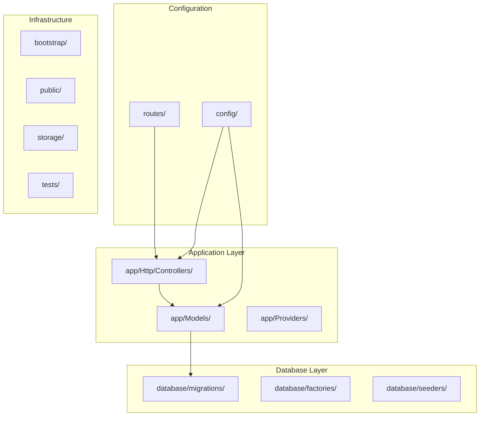
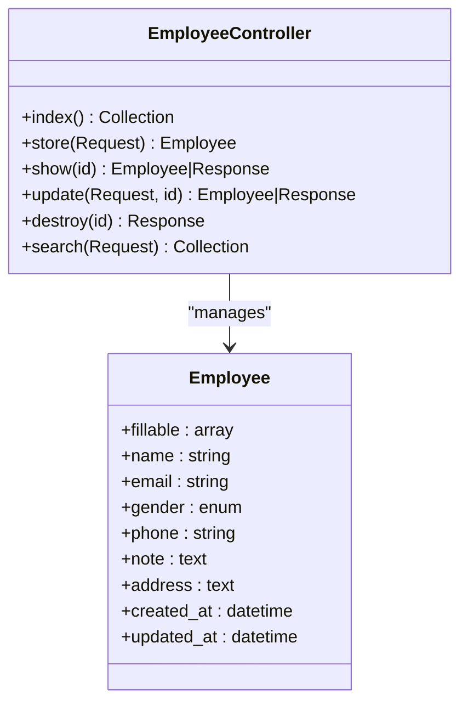
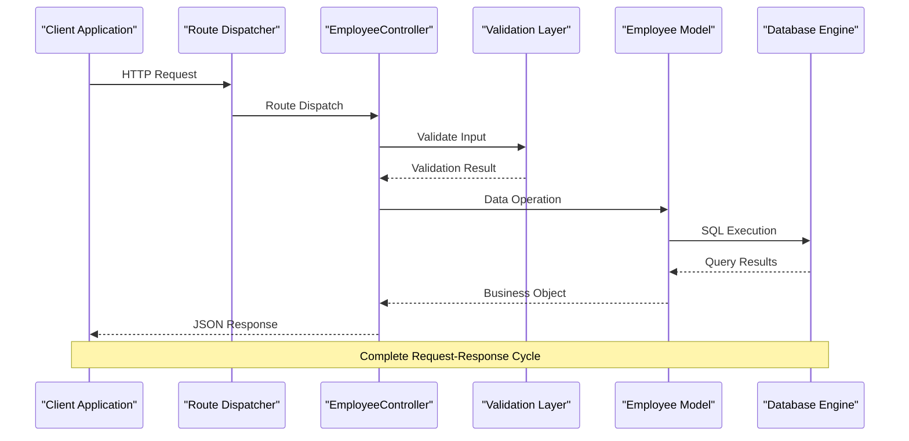
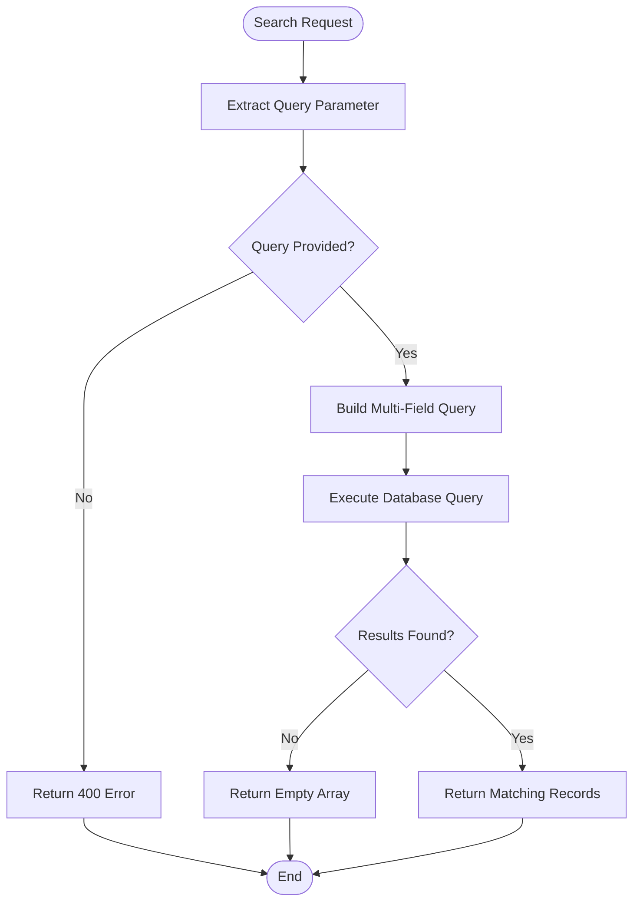
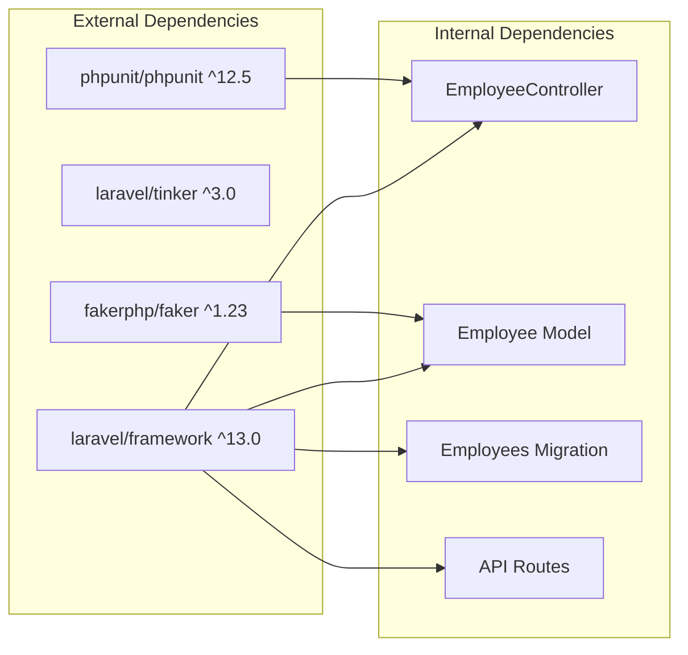

# Project Overview

<cite>
**Referenced Files in This Document**
- [EmployeeController.php](file://app/Http/Controllers/EmployeeController.php)
- [Employee.php](file://app/Models/Employee.php)
- [User.php](file://app/Models/User.php)
- [api.php](file://routes/api.php)
- [2026_04_11_134759_create_employees_table.php](file://database/migrations/2026_04_11_134759_create_employees_table.php)
- [composer.json](file://composer.json)
- [database.php](file://config/database.php)
- [README.md](file://README.md)
- [UserFactory.php](file://database/factories/UserFactory.php)
- [ExampleTest.php](file://tests/Feature/ExampleTest.php)
- [app.php](file://bootstrap/app.php)
</cite>

## Table of Contents
1. [Introduction](#introduction)
2. [Project Structure](#project-structure)
3. [Core Components](#core-components)
4. [Architecture Overview](#architecture-overview)
5. [Detailed Component Analysis](#detailed-component-analysis)
6. [Dependency Analysis](#dependency-analysis)
7. [Performance Considerations](#performance-considerations)
8. [Troubleshooting Guide](#troubleshooting-guide)
9. [Conclusion](#conclusion)

## Introduction

The Employees API is a Laravel-based RESTful API service designed for comprehensive employee management operations. Built on Laravel 13, this project demonstrates modern PHP web application development principles with clean separation of concerns, robust validation patterns, and efficient data persistence through Eloquent ORM.

The project serves as a foundational template for enterprise-level employee management systems, providing essential CRUD operations, advanced search capabilities, and scalable architecture suitable for production environments. It leverages Laravel's ecosystem including routing, middleware, validation, database migrations, and testing frameworks to deliver a professional-grade API solution.

Key architectural goals include:
- Clean MVC separation with dedicated controllers, models, and routes
- Comprehensive input validation using Laravel's validation system
- Flexible search functionality with multiple field matching
- RESTful endpoint design following Laravel conventions
- Database abstraction through Eloquent ORM with migration support
- Test-driven development with comprehensive test coverage

## Project Structure

The project follows Laravel's conventional directory structure, organized around clear functional boundaries:



**Diagram sources**
- [composer.json:21-32](file://composer.json#L21-L32)
- [routes/api.php:1-8](file://routes/api.php#L1-L8)

**Section sources**
- [composer.json:21-32](file://composer.json#L21-L32)
- [bootstrap/app.php:7-18](file://bootstrap/app.php#L7-L18)

## Core Components

### Employee Management Model

The Employee model serves as the central data entity representing individual employees within the organization. Implemented using Laravel's Eloquent ORM, it provides type-safe data manipulation and automatic timestamp management.



**Diagram sources**
- [Employee.php:7-17](file://app/Models/Employee.php#L7-L17)
- [EmployeeController.php:8-95](file://app/Http/Controllers/EmployeeController.php#L8-L95)

### RESTful API Endpoints

The API exposes a comprehensive set of endpoints following Laravel's resource controller conventions:

| HTTP Method | Endpoint | Action | Description |
|-------------|----------|--------|-------------|
| GET | `/api/employees` | index | Retrieve all employees |
| POST | `/api/employees` | store | Create new employee |
| GET | `/api/employees/{id}` | show | Retrieve specific employee |
| PUT/PATCH | `/api/employees/{id}` | update | Update existing employee |
| DELETE | `/api/employees/{id}` | destroy | Remove employee |
| GET | `/api/employees/search?q={query}` | search | Advanced search functionality |

**Section sources**
- [routes/api.php:6-7](file://routes/api.php#L6-L7)
- [EmployeeController.php:13-92](file://app/Http/Controllers/EmployeeController.php#L13-L92)

## Architecture Overview

The Employees API follows Laravel's layered architecture pattern, providing clear separation between presentation, business logic, and data persistence layers:



**Diagram sources**
- [EmployeeController.php:21-32](file://app/Http/Controllers/EmployeeController.php#L21-L32)
- [Employee.php:9-16](file://app/Models/Employee.php#L9-L16)

The architecture emphasizes:
- **Request-Response Pattern**: All interactions follow standardized HTTP protocols
- **Validation Pipeline**: Input validation occurs before any business logic execution
- **ORM Abstraction**: Database operations are handled through Eloquent models
- **JSON Serialization**: Automatic conversion of model instances to API responses

## Detailed Component Analysis

### EmployeeController Implementation

The EmployeeController implements Laravel's resource controller pattern with enhanced validation and error handling:

#### CRUD Operations

**Index Operation** (`GET /api/employees`)
- Retrieves all employee records from database
- Returns paginated collection for scalability
- Utilizes Eloquent's `all()` method for efficient querying

**Store Operation** (`POST /api/employees`)
- Validates incoming request data against predefined rules
- Creates new employee record with mass assignment protection
- Returns created resource with appropriate HTTP status

**Show Operation** (`GET /api/employees/{id}`)
- Implements proper error handling for missing resources
- Returns 404 status with descriptive message when not found
- Provides detailed employee information

**Update Operation** (`PUT/PATCH /api/employees/{id}`)
- Supports partial updates using `sometimes` validation rules
- Handles unique constraint validation for email field
- Maintains referential integrity during updates

**Destroy Operation** (`DELETE /api/employees/{id}`)
- Implements soft deletion pattern
- Returns confirmation message upon successful deletion
- Prevents orphaned records through cascade operations

#### Search Functionality

The search operation provides flexible multi-field matching:



**Diagram sources**
- [EmployeeController.php:78-92](file://app/Http/Controllers/EmployeeController.php#L78-L92)

**Section sources**
- [EmployeeController.php:13-92](file://app/Http/Controllers/EmployeeController.php#L13-L92)

### Data Model Design

The Employee model implements Laravel's Eloquent ORM with comprehensive field definitions:

#### Field Specifications

| Field | Type | Constraints | Purpose |
|-------|------|-------------|---------|
| `name` | string | required, max 255 | Employee full name |
| `email` | string | required, unique, email | Contact email address |
| `gender` | enum | required, in: male,female,other | Gender identification |
| `phone` | string | required | Contact phone number |
| `note` | text | nullable | Additional notes |
| `address` | text | required | Physical address |

#### Validation Rules

The controller implements Laravel's validation system with specific rules for each operation:

**Common Rules:**
- `required`: Ensures field presence
- `string`: Validates string data type
- `email`: Validates email format
- `unique:employees`: Enforces uniqueness constraint
- `in:male,female,other`: Restricts to predefined values
- `nullable`: Allows null values

**Operation-Specific Rules:**
- `sometimes`: Conditional validation for updates
- `unique:employees,email,{id}`: Excludes current record during updates

**Section sources**
- [EmployeeController.php:23-60](file://app/Http/Controllers/EmployeeController.php#L23-L60)
- [Employee.php:9-16](file://app/Models/Employee.php#L9-L16)

### Database Schema

The employees table schema provides comprehensive employee information storage:

```mermaid
erDiagram
EMPLOYEES {
bigint id PK
string name
string email UK
enum gender
text address
string phone
text note
timestamp created_at
timestamp updated_at
}
note on EMPLOYEES.email : "Unique constraint enforced"
note on EMPLOYEES.id : "Auto-increment primary key"
```

**Diagram sources**
- [2026_04_11_134759_create_employees_table.php:14-23](file://database/migrations/2026_04_11_134759_create_employees_table.php#L14-L23)

**Section sources**
- [2026_04_11_134759_create_employees_table.php:14-23](file://database/migrations/2026_04_11_134759_create_employees_table.php#L14-L23)

## Dependency Analysis

The project leverages Laravel's dependency injection container and service provider architecture:



**Diagram sources**
- [composer.json:8-20](file://composer.json#L8-L20)

### Package Dependencies

The project requires specific Laravel ecosystem packages:

**Production Dependencies:**
- `laravel/framework`: Core Laravel framework
- `laravel/tinker`: Interactive debugging tool

**Development Dependencies:**
- `fakerphp/faker`: Data generation for testing
- `phpunit/phpunit`: Testing framework
- `nunomaduro/collision`: Enhanced error reporting

**Section sources**
- [composer.json:8-20](file://composer.json#L8-L20)

## Performance Considerations

### Database Optimization

The current implementation provides several performance characteristics:

**Indexing Strategy:**
- Primary key automatically indexed
- Email field has unique index for fast lookups
- No additional indexes for search operations

**Query Patterns:**
- Simple SELECT operations for listing
- Single WHERE clause for individual lookups
- LIKE operations for search functionality

### Scalability Recommendations

For production deployment, consider implementing:

1. **Pagination**: Add pagination to handle large datasets efficiently
2. **Indexing**: Create composite indexes for frequently searched combinations
3. **Caching**: Implement Redis caching for frequently accessed employee data
4. **Connection Pooling**: Configure database connection pooling for high concurrency
5. **Query Optimization**: Replace LIKE queries with full-text search for better performance

## Troubleshooting Guide

### Common Issues and Solutions

**Database Connection Problems:**
- Verify database configuration in `.env` file
- Ensure SQLite database file has proper write permissions
- Check database credentials for MySQL/MariaDB installations

**Validation Errors:**
- Review validation rules in controller methods
- Ensure required fields are present in requests
- Verify email format compliance

**API Response Issues:**
- Check route registration in `routes/api.php`
- Verify controller namespace and method accessibility
- Confirm proper JSON response formatting

### Debugging Tools

The project includes Laravel Tinker for interactive debugging:

```bash
php artisan tinker
>>> App\Models\Employee::all()
>>> App\Models\Employee::find(1)
>>> App\Models\Employee::where('name', 'LIKE', '%john%')->get()
```

**Section sources**
- [README.md:32-42](file://README.md#L32-L42)

## Conclusion

The Employees API project demonstrates a comprehensive understanding of Laravel framework principles and RESTful API design. The implementation successfully combines modern PHP development practices with Laravel's proven architectural patterns to deliver a robust employee management solution.

Key strengths of the implementation include:
- Clean separation of concerns through MVC architecture
- Comprehensive input validation and error handling
- Flexible search functionality with multiple field matching
- RESTful endpoint design following Laravel conventions
- Extensible database schema supporting future enhancements

The project serves as an excellent foundation for enterprise-level applications, providing a solid base for additional features such as authentication, authorization, advanced reporting, and integration with external systems. Its modular design and adherence to Laravel best practices ensure maintainability and scalability for growing organizational needs.

Future enhancements could include implementing pagination, adding comprehensive test coverage, integrating with authentication systems, and extending the search functionality with advanced filtering capabilities.