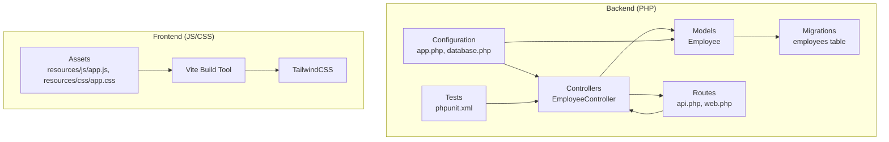
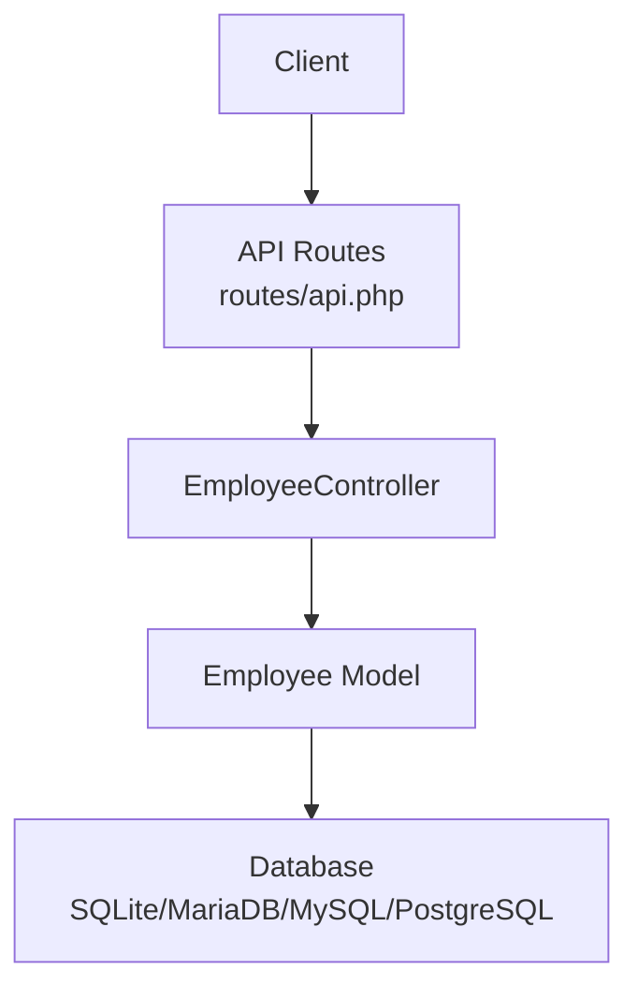
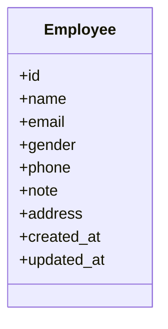
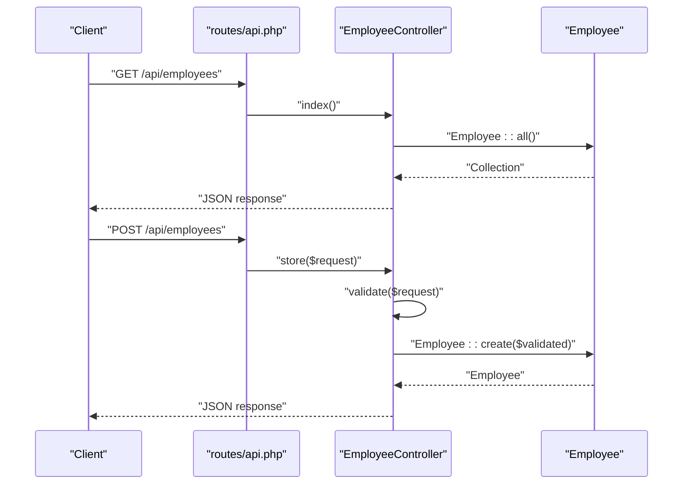
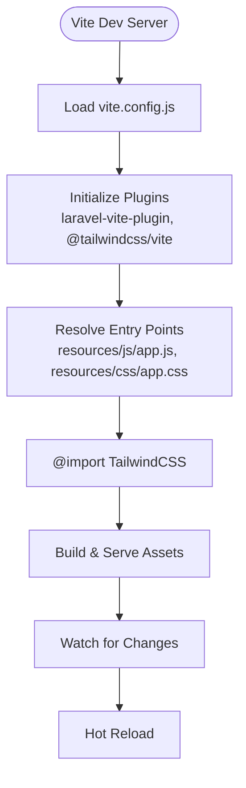
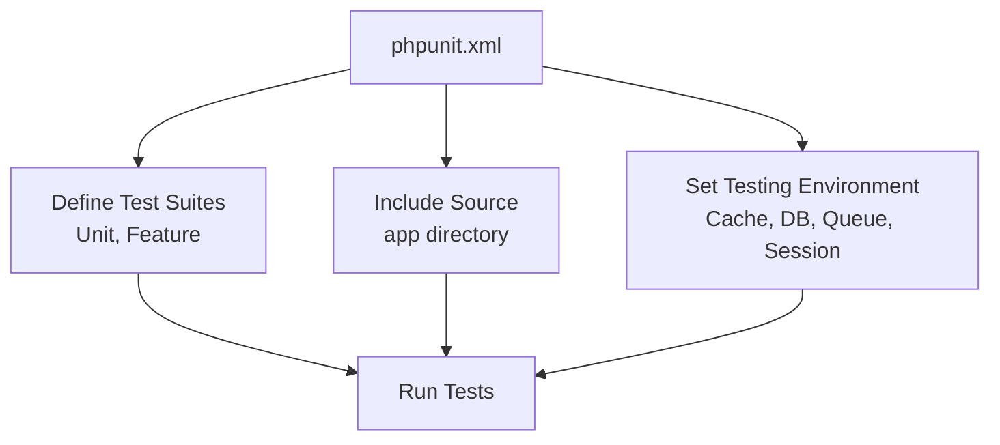
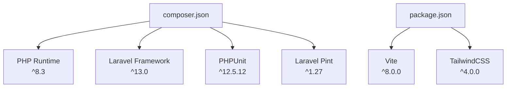

# Technology Stack & Dependencies

<cite>
**Referenced Files in This Document**
- [composer.json](file://composer.json)
- [package.json](file://package.json)
- [vite.config.js](file://vite.config.js)
- [phpunit.xml](file://phpunit.xml)
- [README.md](file://README.md)
- [bootstrap/app.php](file://bootstrap/app.php)
- [config/app.php](file://config/app.php)
- [config/database.php](file://config/database.php)
- [routes/api.php](file://routes/api.php)
- [routes/web.php](file://routes/web.php)
- [app/Http/Controllers/EmployeeController.php](file://app/Http/Controllers/EmployeeController.php)
- [app/Models/Employee.php](file://app/Models/Employee.php)
- [database/migrations/2026_04_11_134759_create_employees_table.php](file://database/migrations/2026_04_11_134759_create_employees_table.php)
- [resources/js/app.js](file://resources/js/app.js)
- [resources/css/app.css](file://resources/css/app.css)
</cite>

## Table of Contents
1. [Introduction](#introduction)
2. [Project Structure](#project-structure)
3. [Core Components](#core-components)
4. [Architecture Overview](#architecture-overview)
5. [Detailed Component Analysis](#detailed-component-analysis)
6. [Dependency Analysis](#dependency-analysis)
7. [Performance Considerations](#performance-considerations)
8. [Troubleshooting Guide](#troubleshooting-guide)
9. [Conclusion](#conclusion)

## Introduction
This document provides comprehensive technology stack documentation for the employees API project. It details the Laravel framework version (^13.0) and its core components, including Eloquent ORM, routing system, and middleware. It also covers PHP dependencies from composer.json, testing framework, and development tools; frontend dependencies from package.json including Vite, TailwindCSS, and build tools; and explains the role of each technology in the application architecture. Version compatibility requirements, development tools like Laravel Pint for code formatting, and testing framework PHPUnit are included. The document concludes with context on why these technologies were chosen and how they work together to create a robust API service.

## Project Structure
The project follows Laravel's standard structure with clear separation of concerns:
- Backend: PHP application built on Laravel ^13.0 with controllers, models, routes, configuration, migrations, and tests.
- Frontend: JavaScript and CSS assets managed via Vite with TailwindCSS integration.
- Configuration: Environment-driven configuration for application, database, and testing.

**Diagram sources**
- [routes/api.php:1-8](file://routes/api.php#L1-L8)
- [routes/web.php:1-8](file://routes/web.php#L1-L8)
- [app/Http/Controllers/EmployeeController.php:1-95](file://app/Http/Controllers/EmployeeController.php#L1-L95)
- [app/Models/Employee.php:1-18](file://app/Models/Employee.php#L1-L18)
- [config/app.php:1-127](file://config/app.php#L1-L127)
- [config/database.php:1-185](file://config/database.php#L1-L185)
- [database/migrations/2026_04_11_134759_create_employees_table.php:1-34](file://database/migrations/2026_04_11_134759_create_employees_table.php#L1-L34)
- [resources/js/app.js:1-2](file://resources/js/app.js#L1-L2)
- [resources/css/app.css:1-12](file://resources/css/app.css#L1-L12)

**Section sources**
- [README.md:10-22](file://README.md#L10-L22)
- [bootstrap/app.php:1-19](file://bootstrap/app.php#L1-L19)
- [config/app.php:1-127](file://config/app.php#L1-L127)
- [config/database.php:1-185](file://config/database.php#L1-L185)

## Core Components
- Laravel Framework (^13.0): Provides the MVC foundation, routing, middleware, service container, and Eloquent ORM.
- Eloquent ORM: Object-relational mapping for database interactions, used by the Employee model.
- Routing System: Declares API endpoints and web routes, enabling request-to-controller mapping.
- Middleware: Framework hook for cross-cutting concerns; configured via bootstrap/app.php.
- Testing Framework: PHPUnit integrated with Laravel testing helpers and phpunit.xml configuration.
- Development Tools: Laravel Pint for code formatting, Faker for fixtures, and Laravel Pail for log viewing.

Key implementation references:
- Laravel configuration and routing bootstrap: [bootstrap/app.php:1-19](file://bootstrap/app.php#L1-L19)
- API routes definition: [routes/api.php:1-8](file://routes/api.php#L1-L8)
- Web routes definition: [routes/web.php:1-8](file://routes/web.php#L1-L8)
- Employee controller actions: [app/Http/Controllers/EmployeeController.php:1-95](file://app/Http/Controllers/EmployeeController.php#L1-L95)
- Employee model fillable attributes: [app/Models/Employee.php:1-18](file://app/Models/Employee.php#L1-L18)
- Employees table migration: [database/migrations/2026_04_11_134759_create_employees_table.php:1-34](file://database/migrations/2026_04_11_134759_create_employees_table.php#L1-L34)
- PHPUnit configuration: [phpunit.xml:1-37](file://phpunit.xml#L1-L37)

**Section sources**
- [composer.json:8-20](file://composer.json#L8-L20)
- [bootstrap/app.php:7-18](file://bootstrap/app.php#L7-L18)
- [routes/api.php:6-7](file://routes/api.php#L6-L7)
- [app/Http/Controllers/EmployeeController.php:13-77](file://app/Http/Controllers/EmployeeController.php#L13-L77)
- [app/Models/Employee.php:9-16](file://app/Models/Employee.php#L9-L16)
- [database/migrations/2026_04_11_134759_create_employees_table.php:14-23](file://database/migrations/2026_04_11_134759_create_employees_table.php#L14-L23)
- [phpunit.xml:7-19](file://phpunit.xml#L7-L19)

## Architecture Overview
The application follows a layered architecture:
- Presentation Layer: Web and API routes define entry points.
- Application Layer: Controllers handle requests, validate input, and orchestrate domain logic.
- Domain Layer: Eloquent models encapsulate entity state and business rules.
- Infrastructure Layer: Database configuration and migrations define persistence.

**Diagram sources**
- [routes/api.php:6-7](file://routes/api.php#L6-L7)
- [app/Http/Controllers/EmployeeController.php:13-77](file://app/Http/Controllers/EmployeeController.php#L13-L77)
- [app/Models/Employee.php:7-17](file://app/Models/Employee.php#L7-L17)
- [config/database.php:20](file://config/database.php#L20)

**Section sources**
- [routes/api.php:1-8](file://routes/api.php#L1-L8)
- [app/Http/Controllers/EmployeeController.php:1-95](file://app/Http/Controllers/EmployeeController.php#L1-L95)
- [config/database.php:33-116](file://config/database.php#L33-L116)

## Detailed Component Analysis

### Laravel Framework and Core Components
- Framework Version: Laravel ^13.0 provides modern PHP features, routing, middleware, and Eloquent ORM.
- Routing System: Declares GET/POST/PUT/DELETE endpoints and supports resource routing for employees.
- Middleware: Configured via bootstrap/app.php; currently empty but extensible.
- Configuration: Environment-driven settings for application name, debug mode, URL, timezone, encryption, and maintenance mode.

Implementation references:
- Bootstrap configuration: [bootstrap/app.php:7-18](file://bootstrap/app.php#L7-L18)
- Application settings: [config/app.php:16-124](file://config/app.php#L16-L124)
- API routes: [routes/api.php:6-7](file://routes/api.php#L6-L7)

**Section sources**
- [composer.json:10](file://composer.json#L10)
- [bootstrap/app.php:7-18](file://bootstrap/app.php#L7-L18)
- [config/app.php:16-124](file://config/app.php#L16-L124)
- [routes/api.php:6-7](file://routes/api.php#L6-L7)

### Eloquent ORM and Database Layer
- Employee Model: Defines fillable attributes for mass assignment protection and interacts with the employees table.
- Database Configuration: Supports SQLite, MySQL, MariaDB, PostgreSQL, and SQL Server with environment variables.
- Migration: Creates the employees table with required fields and timestamps.

**Diagram sources**
- [app/Models/Employee.php:7-17](file://app/Models/Employee.php#L7-L17)
- [database/migrations/2026_04_11_134759_create_employees_table.php:14-23](file://database/migrations/2026_04_11_134759_create_employees_table.php#L14-L23)

**Section sources**
- [app/Models/Employee.php:1-18](file://app/Models/Employee.php#L1-L18)
- [config/database.php:33-116](file://config/database.php#L33-L116)
- [database/migrations/2026_04_11_134759_create_employees_table.php:1-34](file://database/migrations/2026_04_11_134759_create_employees_table.php#L1-L34)

### Routing and Controller Layer
- API Resource Routes: Generated via apiResource for standard CRUD operations.
- Search Endpoint: Custom GET endpoint for employee search by name, email, or phone.
- Validation and Responses: Controller validates input and returns JSON responses with appropriate HTTP status codes.

**Diagram sources**
- [routes/api.php:6-7](file://routes/api.php#L6-L7)
- [app/Http/Controllers/EmployeeController.php:13-33](file://app/Http/Controllers/EmployeeController.php#L13-L33)
- [app/Models/Employee.php:7-17](file://app/Models/Employee.php#L7-L17)

**Section sources**
- [routes/api.php:6-7](file://routes/api.php#L6-L7)
- [app/Http/Controllers/EmployeeController.php:13-77](file://app/Http/Controllers/EmployeeController.php#L13-L77)

### Frontend Build Pipeline
- Vite Configuration: Integrates Laravel Vite Plugin and TailwindCSS plugin, watching for asset changes.
- Asset Entry Points: resources/js/app.js and resources/css/app.css.
- TailwindCSS: Configured with @import and theme customization.

**Diagram sources**
- [vite.config.js:1-19](file://vite.config.js#L1-L19)
- [resources/js/app.js:1-2](file://resources/js/app.js#L1-L2)
- [resources/css/app.css:1-12](file://resources/css/app.css#L1-L12)

**Section sources**
- [vite.config.js:1-19](file://vite.config.js#L1-L19)
- [package.json:5-16](file://package.json#L5-L16)
- [resources/js/app.js:1-2](file://resources/js/app.js#L1-L2)
- [resources/css/app.css:1-12](file://resources/css/app.css#L1-L12)

### Testing Framework and PHPUnit
- Test Suites: Unit and Feature test suites configured in phpunit.xml.
- Source Inclusion: Includes the app directory for coverage.
- Environment Settings: Testing-specific environment variables for cache, database, queues, sessions, and telemetry toggles.

**Diagram sources**
- [phpunit.xml:7-19](file://phpunit.xml#L7-L19)
- [phpunit.xml:20-35](file://phpunit.xml#L20-L35)

**Section sources**
- [phpunit.xml:1-37](file://phpunit.xml#L1-L37)

## Dependency Analysis
- PHP Dependencies (composer.json):
  - Runtime: php (^8.3), laravel/framework (^13.0), laravel/tinker (^3.0)
  - Development: fakerphp/faker (^1.23), laravel/pail (^1.2.5), laravel/pint (^1.27), mockery/mockery (^1.6), nunomaduro/collision (^8.6), phpunit/phpunit (^12.5.12)
  - Autoload: PSR-4 namespaces for app, factories, seeders, and tests
  - Scripts: setup, dev, test, post-autoload-dump, post-update-cmd, post-root-package-install, pre-package-uninstall
- Frontend Dependencies (package.json):
  - Build: vite (^8.0.0), laravel-vite-plugin (^3.0.0)
  - Styling: tailwindcss (^4.0.0), @tailwindcss/vite (^4.0.0)
  - Networking: axios (>=1.11.0 <=1.14.0)
  - Concurrency: concurrently (^9.0.1)

**Diagram sources**
- [composer.json:8-20](file://composer.json#L8-L20)
- [composer.json:33-67](file://composer.json#L33-L67)
- [package.json:5-16](file://package.json#L5-L16)

**Section sources**
- [composer.json:8-20](file://composer.json#L8-L20)
- [composer.json:33-67](file://composer.json#L33-L67)
- [package.json:5-16](file://package.json#L5-L16)

## Performance Considerations
- Database Choice: SQLite is default for simplicity; production deployments should consider MySQL/MariaDB/PostgreSQL for scalability.
- Middleware Extensibility: Add caching, rate limiting, and logging middleware via bootstrap/app.php for improved performance and observability.
- Asset Pipeline: Vite provides fast development builds; ensure production builds optimize assets and enable caching.
- Testing Efficiency: Use in-memory SQLite during tests to speed up test execution, as configured in phpunit.xml.

[No sources needed since this section provides general guidance]

## Troubleshooting Guide
- Environment Setup: Use Composer scripts to initialize the environment and run migrations.
- Development Workflow: The dev script runs the Laravel server, queue listener, log viewer, and Vite concurrently.
- Testing Execution: Use the test script to run unit and feature tests with Laravel's test discovery.
- Database Connectivity: Verify database configuration in config/database.php and environment variables for the selected driver.

**Section sources**
- [composer.json:33-67](file://composer.json#L33-L67)
- [phpunit.xml:20-35](file://phpunit.xml#L20-L35)
- [config/database.php:20](file://config/database.php#L20)

## Conclusion
The employees API leverages Laravel ^13.0 for a robust backend foundation, Eloquent ORM for data modeling, and a concise routing system for API endpoints. The frontend pipeline integrates Vite and TailwindCSS for efficient asset management. Development tools like Laravel Pint and PHPUnit ensure code quality and test reliability. Together, these technologies form a cohesive stack that balances developer productivity, maintainability, and scalability for an API service.

[No sources needed since this section summarizes without analyzing specific files]