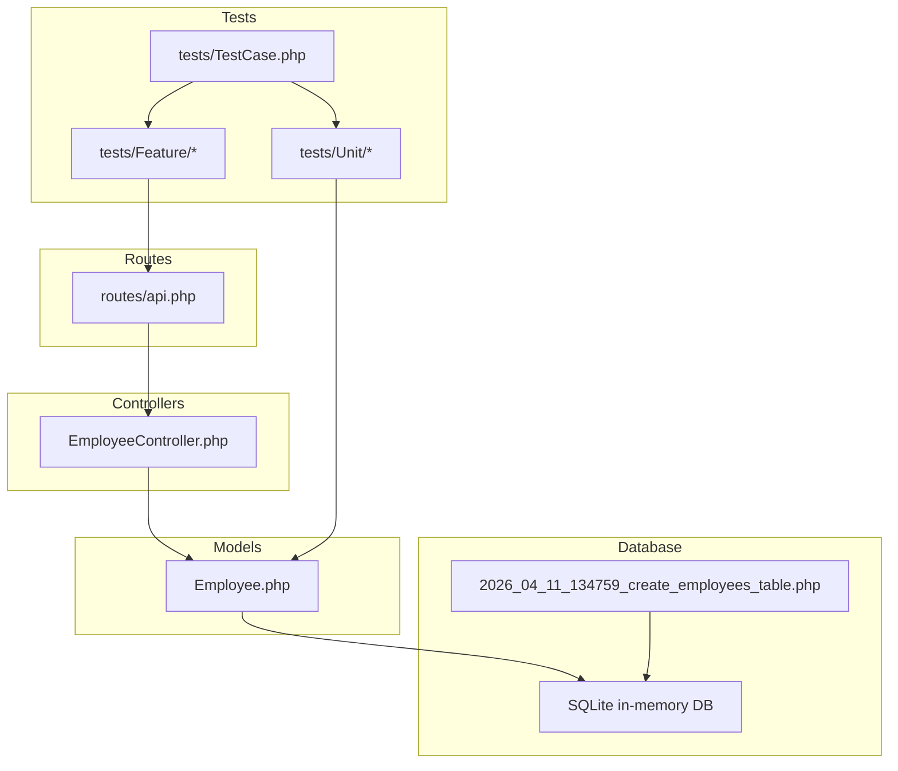
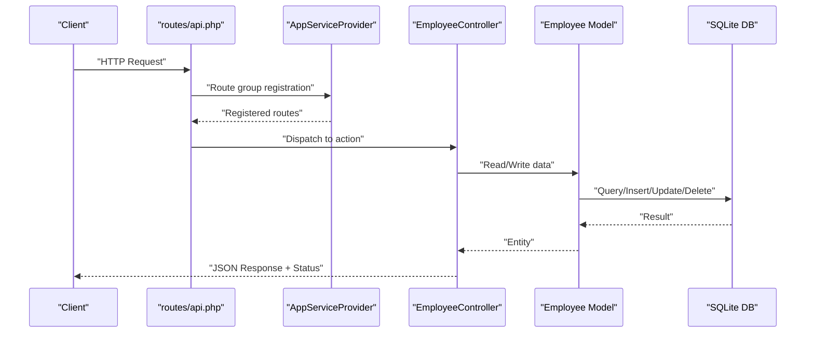
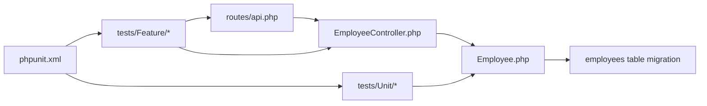

# Feature Testing

<cite>
**Referenced Files in This Document**
- [EmployeeController.php](file://app/Http/Controllers/EmployeeController.php)
- [api.php](file://routes/api.php)
- [AppServiceProvider.php](file://app/Providers/AppServiceProvider.php)
- [Employee.php](file://app/Models/Employee.php)
- [2026_04_11_134759_create_employees_table.php](file://database/migrations/2026_04_11_134759_create_employees_table.php)
- [UserFactory.php](file://database/factories/UserFactory.php)
- [DatabaseSeeder.php](file://database/seeders/DatabaseSeeder.php)
- [TestCase.php](file://tests/TestCase.php)
- [ExampleTest.php (Feature)](file://tests/Feature/ExampleTest.php)
- [ExampleTest.php (Unit)](file://tests/Unit/ExampleTest.php)
- [phpunit.xml](file://phpunit.xml)
- [composer.json](file://composer.json)
- [auth.php](file://config/auth.php)
</cite>

## Table of Contents
1. [Introduction](#introduction)
2. [Project Structure](#project-structure)
3. [Core Components](#core-components)
4. [Architecture Overview](#architecture-overview)
5. [Detailed Component Analysis](#detailed-component-analysis)
6. [Dependency Analysis](#dependency-analysis)
7. [Performance Considerations](#performance-considerations)
8. [Troubleshooting Guide](#troubleshooting-guide)
9. [Conclusion](#conclusion)
10. [Appendices](#appendices)

## Introduction
This document provides comprehensive feature testing guidance for end-to-end API testing and user workflow validation in a Laravel application. It focuses on validating complete request-response cycles, HTTP method testing, URL routing verification, response validation, and error handling for the EmployeeController API endpoints. It also covers request validation, response formatting, HTTP status code assertions, authentication requirements, parameter validation, data serialization, database interaction testing, transaction rollback strategies, test data management, real-world user scenarios, API contract validation, and Laravel-specific integration testing patterns.

## Project Structure
The application follows a standard Laravel layout with controllers, models, routes, migrations, factories, seeders, and tests. The API surface is defined under routes/api.php and orchestrated by the EmployeeController. The test suite is split into Feature and Unit suites, with phpunit.xml configuring the testing environment and database connection.



**Diagram sources**
- [api.php:1-8](file://routes/api.php#L1-L8)
- [EmployeeController.php:1-95](file://app/Http/Controllers/EmployeeController.php#L1-L95)
- [Employee.php:1-18](file://app/Models/Employee.php#L1-L18)
- [2026_04_11_134759_create_employees_table.php:1-34](file://database/migrations/2026_04_11_134759_create_employees_table.php#L1-L34)
- [TestCase.php:1-11](file://tests/TestCase.php#L1-L11)
- [phpunit.xml:1-37](file://phpunit.xml#L1-L37)

**Section sources**
- [api.php:1-8](file://routes/api.php#L1-L8)
- [EmployeeController.php:1-95](file://app/Http/Controllers/EmployeeController.php#L1-L95)
- [Employee.php:1-18](file://app/Models/Employee.php#L1-L18)
- [2026_04_11_134759_create_employees_table.php:1-34](file://database/migrations/2026_04_11_134759_create_employees_table.php#L1-L34)
- [TestCase.php:1-11](file://tests/TestCase.php#L1-L11)
- [phpunit.xml:1-37](file://phpunit.xml#L1-L37)

## Core Components
- EmployeeController: Implements index, store, show, update, destroy, and search endpoints. It validates inputs using the request object’s validate method and returns model instances or JSON responses with appropriate HTTP status codes.
- Routes: Declares API endpoints for employees resource and a dedicated search endpoint.
- Model: Defines fillable attributes for mass assignment protection and interacts with the employees table.
- Database: Employees table migration defines schema and uniqueness constraints.
- Tests: Feature and Unit test suites with phpunit.xml configuring SQLite in-memory database and environment variables for testing.

Key testing areas:
- HTTP method coverage: GET, POST, PATCH/PUT, DELETE
- URL routing verification: apiResource and explicit search route
- Response validation: JSON body shape, HTTP status codes, pagination (if applicable)
- Error handling: 404 for missing resources, 400 for invalid search query, validation errors
- Request validation: Required fields, formats, uniqueness, enums
- Response formatting: Current raw model returns; recommended API Resource for controlled output
- Authentication: Not enforced by default; can be added via middleware or guards
- Transaction rollback: Use RefreshDatabase or DatabaseTransactions traits in Feature tests
- Test data management: Factories and seeders for deterministic datasets

**Section sources**
- [EmployeeController.php:13-92](file://app/Http/Controllers/EmployeeController.php#L13-L92)
- [api.php:6-7](file://routes/api.php#L6-L7)
- [Employee.php:9-16](file://app/Models/Employee.php#L9-L16)
- [2026_04_11_134759_create_employees_table.php:14-22](file://database/migrations/2026_04_11_134759_create_employees_table.php#L14-L22)
- [phpunit.xml:20-35](file://phpunit.xml#L20-L35)

## Architecture Overview
The API request lifecycle flows from routes to the EmployeeController, which delegates to the Employee model for persistence and returns JSON responses. The testing architecture leverages Laravel’s ApplicationServiceProvider to register API routes and the Feature/Unit test harnesses.



**Diagram sources**
- [api.php:1-8](file://routes/api.php#L1-L8)
- [AppServiceProvider.php:23-25](file://app/Providers/AppServiceProvider.php#L23-L25)
- [EmployeeController.php:13-92](file://app/Http/Controllers/EmployeeController.php#L13-L92)
- [Employee.php:1-18](file://app/Models/Employee.php#L1-L18)
- [2026_04_11_134759_create_employees_table.php:14-22](file://database/migrations/2026_04_11_134759_create_employees_table.php#L14-L22)

## Detailed Component Analysis

### EmployeeController Endpoints
Endpoints and behaviors:
- GET /api/employees: Returns all employees. Current implementation returns raw model collection; recommended to return paginated API Resource.
- POST /api/employees: Validates and creates a new employee; returns created entity.
- GET /api/employees/{id}: Returns a single employee or 404 if not found.
- PUT/PATCH /api/employees/{id}: Validates partial updates; returns updated entity or 404 if not found.
- DELETE /api/employees/{id}: Deletes an employee and returns a success message or 404 if not found.
- GET /api/employees/search?q={query}: Searches by name, email, or phone; returns 400 if query is missing.

Validation rules:
- store: name, email (unique), gender enum, phone, optional note, required address.
- update: fields are optional but required when present; email uniqueness excludes current record.

Error handling:
- Missing employee ID yields 404 with JSON message.
- Missing search query yields 400 with JSON message.

```mermaid
flowchart TD
Start(["Request Received"]) --> Method{"HTTP Method"}
Method --> |GET /employees| Index["Index: fetch all"]
Method --> |POST /employees| Store["Store: validate + create"]
Method --> |GET /employees/{id}| Show["Show: find by id"]
Method --> |PATCH/PUT /employees/{id}| Update["Update: find + validate + save"]
Method --> |DELETE /employees/{id}| Destroy["Destroy: find + delete"]
Method --> |GET /employees/search?q=...| Search["Search: validate query + filter"]
Index --> ReturnIndex["Return JSON"]
Store --> ValidStore{"Validation OK?"}
ValidStore --> |No| Return422["Return 422 with errors"]
ValidStore --> |Yes| Return201["Return 201 + created"]
Show --> FoundShow{"Found?"}
FoundShow --> |No| Return404A["Return 404 JSON"]
FoundShow --> |Yes| Return200A["Return JSON"]
Update --> ValidUpdate{"Validation OK?"}
ValidUpdate --> |No| Return422
ValidUpdate --> |Yes| Return200B["Return JSON"]
Destroy --> FoundDel{"Found?"}
FoundDel --> |No| Return404B["Return 404 JSON"]
FoundDel --> |Yes| Return200C["Return success JSON"]
Search --> HasQ{"Has q?"}
HasQ --> |No| Return400["Return 400 JSON"]
HasQ --> |Yes| ReturnResults["Return filtered JSON"]
```

**Diagram sources**
- [EmployeeController.php:13-92](file://app/Http/Controllers/EmployeeController.php#L13-L92)

**Section sources**
- [EmployeeController.php:13-92](file://app/Http/Controllers/EmployeeController.php#L13-L92)

### Routing and URL Verification
- Resource routes: Generated via apiResource for employees, covering index, store, show, update, destroy.
- Search route: Explicit GET /api/employees/search mapped to the search method.

Testing checklist:
- Verify base path and prefix resolution via AppServiceProvider route group registration.
- Confirm HTTP verbs align with REST semantics.
- Validate URL patterns match controller actions.

**Section sources**
- [api.php:6-7](file://routes/api.php#L6-L7)
- [AppServiceProvider.php:23-25](file://app/Providers/AppServiceProvider.php#L23-L25)

### Request Validation and Parameter Constraints
Validation coverage:
- Required fields: name, email, gender, phone, address.
- Unique constraint: email uniqueness enforced.
- Enum constraint: gender restricted to predefined values.
- Optional field: note.
- Search query: required for search endpoint.

Testing guidance:
- Positive cases: Provide valid combinations of required fields.
- Negative cases: Omit required fields, provide invalid formats, duplicate email, invalid gender, missing search query.
- Assert validation error shapes and 422 status codes.

**Section sources**
- [EmployeeController.php:23-30](file://app/Http/Controllers/EmployeeController.php#L23-L30)
- [EmployeeController.php:52-60](file://app/Http/Controllers/EmployeeController.php#L52-L60)
- [EmployeeController.php:82-84](file://app/Http/Controllers/EmployeeController.php#L82-L84)

### Response Formatting and Serialization
Current behavior:
- Raw Eloquent model instances returned as JSON.
- JSON messages for error responses.

Recommended improvements:
- Use API Resource to normalize response shape, control exposure of fields, and ensure consistent serialization.
- Apply proper HTTP status codes: 201 for creation, 200 otherwise, 404 for not found, 400 for bad request, 422 for validation errors.

Testing guidance:
- Assert JSON structure and presence of keys.
- Assert HTTP status codes per scenario.
- Compare against a documented API contract.

**Section sources**
- [EmployeeController.php:15-15](file://app/Http/Controllers/EmployeeController.php#L15-L15)
- [EmployeeController.php:31-31](file://app/Http/Controllers/EmployeeController.php#L31-L31)
- [EmployeeController.php:40-40](file://app/Http/Controllers/EmployeeController.php#L40-L40)
- [EmployeeController.php:62-62](file://app/Http/Controllers/EmployeeController.php#L62-L62)
- [EmployeeController.php:76-76](file://app/Http/Controllers/EmployeeController.php#L76-L76)

### Error Handling Scenarios
Common failure modes:
- Not found: show, update, destroy on non-existent ID.
- Bad request: search without query parameter.
- Validation failures: invalid or missing fields.

Testing guidance:
- Trigger each failure mode and assert appropriate JSON message and HTTP status code.
- Ensure error responses are consistent and machine-parsable.

**Section sources**
- [EmployeeController.php:37-40](file://app/Http/Controllers/EmployeeController.php#L37-L40)
- [EmployeeController.php:49-52](file://app/Http/Controllers/EmployeeController.php#L49-L52)
- [EmployeeController.php:72-77](file://app/Http/Controllers/EmployeeController.php#L72-L77)
- [EmployeeController.php:82-84](file://app/Http/Controllers/EmployeeController.php#L82-L84)

### Authentication Requirements
Current configuration:
- Authentication guard and provider are defined in config/auth.php.
- No middleware enforcing authentication is applied to the EmployeeController routes.

Testing guidance:
- To require authentication, apply the desired guard middleware to routes or controller methods.
- Write tests that assert 401 Unauthorized when unauthenticated and 200/201/404 upon successful authentication.
- Use factories/seeders to provision users and simulate login if needed.

**Section sources**
- [auth.php:18-74](file://config/auth.php#L18-L74)

### Database Interaction Testing
Schema and constraints:
- Employees table includes unique email, enum gender, and nullable note.
- Timestamps are managed automatically.

Testing guidance:
- Use SQLite in-memory database configured in phpunit.xml for fast, isolated tests.
- Employ RefreshDatabase trait to rollback transactions after tests.
- Seed initial data using DatabaseSeeder and factories for deterministic scenarios.
- Validate persistence outcomes (existence, uniqueness, updates, deletions).

**Section sources**
- [2026_04_11_134759_create_employees_table.php:14-22](file://database/migrations/2026_04_11_134759_create_employees_table.php#L14-L22)
- [phpunit.xml:26-28](file://phpunit.xml#L26-L28)
- [DatabaseSeeder.php:16-24](file://database/seeders/DatabaseSeeder.php#L16-L24)
- [UserFactory.php:25-34](file://database/factories/UserFactory.php#L25-L34)

### Transaction Rollback Strategies
- RefreshDatabase trait: Resets the database after each test, ensuring isolation.
- DatabaseTransactions trait: Wraps tests in transactions rolled back afterward.
- Environment-driven: phpunit.xml sets DB_CONNECTION=sqlite and DB_DATABASE=:memory: for speed and isolation.

Best practices:
- Prefer RefreshDatabase for full reset semantics.
- Keep tests independent; avoid shared state.

**Section sources**
- [phpunit.xml:26-28](file://phpunit.xml#L26-L28)

### Test Data Management
- Factories: Generate realistic user data for seeding and test fixtures.
- Seeders: Populate initial dataset for predictable tests.
- Test harness: TestCase base class provides Laravel testing utilities.

Guidance:
- Use factories to create employees with varied attributes for robust testing.
- Combine seeders and factories to establish baseline data.

**Section sources**
- [UserFactory.php:25-34](file://database/factories/UserFactory.php#L25-L34)
- [DatabaseSeeder.php:16-24](file://database/seeders/DatabaseSeeder.php#L16-L24)
- [TestCase.php:7-10](file://tests/TestCase.php#L7-L10)

### Real-World User Scenarios
Typical workflows to test:
- Create an employee, then retrieve and update details, then search by name/email/phone, then delete.
- Attempt to create duplicates (unique email) and observe validation errors.
- Search with partial matches and verify filtering logic.
- Trigger not-found scenarios for update/delete operations.

Testing patterns:
- Arrange: Prepare test data via factories/seeders.
- Act: Issue HTTP requests to API endpoints.
- Assert: Validate status codes, JSON structure, and database state.

**Section sources**
- [EmployeeController.php:21-32](file://app/Http/Controllers/EmployeeController.php#L21-L32)
- [EmployeeController.php:34-41](file://app/Http/Controllers/EmployeeController.php#L34-L41)
- [EmployeeController.php:46-63](file://app/Http/Controllers/EmployeeController.php#L46-L63)
- [EmployeeController.php:69-77](file://app/Http/Controllers/EmployeeController.php#L69-L77)
- [EmployeeController.php:78-92](file://app/Http/Controllers/EmployeeController.php#L78-L92)

### API Contract Validation
Define expected contracts per endpoint:
- GET /api/employees: Array of employee objects with defined fields; pagination if implemented.
- POST /api/employees: Created employee object; 201 status.
- GET /api/employees/{id}: Single employee object; 200 status or 404.
- PATCH/PUT /api/employees/{id}: Updated employee object; 200 status or 404.
- DELETE /api/employees/{id}: Success message; 200 status or 404.
- GET /api/employees/search?q={query}: Array of matching employees; 200 status or 400.

Validation steps:
- Assert response shape and content-type.
- Compare actual vs expected schemas.
- Maintain a living contract document updated with tests.

**Section sources**
- [EmployeeController.php:13-92](file://app/Http/Controllers/EmployeeController.php#L13-L92)

### Integration Testing Patterns (Laravel)
Patterns to adopt:
- Feature tests for end-to-end flows using the application container and HTTP client.
- Unit tests for isolated logic (e.g., validation rules, helpers).
- Use of traits: RefreshDatabase, DatabaseTransactions, WithFaker.
- Environment isolation via phpunit.xml and sqlite in-memory database.

**Section sources**
- [ExampleTest.php (Feature):13-18](file://tests/Feature/ExampleTest.php#L13-L18)
- [ExampleTest.php (Unit):12-15](file://tests/Unit/ExampleTest.php#L12-L15)
- [phpunit.xml:20-35](file://phpunit.xml#L20-L35)

## Dependency Analysis
The following diagram shows key dependencies among components involved in API testing:



**Diagram sources**
- [api.php:1-8](file://routes/api.php#L1-L8)
- [EmployeeController.php:1-95](file://app/Http/Controllers/EmployeeController.php#L1-L95)
- [Employee.php:1-18](file://app/Models/Employee.php#L1-L18)
- [2026_04_11_134759_create_employees_table.php:1-34](file://database/migrations/2026_04_11_134759_create_employees_table.php#L1-L34)
- [phpunit.xml:1-37](file://phpunit.xml#L1-L37)

**Section sources**
- [api.php:1-8](file://routes/api.php#L1-L8)
- [EmployeeController.php:1-95](file://app/Http/Controllers/EmployeeController.php#L1-L95)
- [Employee.php:1-18](file://app/Models/Employee.php#L1-L18)
- [2026_04_11_134759_create_employees_table.php:1-34](file://database/migrations/2026_04_11_134759_create_employees_table.php#L1-L34)
- [phpunit.xml:1-37](file://phpunit.xml#L1-L37)

## Performance Considerations
- Use SQLite in-memory database for tests to minimize I/O overhead.
- Prefer RefreshDatabase for clean state; avoid excessive seeding in hot loops.
- Limit payload sizes in tests; focus on representative samples.
- Parallelize independent tests where feasible; keep database-bound tests serialized to prevent contention.

## Troubleshooting Guide
Common issues and resolutions:
- Database not reset between tests: Ensure RefreshDatabase trait is used in Feature tests.
- Unexpected 500 errors: Verify validation rules and route bindings; assert 422 for validation failures.
- Search endpoint returning empty: Confirm query parameter presence and LIKE pattern correctness.
- Authentication failures: Apply appropriate middleware and ensure test requests include credentials.

**Section sources**
- [phpunit.xml:26-28](file://phpunit.xml#L26-L28)
- [EmployeeController.php:82-84](file://app/Http/Controllers/EmployeeController.php#L82-L84)

## Conclusion
This guide outlines a comprehensive approach to feature testing for the EmployeeController API in Laravel. By validating request-response cycles, HTTP methods, routing, validation, error handling, and database interactions, teams can ensure reliable API behavior. Adopting API Resources, strict contracts, and robust test patterns improves maintainability and confidence in production deployments.

## Appendices

### Appendix A: Endpoint Reference
- GET /api/employees: List all employees
- POST /api/employees: Create an employee
- GET /api/employees/{id}: Retrieve an employee
- PATCH/PUT /api/employees/{id}: Update an employee
- DELETE /api/employees/{id}: Delete an employee
- GET /api/employees/search?q={query}: Search employees

**Section sources**
- [api.php:6-7](file://routes/api.php#L6-L7)
- [EmployeeController.php:13-92](file://app/Http/Controllers/EmployeeController.php#L13-L92)

### Appendix B: Test Environment Setup
- Database: SQLite in-memory via phpunit.xml
- Test suites: Feature and Unit directories
- Base class: TestCase for shared utilities

**Section sources**
- [phpunit.xml:7-14](file://phpunit.xml#L7-L14)
- [TestCase.php:7-10](file://tests/TestCase.php#L7-L10)