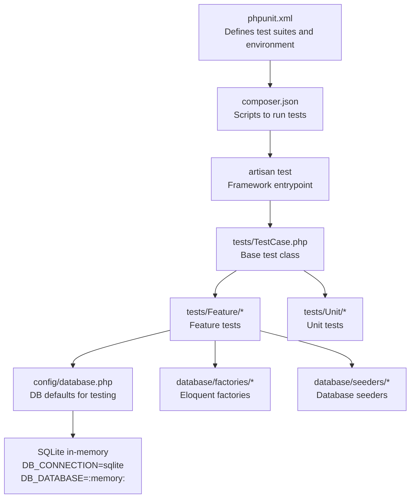
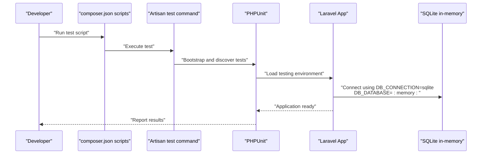
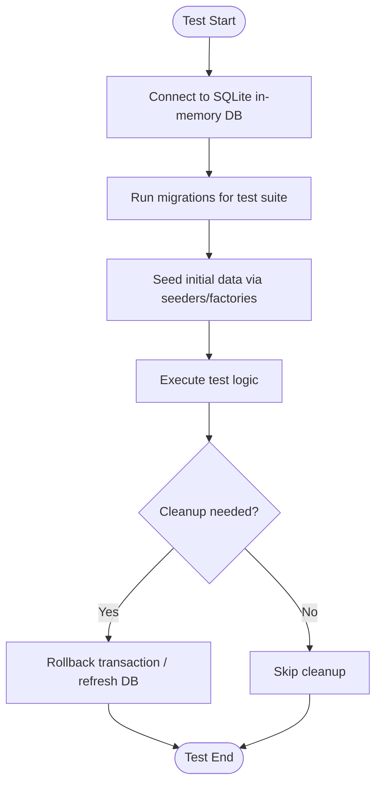
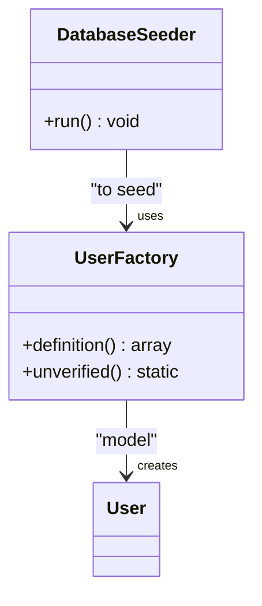
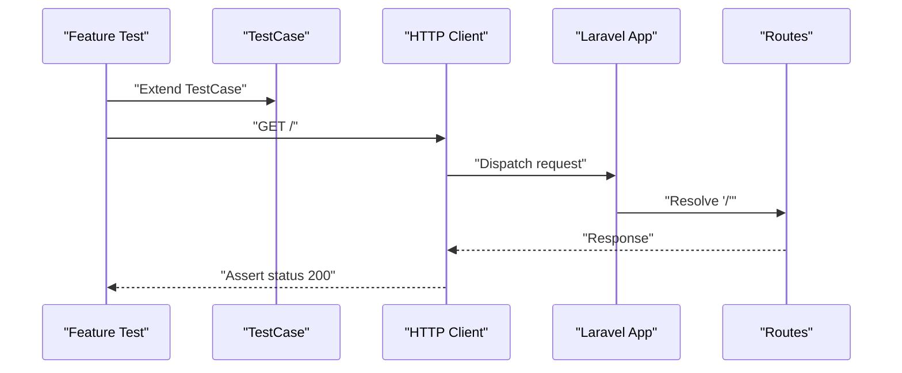
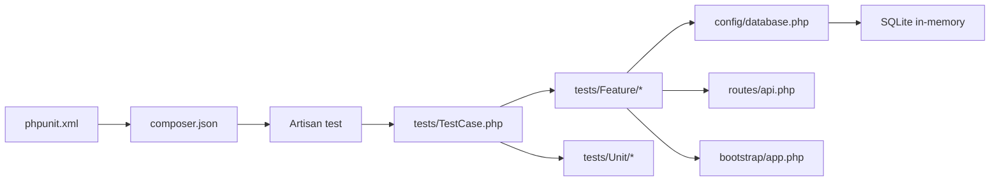

# Test Configuration & Setup

<cite>
**Referenced Files in This Document**
- [phpunit.xml](file://phpunit.xml)
- [TestCase.php](file://tests/TestCase.php)
- [composer.json](file://composer.json)
- [database.php](file://config/database.php)
- [UserFactory.php](file://database/factories/UserFactory.php)
- [DatabaseSeeder.php](file://database/seeders/DatabaseSeeder.php)
- [2026_04_11_134759_create_employees_table.php](file://database/migrations/2026_04_11_134759_create_employees_table.php)
- [ExampleTest.php (Feature)](file://tests/Feature/ExampleTest.php)
- [ExampleTest.php (Unit)](file://tests/Unit/ExampleTest.php)
- [app.php](file://bootstrap/app.php)
- [api.php](file://routes/api.php)
</cite>

## Table of Contents
1. [Introduction](#introduction)
2. [Project Structure](#project-structure)
3. [Core Components](#core-components)
4. [Architecture Overview](#architecture-overview)
5. [Detailed Component Analysis](#detailed-component-analysis)
6. [Dependency Analysis](#dependency-analysis)
7. [Performance Considerations](#performance-considerations)
8. [Troubleshooting Guide](#troubleshooting-guide)
9. [Conclusion](#conclusion)
10. [Appendices](#appendices)

## Introduction
This document explains how to configure and run tests in this Laravel project. It covers PHPUnit setup, environment configuration for testing, the base TestCase, database testing strategies, factories and seeders for test data, and practical guidance for test isolation, parallel execution, and CI setup. It also outlines how to enable coverage reporting and adopt reusable testing helpers.

## Project Structure
The testing setup centers around:
- PHPUnit configuration that defines test suites, source inclusion, and environment variables for the testing environment.
- A minimal base TestCase that extends Laravel’s framework testing support.
- Composer scripts to orchestrate test runs and environment preparation.
- Database configuration supporting SQLite in-memory testing by default.
- Factories and seeders for generating deterministic test data.
- Example unit and feature tests demonstrating common patterns.

**Diagram sources**
- [phpunit.xml:1-37](file://phpunit.xml#L1-L37)
- [composer.json:46-49](file://composer.json#L46-L49)
- [TestCase.php:1-11](file://tests/TestCase.php#L1-L11)
- [database.php:20-45](file://config/database.php#L20-L45)

**Section sources**
- [phpunit.xml:1-37](file://phpunit.xml#L1-L37)
- [composer.json:46-49](file://composer.json#L46-L49)
- [TestCase.php:1-11](file://tests/TestCase.php#L1-L11)

## Core Components
- PHPUnit configuration
  - Defines two test suites: Unit and Feature.
  - Includes the application source tree for coverage.
  - Sets environment variables for a fast, isolated testing environment (e.g., SQLite in-memory, array caches, sync queues).
- Base TestCase
  - Extends Laravel’s framework test case to inherit helpful testing traits and application bootstrapping.
- Composer scripts
  - Provides a standardized way to run tests via Artisan, clearing config cache first to ensure the testing environment is loaded.
- Database configuration for testing
  - Defaults to SQLite with an in-memory database for speed and isolation.
  - Foreign key constraints are enabled by default for integrity checks.
- Factories and seeders
  - Factories generate realistic model instances quickly.
  - Seeders prepare initial data for tests.

**Section sources**
- [phpunit.xml:7-19](file://phpunit.xml#L7-L19)
- [phpunit.xml:20-35](file://phpunit.xml#L20-L35)
- [TestCase.php:5-10](file://tests/TestCase.php#L5-L10)
- [composer.json:46-49](file://composer.json#L46-L49)
- [database.php:20-45](file://config/database.php#L20-L45)
- [UserFactory.php:13-45](file://database/factories/UserFactory.php#L13-L45)
- [DatabaseSeeder.php:9-25](file://database/seeders/DatabaseSeeder.php#L9-L25)

## Architecture Overview
The testing pipeline integrates PHPUnit, Laravel’s application container, and the configured database driver. Tests run against an in-memory SQLite database by default, ensuring isolation and speed.

**Diagram sources**
- [composer.json:46-49](file://composer.json#L46-L49)
- [phpunit.xml:2-6](file://phpunit.xml#L2-L6)
- [database.php:20-45](file://config/database.php#L20-L45)

## Detailed Component Analysis

### PHPUnit Configuration
- Test suites
  - Unit suite scans tests/Unit.
  - Feature suite scans tests/Feature.
- Source coverage
  - Includes app for coverage reporting.
- Environment overrides
  - Sets APP_ENV=testing and disables persistent services (cache, queue, mailers) for isolation.
  - Uses SQLite in-memory database for speed and isolation.

Recommended enhancements for coverage and parallelism:
- Add a coverage filter to exclude tests and third-party directories.
- Enable process isolation per test group if needed.
- Configure parallel execution using PHPUnit’s built-in mechanisms or CI matrix jobs.

**Section sources**
- [phpunit.xml:7-19](file://phpunit.xml#L7-L19)
- [phpunit.xml:20-35](file://phpunit.xml#L20-L35)

### Base TestCase
- Purpose
  - Provides a shared foundation for all tests, including Laravel’s application bootstrapping and HTTP/test helpers.
- Usage
  - Extend this class in both Unit and Feature tests to inherit common capabilities.

Best practices:
- Keep the base class minimal and additive.
- Add shared helpers (e.g., login helpers, data builders) as protected methods to reuse across tests.

**Section sources**
- [TestCase.php:5-10](file://tests/TestCase.php#L5-L10)
- [ExampleTest.php (Feature):8-19](file://tests/Feature/ExampleTest.php#L8-L19)
- [ExampleTest.php (Unit):7-16](file://tests/Unit/ExampleTest.php#L7-L16)

### Database Testing Strategies
- Default in-memory SQLite
  - DB_CONNECTION=sqlite and DB_DATABASE=:memory: ensure each test run starts with a clean slate.
- Migration execution during tests
  - Use Laravel’s RefreshDatabase trait in Feature tests to rollback and re-migrate the in-memory database between tests.
  - Alternatively, run migrations programmatically in setUp methods if you need more control.
- Data cleanup
  - Use transactions and rollbacks via RefreshDatabase or DatabaseTransactions.
  - For factories and seeders, rely on database transactions to keep tests isolated.

**Diagram sources**
- [database.php:20-45](file://config/database.php#L20-L45)
- [2026_04_11_134759_create_employees_table.php:7-33](file://database/migrations/2026_04_11_134759_create_employees_table.php#L7-L33)
- [DatabaseSeeder.php:16-24](file://database/seeders/DatabaseSeeder.php#L16-L24)

**Section sources**
- [database.php:20-45](file://config/database.php#L20-L45)
- [2026_04_11_134759_create_employees_table.php:7-33](file://database/migrations/2026_04_11_134759_create_employees_table.php#L7-L33)
- [DatabaseSeeder.php:16-24](file://database/seeders/DatabaseSeeder.php#L16-L24)

### Factories and Seeders
- Factories
  - Use Eloquent factories to generate model instances quickly and deterministically.
  - Customize default states and add common states (e.g., unverified) for varied scenarios.
- Seeders
  - Use seeders to populate initial data for tests.
  - Combine with factories to create realistic datasets.

**Diagram sources**
- [UserFactory.php:13-45](file://database/factories/UserFactory.php#L13-L45)
- [DatabaseSeeder.php:9-25](file://database/seeders/DatabaseSeeder.php#L9-L25)

**Section sources**
- [UserFactory.php:13-45](file://database/factories/UserFactory.php#L13-L45)
- [DatabaseSeeder.php:16-24](file://database/seeders/DatabaseSeeder.php#L16-L24)

### Example Tests
- Feature test
  - Demonstrates HTTP testing against the application root route and asserting a successful response.
- Unit test
  - Demonstrates a simple assertion within a PHPUnit test case.

**Diagram sources**
- [ExampleTest.php (Feature):8-19](file://tests/Feature/ExampleTest.php#L8-L19)
- [api.php:6-7](file://routes/api.php#L6-L7)
- [app.php:8-12](file://bootstrap/app.php#L8-L12)

**Section sources**
- [ExampleTest.php (Feature):8-19](file://tests/Feature/ExampleTest.php#L8-L19)
- [ExampleTest.php (Unit):7-16](file://tests/Unit/ExampleTest.php#L7-L16)

### Environment Variables for Testing
- Core overrides
  - APP_ENV=testing enables testing-specific behavior.
  - CACHE_STORE=array, QUEUE_CONNECTION=sync, MAIL_MAILER=array minimize external dependencies.
  - BROADCAST_CONNECTION=null and SESSION_DRIVER=array reduce overhead.
  - PULSE_ENABLED=false, TELESCOPE_ENABLED=false, NIGHTWATCH_ENABLED=false disable observability during tests.
- Database
  - DB_CONNECTION=sqlite and DB_DATABASE=:memory: set an in-memory SQLite database for speed and isolation.

Recommendations:
- Keep environment overrides minimal and explicit.
- Use .env.testing for local overrides if needed, but rely on phpunit.xml for CI consistency.

**Section sources**
- [phpunit.xml:20-35](file://phpunit.xml#L20-L35)
- [database.php:20-45](file://config/database.php#L20-L45)

### Test Coverage Reporting
- Enable coverage
  - Include the app directory in the source configuration.
  - Exclude tests and vendor directories in your coverage configuration.
- Generate reports
  - Use PHPUnit’s built-in coverage options or integrate with CI platforms to publish coverage artifacts.

Note: Add coverage configuration to your PHPUnit setup to produce reports.

**Section sources**
- [phpunit.xml:15-19](file://phpunit.xml#L15-L19)

### Parallel Test Execution
- PHPUnit parallelization
  - Use PHPUnit’s parallel runner or split suites across CI jobs.
- Suite separation
  - Keep Unit and Feature tests in separate suites to simplify parallelization and resource allocation.

Guidance:
- Run Unit tests in parallel first, then Feature tests to avoid heavy database contention.
- Use process isolation per suite if tests depend on global state.

**Section sources**
- [phpunit.xml:7-14](file://phpunit.xml#L7-L14)

### Continuous Integration Setup
- Steps
  - Install dependencies.
  - Prepare environment (key generation, migrations).
  - Run tests via the composer test script.
- Isolation
  - Ensure CI uses the testing environment and SQLite in-memory database.
- Artifacts
  - Publish coverage reports and test logs.

**Section sources**
- [composer.json:46-49](file://composer.json#L46-L49)
- [phpunit.xml:20-35](file://phpunit.xml#L20-L35)

### Reusable Test Helpers and Custom Assertions
- Helpers
  - Add shared helpers in the base TestCase (e.g., login helpers, data builders).
- Custom assertions
  - Extend PHPUnit assertions or use Laravel’s assertion helpers for HTTP responses and database checks.

Examples to consider:
- Assert JSON shape and pagination.
- Assert database counts and presence of records.
- Shared factories and seeders for common datasets.

**Section sources**
- [TestCase.php:5-10](file://tests/TestCase.php#L5-L10)
- [UserFactory.php:13-45](file://database/factories/UserFactory.php#L13-L45)
- [DatabaseSeeder.php:16-24](file://database/seeders/DatabaseSeeder.php#L16-L24)

## Dependency Analysis
- PHPUnit depends on phpunit.xml for configuration and Composer autoloading.
- Laravel’s application loads routing and middleware from bootstrap/app.php.
- Tests depend on the configured database connection and migrations.
- Factories and seeders depend on Eloquent models.

**Diagram sources**
- [phpunit.xml:2-6](file://phpunit.xml#L2-L6)
- [composer.json:46-49](file://composer.json#L46-L49)
- [TestCase.php:5-10](file://tests/TestCase.php#L5-L10)
- [database.php:20-45](file://config/database.php#L20-L45)
- [api.php:6-7](file://routes/api.php#L6-L7)
- [app.php:8-12](file://bootstrap/app.php#L8-L12)

**Section sources**
- [phpunit.xml:2-6](file://phpunit.xml#L2-L6)
- [composer.json:46-49](file://composer.json#L46-L49)
- [TestCase.php:5-10](file://tests/TestCase.php#L5-L10)
- [database.php:20-45](file://config/database.php#L20-L45)
- [api.php:6-7](file://routes/api.php#L6-L7)
- [app.php:8-12](file://bootstrap/app.php#L8-L12)

## Performance Considerations
- Prefer SQLite in-memory for tests to avoid disk I/O.
- Use array-backed cache and sync queues to eliminate external dependencies.
- Keep test suites small and focused; use targeted migrations for each test class.
- Avoid unnecessary model factories in loops; batch creation where possible.

[No sources needed since this section provides general guidance]

## Troubleshooting Guide
- Tests fail to connect to the database
  - Verify DB_CONNECTION=sqlite and DB_DATABASE=:memory: are applied in the testing environment.
- Migrations not applied in tests
  - Ensure migrations are executed before tests run (e.g., via RefreshDatabase or programmatic migration calls).
- Slow tests
  - Confirm cache and queue drivers are array/sync and broadcast/session drivers are disabled for testing.
- Coverage not generated
  - Ensure the app directory is included in the source configuration and coverage filters exclude tests/vendor.

**Section sources**
- [phpunit.xml:20-35](file://phpunit.xml#L20-L35)
- [database.php:20-45](file://config/database.php#L20-L45)

## Conclusion
This project provides a solid, fast, and isolated testing foundation using PHPUnit and Laravel’s framework testing support. By leveraging SQLite in-memory databases, factories, and seeders, you can write reliable unit and feature tests. Use the composer test script to standardize test runs, and extend the base TestCase with reusable helpers and custom assertions to streamline development.

[No sources needed since this section summarizes without analyzing specific files]

## Appendices
- Example test files
  - Feature test: [ExampleTest.php (Feature):8-19](file://tests/Feature/ExampleTest.php#L8-L19)
  - Unit test: [ExampleTest.php (Unit):7-16](file://tests/Unit/ExampleTest.php#L7-L16)
- Additional database configuration
  - Database connections: [database.php:33-117](file://config/database.php#L33-L117)
  - Employees table migration: [2026_04_11_134759_create_employees_table.php:7-33](file://database/migrations/2026_04_11_134759_create_employees_table.php#L7-L33)