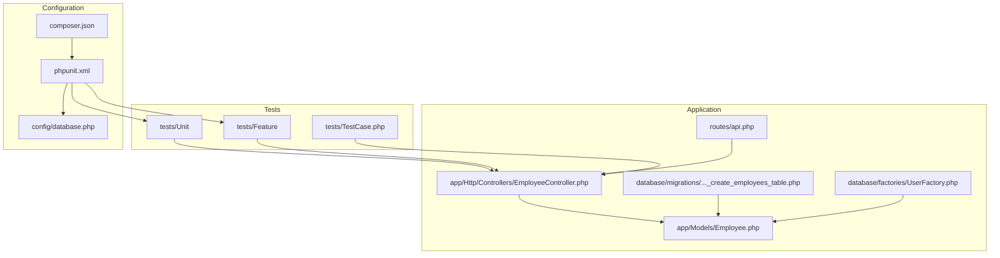
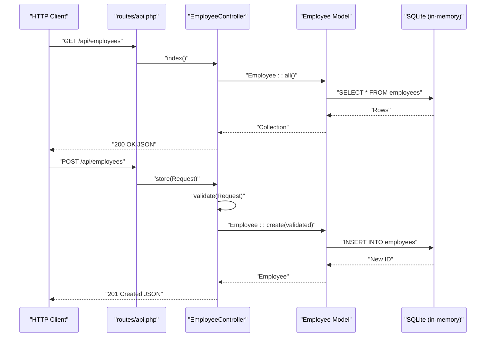
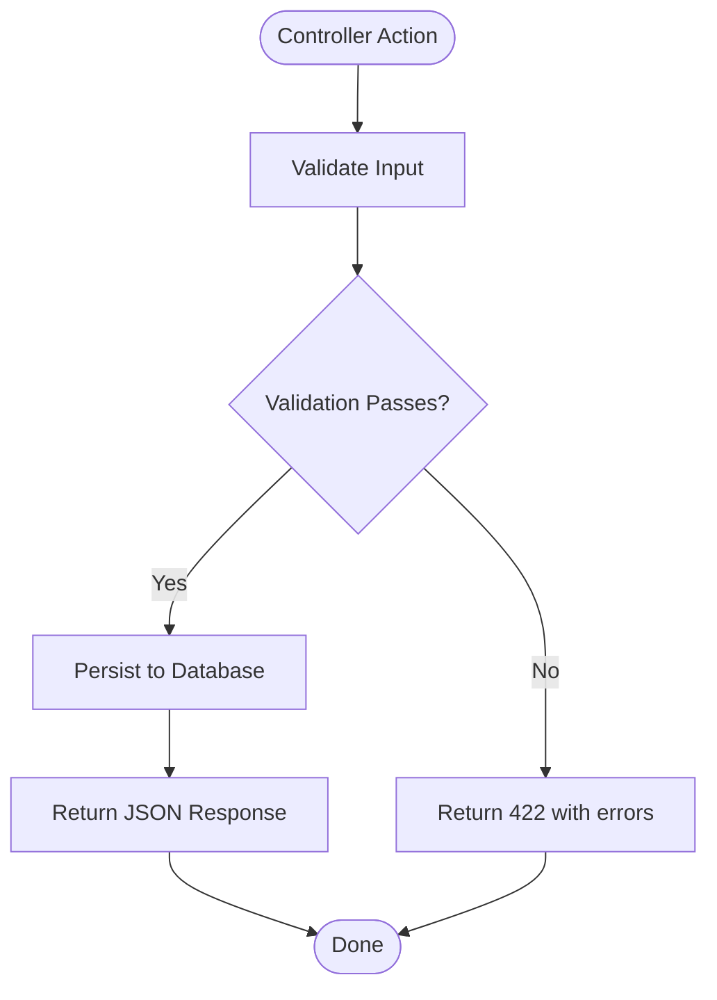
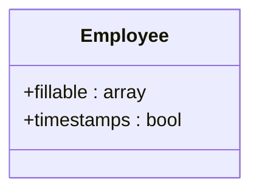
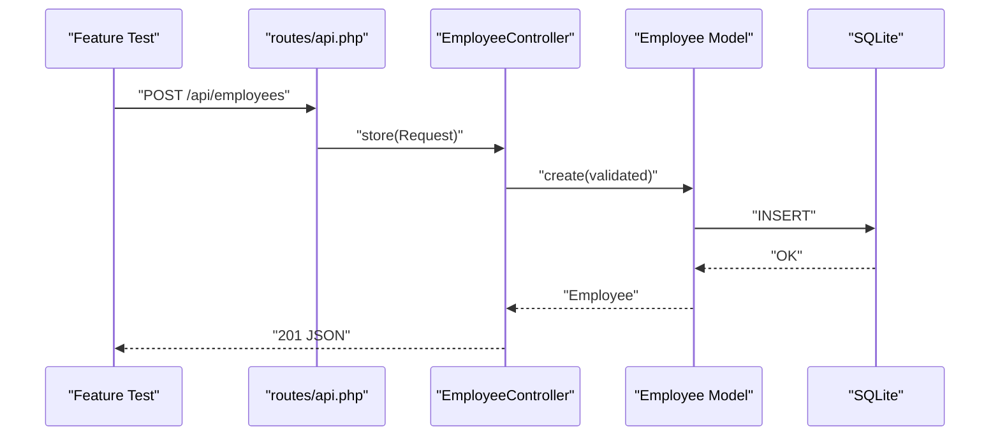
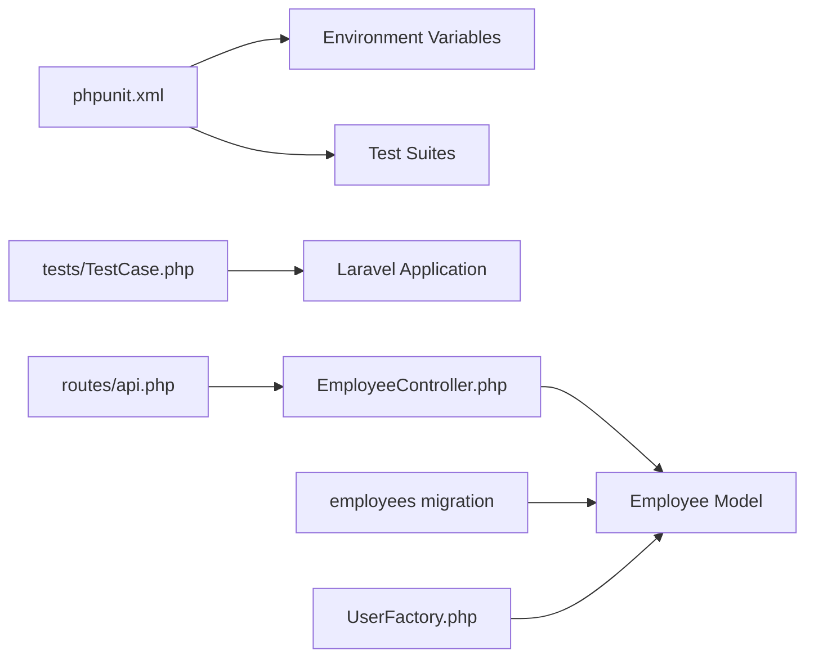

# Testing Strategy

<cite>
**Referenced Files in This Document**
- [phpunit.xml](file://phpunit.xml)
- [TestCase.php](file://tests/TestCase.php)
- [ExampleTest.php (Unit)](file://tests/Unit/ExampleTest.php)
- [ExampleTest.php (Feature)](file://tests/Feature/ExampleTest.php)
- [EmployeeController.php](file://app/Http/Controllers/EmployeeController.php)
- [Employee.php](file://app/Models/Employee.php)
- [api.php](file://routes/api.php)
- [2026_04_11_134759_create_employees_table.php](file://database/migrations/2026_04_11_134759_create_employees_table.php)
- [UserFactory.php](file://database/factories/UserFactory.php)
- [composer.json](file://composer.json)
- [database.php](file://config/database.php)
- [BACKEND_ROADMAP.md](file://BACKEND_ROADMAP.md)
</cite>

## Table of Contents
1. [Introduction](#introduction)
2. [Project Structure](#project-structure)
3. [Core Components](#core-components)
4. [Architecture Overview](#architecture-overview)
5. [Detailed Component Analysis](#detailed-component-analysis)
6. [Dependency Analysis](#dependency-analysis)
7. [Performance Considerations](#performance-considerations)
8. [Troubleshooting Guide](#troubleshooting-guide)
9. [Conclusion](#conclusion)
10. [Appendices](#appendices)

## Introduction
This document provides a comprehensive testing strategy for the employees API project. It covers unit and feature testing approaches, PHPUnit configuration, test case structure, and best practices tailored for Laravel and RESTful API development. It also explains how to test controllers, models, and API endpoints, including CRUD operations, validation scenarios, and error conditions. Guidance is included on test data generation via factories, database testing strategies, mocking techniques, continuous integration setup, test automation, and code coverage analysis.

## Project Structure
The testing setup follows Laravel conventions:
- Unit tests live under tests/Unit
- Feature tests live under tests/Feature
- A shared base TestCase extends Laravel’s base testing class
- PHPUnit configuration defines test suites, environment variables, and source inclusion

**Diagram sources**
- [phpunit.xml:1-37](file://phpunit.xml#L1-L37)
- [TestCase.php:1-11](file://tests/TestCase.php#L1-L11)
- [EmployeeController.php:1-95](file://app/Http/Controllers/EmployeeController.php#L1-L95)
- [Employee.php:1-18](file://app/Models/Employee.php#L1-L18)
- [api.php:1-8](file://routes/api.php#L1-L8)
- [2026_04_11_134759_create_employees_table.php:1-34](file://database/migrations/2026_04_11_134759_create_employees_table.php#L1-L34)
- [UserFactory.php:1-46](file://database/factories/UserFactory.php#L1-L46)
- [composer.json:1-86](file://composer.json#L1-L86)
- [database.php:1-185](file://config/database.php#L1-L185)

**Section sources**
- [phpunit.xml:1-37](file://phpunit.xml#L1-L37)
- [TestCase.php:1-11](file://tests/TestCase.php#L1-L11)
- [composer.json:1-86](file://composer.json#L1-L86)

## Core Components
- PHPUnit configuration defines:
  - Test suites for Unit and Feature
  - Environment variables optimized for testing (SQLite in-memory database, array caches, sync queues, etc.)
  - Source inclusion for coverage reporting
- Shared base TestCase provides Laravel application bootstrapping for all tests
- Application components under test:
  - EmployeeController exposes REST endpoints for CRUD and search
  - Employee model defines fillable attributes and Eloquent behavior
  - Routes register API endpoints for employees and search

Key testing implications:
- SQLite in-memory database ensures fast, isolated tests without external dependencies
- Array cache and session drivers simplify stateless testing
- Sync queue driver avoids async complexity during tests

**Section sources**
- [phpunit.xml:7-35](file://phpunit.xml#L7-L35)
- [TestCase.php:7-10](file://tests/TestCase.php#L7-L10)
- [EmployeeController.php:13-92](file://app/Http/Controllers/EmployeeController.php#L13-L92)
- [Employee.php:9-16](file://app/Models/Employee.php#L9-L16)
- [api.php:6-7](file://routes/api.php#L6-L7)

## Architecture Overview
The testing architecture leverages Laravel’s built-in testing traits and helpers to drive HTTP requests against the EmployeeController and assert responses. The database is managed via migrations executed in the testing environment.

**Diagram sources**
- [api.php:6-7](file://routes/api.php#L6-L7)
- [EmployeeController.php:13-33](file://app/Http/Controllers/EmployeeController.php#L13-L33)
- [Employee.php:9-16](file://app/Models/Employee.php#L9-L16)
- [phpunit.xml:26-27](file://phpunit.xml#L26-L27)

## Detailed Component Analysis

### PHPUnit Configuration and Test Suites
- Test suites:
  - Unit: tests/Unit
  - Feature: tests/Feature
- Source coverage:
  - Includes app directory for coverage analysis
- Environment variables:
  - APP_ENV set to testing
  - DB_CONNECTION set to sqlite with DB_DATABASE as in-memory target
  - CACHE_STORE, QUEUE_CONNECTION, SESSION_DRIVER set to in-memory/sync variants
  - Telemetry and observability disabled for clean test runs

Best practices derived from configuration:
- Keep tests isolated using in-memory databases
- Use array stores for cache and sessions to avoid cross-test interference
- Disable telemetry to reduce noise and speed up tests

**Section sources**
- [phpunit.xml:7-19](file://phpunit.xml#L7-L19)
- [phpunit.xml:20-35](file://phpunit.xml#L20-L35)

### Base Test Case
- Extends Laravel’s base TestCase to benefit from application bootstrapping, HTTP client, and database testing helpers
- Provides a foundation for both unit and feature tests

Usage tips:
- Extend this base class in all tests
- Use $this->get(), $this->post(), etc., for HTTP assertions in feature tests

**Section sources**
- [TestCase.php:7-10](file://tests/TestCase.php#L7-L10)

### EmployeeController Testing Strategy
Controller responsibilities:
- index(): returns all employees
- store(): validates input and creates employee
- show(): retrieves employee by ID or returns 404
- update(): validates partial input and updates employee
- destroy(): deletes employee and returns success message
- search(): filters employees by name, email, or phone

Recommended test categories:
- Unit tests for validation logic and model interactions
- Feature tests for HTTP endpoints and response assertions
- Edge-case tests for invalid IDs, missing query parameters, and constraint violations

**Diagram sources**
- [EmployeeController.php:23-30](file://app/Http/Controllers/EmployeeController.php#L23-L30)
- [EmployeeController.php:48-62](file://app/Http/Controllers/EmployeeController.php#L48-L62)

**Section sources**
- [EmployeeController.php:13-92](file://app/Http/Controllers/EmployeeController.php#L13-L92)

### Employee Model Testing Strategy
Model responsibilities:
- Defines fillable attributes for mass assignment protection
- Interacts with employees table schema

Testing focus:
- Mass assignment protection via fillable attributes
- Attribute presence and types align with migration schema
- Relationship expectations if extended later

**Diagram sources**
- [Employee.php:9-16](file://app/Models/Employee.php#L9-L16)
- [2026_04_11_134759_create_employees_table.php:14-22](file://database/migrations/2026_04_11_134759_create_employees_table.php#L14-L22)

**Section sources**
- [Employee.php:9-16](file://app/Models/Employee.php#L9-L16)
- [2026_04_11_134759_create_employees_table.php:14-22](file://database/migrations/2026_04_11_134759_create_employees_table.php#L14-L22)

### API Routes Testing Strategy
Routes:
- GET /api/employees/search?q=query
- apiResource('employees', EmployeeController::class)

Testing approach:
- Feature tests for each endpoint
- Assertions for status codes, JSON structure, pagination if applicable
- Search endpoint requires q parameter; missing or empty query should yield 400

**Section sources**
- [api.php:6-7](file://routes/api.php#L6-L7)

### CRUD Operations Testing Examples
Below are recommended test scenarios per operation. Replace placeholders with concrete assertion calls appropriate for your test framework.

- Index
  - Endpoint: GET /api/employees
  - Assertions: 200 OK, JSON array, non-empty when records exist
- Store
  - Endpoint: POST /api/employees
  - Assertions: 201 Created, JSON includes created fields, unique email constraint enforced
  - Negative: Missing required fields → 422 Unprocessable Entity
- Show
  - Endpoint: GET /api/employees/{id}
  - Assertions: 200 OK when exists, 404 Not Found when missing
- Update
  - Endpoint: PUT/PATCH /api/employees/{id}
  - Assertions: 200 OK, updated fields persisted, unique email constraint respected
  - Negative: Partial invalid fields → 422; Non-existent ID → 404
- Destroy
  - Endpoint: DELETE /api/employees/{id}
  - Assertions: 200 OK with success message, record removed from database
  - Negative: Non-existent ID → 404

**Diagram sources**
- [api.php:7](file://routes/api.php#L7)
- [EmployeeController.php:21-33](file://app/Http/Controllers/EmployeeController.php#L21-L33)
- [Employee.php:9-16](file://app/Models/Employee.php#L9-L16)

### Validation Scenarios and Error Conditions
- Validation failures:
  - Missing required fields → 422 Unprocessable Entity
  - Invalid email format → 422
  - Gender not in enum → 422
  - Unique email violation → 422
- Not found errors:
  - show/update/destroy with non-existent ID → 404 Not Found
- Search validation:
  - Missing or empty q → 400 Bad Request

Use Laravel’s built-in assertions to verify:
- Status codes
- JSON structure and keys
- Error messages when present

**Section sources**
- [EmployeeController.php:23-30](file://app/Http/Controllers/EmployeeController.php#L23-L30)
- [EmployeeController.php:34-41](file://app/Http/Controllers/EmployeeController.php#L34-L41)
- [EmployeeController.php:46-62](file://app/Http/Controllers/EmployeeController.php#L46-L62)
- [EmployeeController.php:69-77](file://app/Http/Controllers/EmployeeController.php#L69-L77)
- [EmployeeController.php:78-92](file://app/Http/Controllers/EmployeeController.php#L78-L92)

### Test Data Generation Using Factories
- UserFactory exists for generating user records
- Factories enable deterministic and scalable test data creation
- Use factories in setUp or dedicated test methods to seed data

Guidelines:
- Keep factories focused on realistic defaults
- Provide additional state methods for common variations (e.g., verified/unverified)
- Combine factories with database transactions for isolation

Note: The employees table is separate from the users table. Use factories to generate related users if needed for authorization or ownership scenarios.

**Section sources**
- [UserFactory.php:25-44](file://database/factories/UserFactory.php#L25-L44)

### Database Testing Strategies
- In-memory SQLite database configured via environment variables
- Migrations executed in testing environment
- Use transactions or database refresh strategies to keep tests isolated

Recommended patterns:
- Wrap tests in transactions and roll back after each test
- Use database seeding sparingly; prefer factories for dynamic data
- Assert against database state using Eloquent or query builders

Environment alignment:
- DB_CONNECTION=sqlite and DB_DATABASE=:memory: ensure fast, isolated tests

**Section sources**
- [phpunit.xml:26-27](file://phpunit.xml#L26-L27)
- [database.php:35-45](file://config/database.php#L35-L45)

### Mocking Techniques
- Mock external services (HTTP clients, queues, mailers) using framework helpers
- Mock model queries for performance and isolation when verifying controller logic
- Use spies to verify method calls without changing behavior

When to mock:
- External integrations
- Slow or unreliable systems
- Deterministic behavior verification

Avoid over-mocking:
- Prefer real database interactions for persistence logic
- Keep mocks minimal and focused

[No sources needed since this section provides general guidance]

### Continuous Integration Setup and Test Automation
- Composer scripts provide a unified entry point for running tests
- CI pipeline should:
  - Install dependencies
  - Prepare environment (migrate, clear caches)
  - Run PHPUnit suites
  - Collect coverage (if enabled)
  - Fail on test failures

Recommended CI steps:
- composer install
- php artisan migrate --env=testing
- php artisan test

Coverage:
- Enable coverage collection in phpunit.xml if desired
- Publish coverage reports to your CI platform

**Section sources**
- [composer.json:46-49](file://composer.json#L46-L49)
- [phpunit.xml:15-19](file://phpunit.xml#L15-L19)

### Code Coverage Analysis
- Source include directive targets app directory for coverage
- Coverage can be generated via PHPUnit CLI options
- Integrate coverage artifacts into CI for trend monitoring

Tips:
- Exclude test and documentation directories from coverage
- Focus on functional coverage for controllers and models
- Track coverage drift over time

**Section sources**
- [phpunit.xml:15-19](file://phpunit.xml#L15-L19)

## Dependency Analysis
The testing layer interacts with the application through HTTP requests and Eloquent models. Dependencies are straightforward and well-contained.

**Diagram sources**
- [phpunit.xml:7-19](file://phpunit.xml#L7-L19)
- [TestCase.php:7-10](file://tests/TestCase.php#L7-L10)
- [EmployeeController.php:13-92](file://app/Http/Controllers/EmployeeController.php#L13-L92)
- [Employee.php:9-16](file://app/Models/Employee.php#L9-L16)
- [api.php:6-7](file://routes/api.php#L6-L7)
- [2026_04_11_134759_create_employees_table.php:14-22](file://database/migrations/2026_04_11_134759_create_employees_table.php#L14-L22)
- [UserFactory.php:25-44](file://database/factories/UserFactory.php#L25-L44)

**Section sources**
- [phpunit.xml:7-19](file://phpunit.xml#L7-L19)
- [EmployeeController.php:13-92](file://app/Http/Controllers/EmployeeController.php#L13-L92)
- [Employee.php:9-16](file://app/Models/Employee.php#L9-L16)
- [api.php:6-7](file://routes/api.php#L6-L7)

## Performance Considerations
- SQLite in-memory database minimizes IO overhead
- Array cache and session drivers eliminate persistent state
- Sync queue driver simplifies concurrency concerns
- Use transactions to rollback state between tests
- Prefer small, focused tests to maintain speed

[No sources needed since this section provides general guidance]

## Troubleshooting Guide
Common issues and resolutions:
- Database not migrated in tests:
  - Ensure migrations are run in the testing environment
  - Verify DB_CONNECTION and DB_DATABASE environment variables
- 404 Not Found on valid IDs:
  - Confirm route model binding is used or IDs match database records
- Validation errors differ from expectations:
  - Align test payloads with controller validation rules
  - Use assertJsonValidationErrors for detailed failure inspection
- Inconsistent response formats:
  - Standardize responses across endpoints (status codes, structure)
  - Consider adopting API Resources for consistent envelopes

**Section sources**
- [phpunit.xml:20-35](file://phpunit.xml#L20-L35)
- [EmployeeController.php:23-30](file://app/Http/Controllers/EmployeeController.php#L23-L30)
- [EmployeeController.php:34-41](file://app/Http/Controllers/EmployeeController.php#L34-L41)
- [EmployeeController.php:46-62](file://app/Http/Controllers/EmployeeController.php#L46-L62)
- [EmployeeController.php:69-77](file://app/Http/Controllers/EmployeeController.php#L69-L77)
- [EmployeeController.php:78-92](file://app/Http/Controllers/EmployeeController.php#L78-L92)

## Conclusion
This testing strategy emphasizes pragmatic, Laravel-aligned practices: using in-memory databases, feature-driven HTTP tests, and model-focused unit tests. By following the outlined patterns for CRUD operations, validation, error handling, factories, and CI automation, teams can achieve reliable, maintainable test suites that scale with the application.

[No sources needed since this section summarizes without analyzing specific files]

## Appendices

### Appendix A: Suggested Test Categories and Examples
- Unit tests
  - Validate model fillable attributes
  - Validate controller validation rules via Form Requests (recommended)
  - Mock external services for isolated behavior checks
- Feature tests
  - End-to-end HTTP tests for all endpoints
  - Search endpoint tests with various query parameters
  - Error condition tests (404, 422, 400)
- Database tests
  - Transactional tests to verify persistence
  - Seed data via factories for realistic scenarios

**Section sources**
- [EmployeeController.php:13-92](file://app/Http/Controllers/EmployeeController.php#L13-L92)
- [Employee.php:9-16](file://app/Models/Employee.php#L9-L16)
- [UserFactory.php:25-44](file://database/factories/UserFactory.php#L25-L44)

### Appendix B: Laravel-Specific Testing Patterns
- Use Laravel’s built-in assertions for HTTP responses
- Leverage database transactions for isolation
- Use factories for dynamic, realistic data
- Consider Form Requests to decouple validation from controllers
- Adopt API Resources for consistent response envelopes

**Section sources**
- [EmployeeController.php:23-30](file://app/Http/Controllers/EmployeeController.php#L23-L30)
- [EmployeeController.php:48-62](file://app/Http/Controllers/EmployeeController.php#L48-L62)
- [BACKEND_ROADMAP.md:75-133](file://BACKEND_ROADMAP.md#L75-L133)