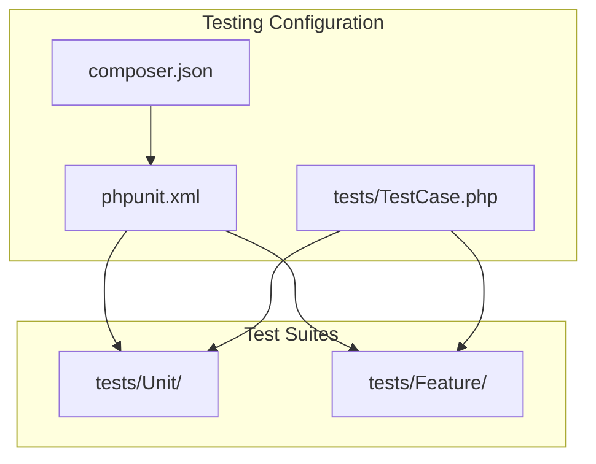
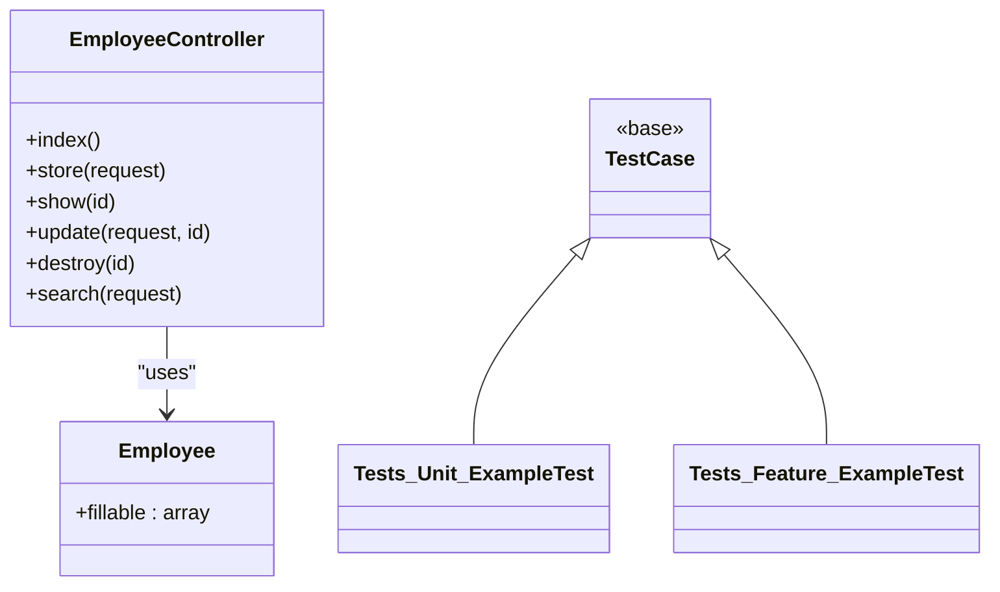
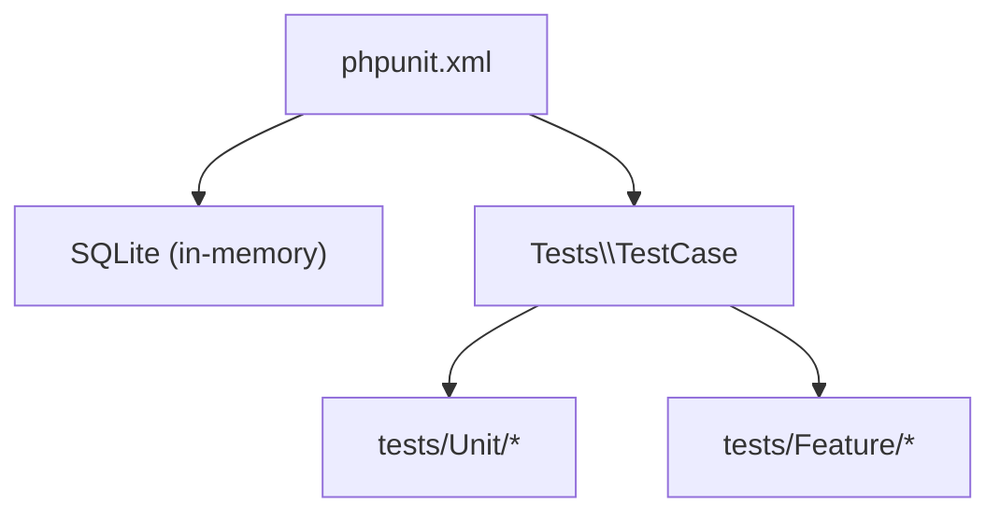
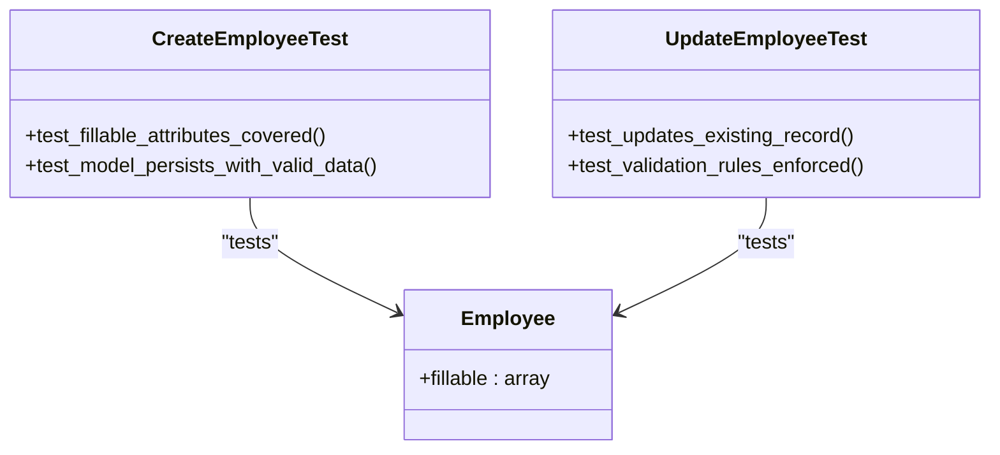
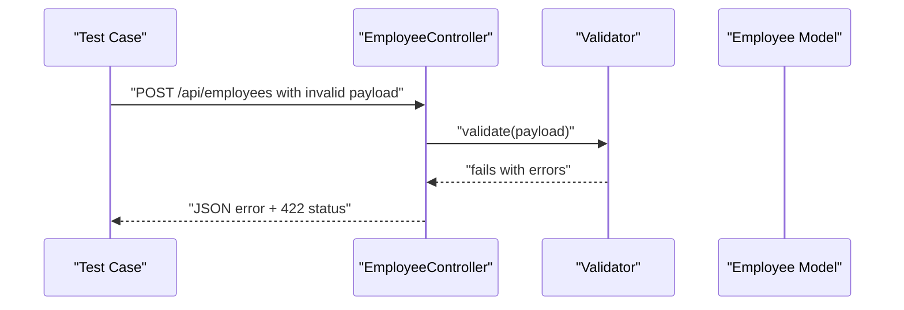
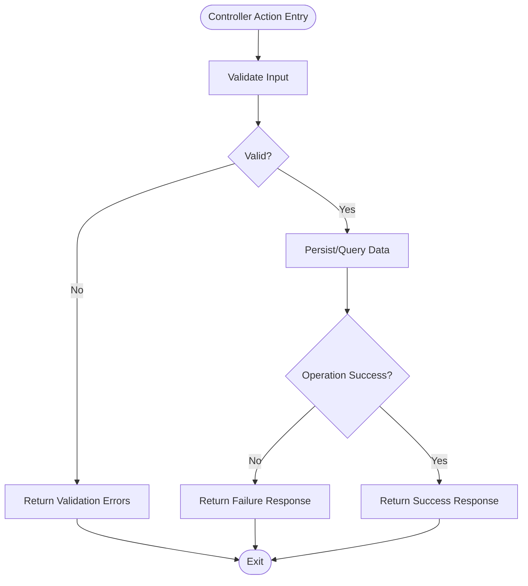
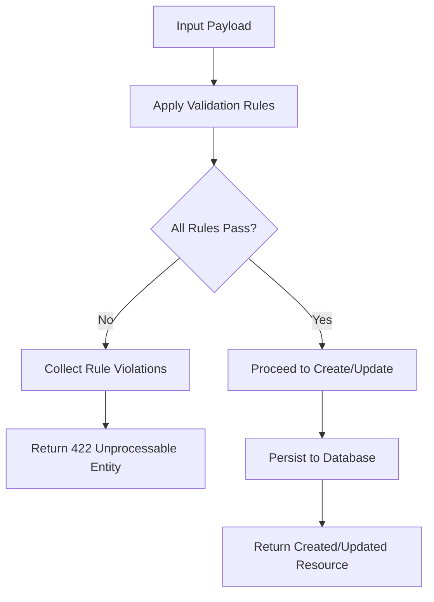
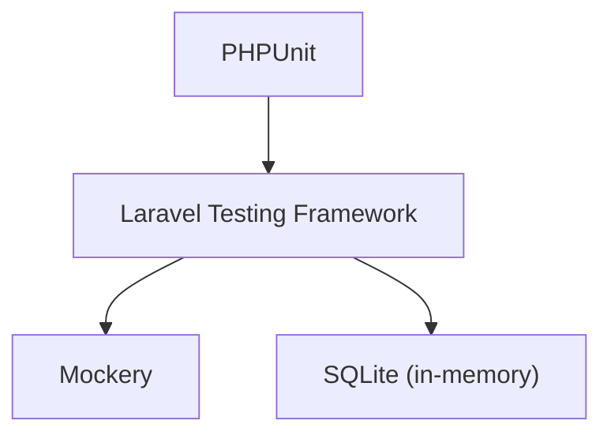

# Unit Testing

<cite>
**Referenced Files in This Document**
- [Employee.php](file://app/Models/Employee.php)
- [EmployeeController.php](file://app/Http/Controllers/EmployeeController.php)
- [TestCase.php](file://tests/TestCase.php)
- [ExampleTest.php (Unit)](file://tests/Unit/ExampleTest.php)
- [ExampleTest.php (Feature)](file://tests/Feature/ExampleTest.php)
- [phpunit.xml](file://phpunit.xml)
- [composer.json](file://composer.json)
- [2026_04_11_134759_create_employees_table.php](file://database/migrations/2026_04_11_134759_create_employees_table.php)
- [database.php](file://config/database.php)
</cite>

## Table of Contents
1. [Introduction](#introduction)
2. [Project Structure](#project-structure)
3. [Core Components](#core-components)
4. [Architecture Overview](#architecture-overview)
5. [Detailed Component Analysis](#detailed-component-analysis)
6. [Dependency Analysis](#dependency-analysis)
7. [Performance Considerations](#performance-considerations)
8. [Troubleshooting Guide](#troubleshooting-guide)
9. [Conclusion](#conclusion)

## Introduction
This document provides comprehensive unit testing guidance for the employees-api project. It focuses on writing effective unit tests for models, business logic, and utility functions using PHPUnit within Laravel. It explains the testing structure, test case inheritance from the base TestCase, and testing patterns for the Employee model, validation logic, and business rules. It also covers mocking external dependencies, dependency injection in tests, test isolation strategies, error condition testing, edge cases, and performance characteristics.

## Project Structure
The testing setup is organized into two primary suites:
- Unit tests under tests/Unit
- Feature tests under tests/Feature
Both suites inherit from a shared base class that bootstraps the Laravel testing framework.

Key configuration:
- phpunit.xml defines the test suites and environment variables for testing, including an in-memory SQLite database.
- composer.json lists PHPUnit and Mockery as development dependencies.
- The base TestCase class is located under tests/TestCase.php.

**Diagram sources**
- [phpunit.xml:1-37](file://phpunit.xml#L1-L37)
- [composer.json:13-19](file://composer.json#L13-L19)
- [TestCase.php:1-11](file://tests/TestCase.php#L1-L11)

**Section sources**
- [phpunit.xml:1-37](file://phpunit.xml#L1-L37)
- [composer.json:13-19](file://composer.json#L13-L19)
- [TestCase.php:1-11](file://tests/TestCase.php#L1-L11)

## Core Components
This section outlines the core components relevant to unit testing:
- Employee model: Defines fillable attributes and persistence behavior.
- EmployeeController: Orchestrates business logic, validation, and persistence via the model.
- Database schema: Defines the employees table structure and constraints.
- Testing base class: Provides shared test infrastructure.

**Diagram sources**
- [Employee.php:7-17](file://app/Models/Employee.php#L7-L17)
- [EmployeeController.php:8-94](file://app/Http/Controllers/EmployeeController.php#L8-L94)
- [TestCase.php:7-10](file://tests/TestCase.php#L7-L10)

**Section sources**
- [Employee.php:7-17](file://app/Models/Employee.php#L7-L17)
- [EmployeeController.php:8-94](file://app/Http/Controllers/EmployeeController.php#L8-L94)
- [TestCase.php:7-10](file://tests/TestCase.php#L7-L10)

## Architecture Overview
The testing architecture leverages Laravel’s built-in testing capabilities:
- The base TestCase bootstraps the framework and sets the testing environment.
- phpunit.xml configures the test suites and environment variables, including an in-memory SQLite database for fast, isolated tests.
- Tests in tests/Unit focus on isolated logic, while tests/Feature exercise HTTP interactions.

**Diagram sources**
- [phpunit.xml:20-35](file://phpunit.xml#L20-L35)
- [database.php:35-45](file://config/database.php#L35-L45)
- [TestCase.php:7-10](file://tests/TestCase.php#L7-L10)

**Section sources**
- [phpunit.xml:20-35](file://phpunit.xml#L20-L35)
- [database.php:35-45](file://config/database.php#L35-L45)
- [TestCase.php:7-10](file://tests/TestCase.php#L7-L10)

## Detailed Component Analysis

### Employee Model Testing
Focus areas:
- Attribute fillable coverage
- Data type expectations (via casts if present)
- Persistence behavior and constraints

Recommended testing patterns:
- Verify fillable attributes include all expected fields.
- Test attribute accessors and mutators if introduced later.
- Validate persistence behavior against the employees table schema.

**Diagram sources**
- [Employee.php:7-17](file://app/Models/Employee.php#L7-L17)

**Section sources**
- [Employee.php:7-17](file://app/Models/Employee.php#L7-L17)
- [2026_04_11_134759_create_employees_table.php:14-23](file://database/migrations/2026_04_11_134759_create_employees_table.php#L14-L23)

### Business Logic and Validation Testing
Focus areas:
- Validation rules in the controller
- HTTP response codes and messages
- Search logic behavior

Recommended testing patterns:
- Use form requests to encapsulate validation rules and test them independently.
- Mock the model layer to isolate business logic.
- Assert correct HTTP status codes and JSON responses.

**Diagram sources**
- [EmployeeController.php:21-33](file://app/Http/Controllers/EmployeeController.php#L21-L33)

**Section sources**
- [EmployeeController.php:21-33](file://app/Http/Controllers/EmployeeController.php#L21-L33)

### Controller Methods Testing
Focus areas:
- index: returns collection of employees
- store: validates and creates employee
- show: retrieves employee or returns 404
- update: validates and updates employee
- destroy: deletes employee or returns 404
- search: filters employees by name, email, or phone

Recommended testing patterns:
- Use Laravel’s testing helpers to simulate requests and assert responses.
- Mock model queries to avoid database round-trips.
- Test both success and failure paths.

**Diagram sources**
- [EmployeeController.php:13-92](file://app/Http/Controllers/EmployeeController.php#L13-L92)

**Section sources**
- [EmployeeController.php:13-92](file://app/Http/Controllers/EmployeeController.php#L13-L92)

### Data Validation Logic Testing
Focus areas:
- Required fields
- Email uniqueness
- Gender enum validation
- Phone and address requirements
- Optional note field

Recommended testing patterns:
- Parameterize tests for each rule.
- Test boundary conditions and invalid combinations.
- Use factories or manual arrays to generate test data.

**Diagram sources**
- [EmployeeController.php:23-30](file://app/Http/Controllers/EmployeeController.php#L23-L30)
- [EmployeeController.php:52-62](file://app/Http/Controllers/EmployeeController.php#L52-L62)

**Section sources**
- [EmployeeController.php:23-30](file://app/Http/Controllers/EmployeeController.php#L23-L30)
- [EmployeeController.php:52-62](file://app/Http/Controllers/EmployeeController.php#L52-L62)

### Utility Functions Testing
Focus areas:
- Helper functions for formatting or calculations
- Data transformation utilities

Recommended testing patterns:
- Keep utilities pure and deterministic.
- Test edge cases and invalid inputs.
- Use minimal dependencies to maintain isolation.

[No sources needed since this section doesn't analyze specific files]

### Mocking Techniques and Dependency Injection
Focus areas:
- Mocking the Employee model in tests
- Injecting mocks via constructor or container
- Stubbing external services

Recommended testing patterns:
- Use Mockery to stub model methods and assertions.
- Inject dependencies through constructors to enable easy mocking.
- Prefer interface-based abstractions for easier test doubles.

**Section sources**
- [composer.json:17-17](file://composer.json#L17-L17)

### Test Isolation Strategies
Focus areas:
- In-memory SQLite database
- Environment variable overrides
- Test cleanup and transactions

Recommended testing patterns:
- Use phpunit.xml to set DB_CONNECTION=sqlite and DB_DATABASE=:memory:.
- Clear caches and reset state between tests.
- Avoid global state and rely on per-test fixtures.

**Section sources**
- [phpunit.xml:26-28](file://phpunit.xml#L26-L28)
- [database.php:35-45](file://config/database.php#L35-L45)

### Error Conditions and Edge Cases
Focus areas:
- Missing or malformed input
- Non-existent employee ID
- Duplicate email during creation/update
- Empty search query

Recommended testing patterns:
- Assert appropriate HTTP status codes (422, 404, 400).
- Verify error message formats.
- Test boundary values and empty inputs.

**Section sources**
- [EmployeeController.php:37-40](file://app/Http/Controllers/EmployeeController.php#L37-L40)
- [EmployeeController.php:71-76](file://app/Http/Controllers/EmployeeController.php#L71-L76)
- [EmployeeController.php:82-84](file://app/Http/Controllers/EmployeeController.php#L82-L84)

### Performance Characteristics
Focus areas:
- Query count in controller actions
- Pagination usage
- Avoid N+1 queries

Recommended testing patterns:
- Use Laravel Debugbar or query log assertions to measure query counts.
- Prefer pagination in index actions.
- Avoid loading unnecessary relations.

[No sources needed since this section provides general guidance]

## Dependency Analysis
The testing stack relies on:
- PHPUnit for test execution and assertions
- Laravel’s testing framework via the base TestCase
- Mockery for creating test doubles
- SQLite in-memory database for fast, isolated tests

**Diagram sources**
- [composer.json:19-19](file://composer.json#L19-L19)
- [composer.json:17-17](file://composer.json#L17-L17)
- [phpunit.xml:26-28](file://phpunit.xml#L26-L28)

**Section sources**
- [composer.json:13-19](file://composer.json#L13-L19)
- [phpunit.xml:20-35](file://phpunit.xml#L20-L35)

## Performance Considerations
- Use SQLite in-memory database to minimize overhead.
- Avoid heavy fixtures; prefer factories or minimal datasets.
- Assert only what is necessary; avoid verbose assertions.
- Leverage Laravel’s built-in testing helpers to reduce boilerplate.

[No sources needed since this section provides general guidance]

## Troubleshooting Guide
Common issues and resolutions:
- Database not initialized: Ensure migrations are run in the testing environment.
- Incorrect environment variables: Confirm APP_ENV=testing and DB_CONNECTION=sqlite with DB_DATABASE=:memory:.
- Missing dependencies: Install dev dependencies via Composer.

**Section sources**
- [phpunit.xml:21-35](file://phpunit.xml#L21-L35)
- [composer.json:13-19](file://composer.json#L13-L19)

## Conclusion
This guide outlined how to structure and execute unit tests for models, business logic, and utilities in the employees-api project. By leveraging Laravel’s testing framework, PHPUnit, and Mockery, you can achieve reliable, isolated, and maintainable tests. Focus on validating model attributes, controller validation rules, and business logic paths, while ensuring error conditions and edge cases are covered. Use mocking and dependency injection to isolate components and improve test reliability.