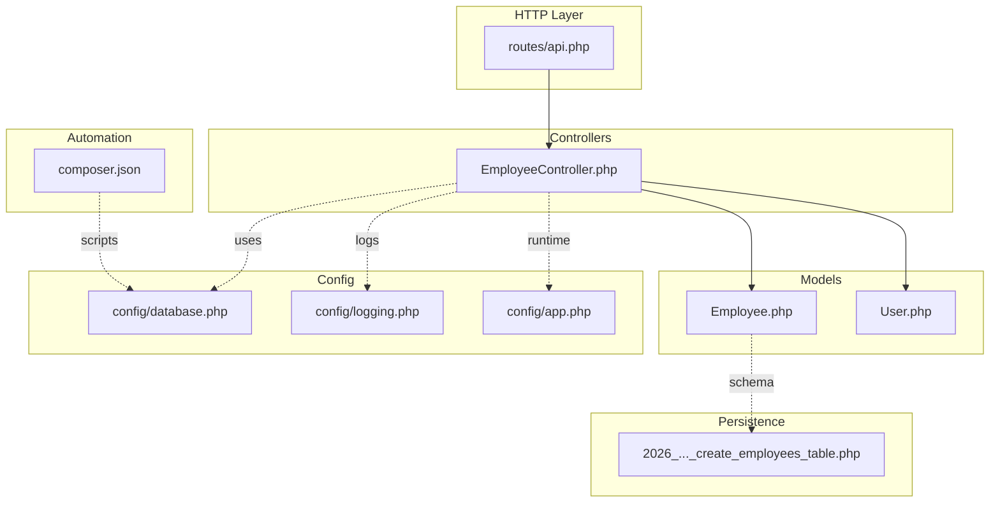
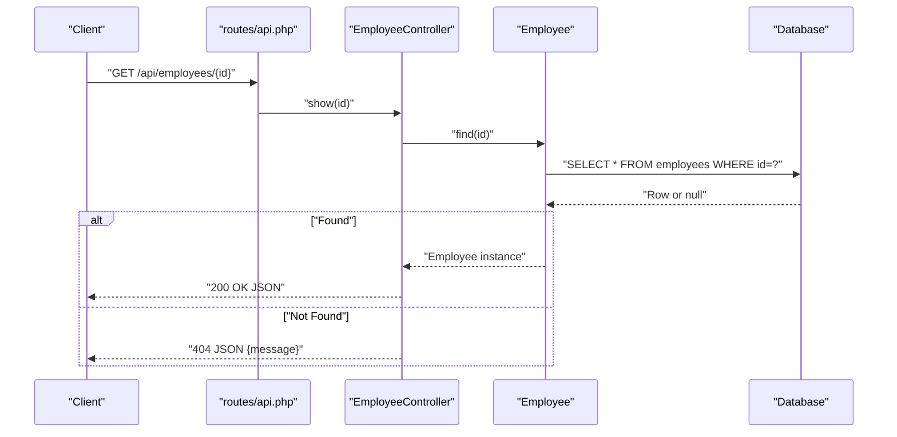
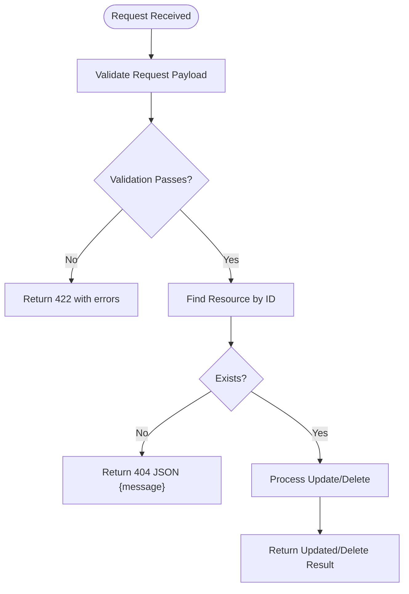
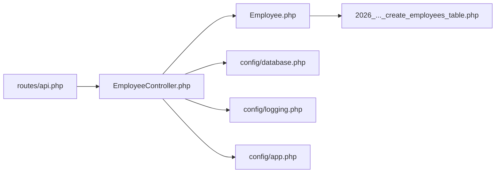

# Troubleshooting & FAQ

<cite>
**Referenced Files in This Document**
- [EmployeeController.php](file://app/Http/Controllers/EmployeeController.php)
- [Employee.php](file://app/Models/Employee.php)
- [User.php](file://app/Models/User.php)
- [routes/api.php](file://routes/api.php)
- [config/database.php](file://config/database.php)
- [.env.example](file://.env.example)
- [composer.json](file://composer.json)
- [2026_04_11_134759_create_employees_table.php](file://database/migrations/2026_04_11_134759_create_employees_table.php)
- [storage/logs/laravel.log](file://storage/logs/laravel.log)
- [config/logging.php](file://config/logging.php)
- [config/app.php](file://config/app.php)
- [tests/Feature/ExampleTest.php](file://tests/Feature/ExampleTest.php)
- [tests/Unit/ExampleTest.php](file://tests/Unit/ExampleTest.php)
</cite>

## Table of Contents
1. [Introduction](#introduction)
2. [Project Structure](#project-structure)
3. [Core Components](#core-components)
4. [Architecture Overview](#architecture-overview)
5. [Detailed Component Analysis](#detailed-component-analysis)
6. [Dependency Analysis](#dependency-analysis)
7. [Performance Considerations](#performance-considerations)
8. [Troubleshooting Guide](#troubleshooting-guide)
9. [FAQ](#faq)
10. [Conclusion](#conclusion)

## Introduction
This document provides a comprehensive troubleshooting guide and FAQ for the employees API project. It focuses on resolving common setup, development, and deployment issues, including database connectivity, permissions, validation errors, API response anomalies, controller and model debugging, error log analysis, performance tuning, and memory optimization. It also includes practical step-by-step resolutions and best practices for Laravel API development.

## Project Structure
The project follows Laravel’s standard MVC layout with a dedicated API surface and Eloquent models. Key areas relevant to troubleshooting:
- Controllers: handle HTTP requests and responses for employee resources and search.
- Models: define fillable attributes and relationships for employees and users.
- Routes: register API endpoints for employees and a custom search endpoint.
- Configurations: database, logging, and application settings.
- Migrations: define the employees table schema.
- Scripts: Composer scripts for setup, development, and testing.

**Diagram sources**
- [routes/api.php:1-8](file://routes/api.php#L1-L8)
- [EmployeeController.php:1-95](file://app/Http/Controllers/EmployeeController.php#L1-L95)
- [Employee.php:1-18](file://app/Models/Employee.php#L1-L18)
- [User.php:1-33](file://app/Models/User.php#L1-L33)
- [config/database.php:1-185](file://config/database.php#L1-L185)
- [config/logging.php:1-133](file://config/logging.php#L1-L133)
- [config/app.php:1-127](file://config/app.php#L1-L127)
- [2026_04_11_134759_create_employees_table.php:1-34](file://database/migrations/2026_04_11_134759_create_employees_table.php#L1-L34)
- [composer.json:1-86](file://composer.json#L1-L86)

**Section sources**
- [routes/api.php:1-8](file://routes/api.php#L1-L8)
- [EmployeeController.php:1-95](file://app/Http/Controllers/EmployeeController.php#L1-L95)
- [Employee.php:1-18](file://app/Models/Employee.php#L1-L18)
- [User.php:1-33](file://app/Models/User.php#L1-L33)
- [config/database.php:1-185](file://config/database.php#L1-L185)
- [config/logging.php:1-133](file://config/logging.php#L1-L133)
- [config/app.php:1-127](file://config/app.php#L1-L127)
- [2026_04_11_134759_create_employees_table.php:1-34](file://database/migrations/2026_04_11_134759_create_employees_table.php#L1-L34)
- [composer.json:1-86](file://composer.json#L1-L86)

## Core Components
- EmployeeController: Implements CRUD operations and a search endpoint. Validation rules are applied via request validation, and responses return JSON for missing resources and standard CRUD results.
- Employee model: Defines fillable attributes for mass assignment and integrates with Eloquent ORM.
- User model: Provides authentication scaffolding with factory and attribute-level directives for fillable and hidden fields.
- Routes: Registers RESTful endpoints for employees and a dedicated search route.
- Database configuration: Supports SQLite, MySQL, MariaDB, PostgreSQL, and SQL Server with environment-driven settings.
- Logging configuration: Stack-based logging with configurable channels and levels.
- Application configuration: Debug mode, environment, timezone, and maintenance settings.

**Section sources**
- [EmployeeController.php:1-95](file://app/Http/Controllers/EmployeeController.php#L1-L95)
- [Employee.php:1-18](file://app/Models/Employee.php#L1-L18)
- [User.php:1-33](file://app/Models/User.php#L1-L33)
- [routes/api.php:1-8](file://routes/api.php#L1-L8)
- [config/database.php:1-185](file://config/database.php#L1-L185)
- [config/logging.php:1-133](file://config/logging.php#L1-L133)
- [config/app.php:1-127](file://config/app.php#L1-L127)

## Architecture Overview
The API follows a clean separation of concerns:
- HTTP requests enter via routes and are handled by controllers.
- Controllers validate input, interact with models, and return structured JSON responses.
- Models encapsulate persistence and attribute policies.
- Configuration files govern database connections, logging, and application behavior.
- Composer scripts automate setup, development, and testing.

**Diagram sources**
- [routes/api.php:1-8](file://routes/api.php#L1-L8)
- [EmployeeController.php:34-41](file://app/Http/Controllers/EmployeeController.php#L34-L41)
- [Employee.php:1-18](file://app/Models/Employee.php#L1-L18)
- [2026_04_11_134759_create_employees_table.php:1-34](file://database/migrations/2026_04_11_134759_create_employees_table.php#L1-L34)

## Detailed Component Analysis

### EmployeeController: Validation, Responses, and Search
Key behaviors:
- Validation rules enforce required fields, email format, enum constraints, and uniqueness for creation and updates.
- Missing resource handling returns a JSON message with a 404 status.
- Search endpoint requires a query parameter and performs OR-like matches across name, email, and phone.

Common issues and resolutions:
- Validation failures: Ensure incoming JSON matches the validated fields and constraints. Review the validation rules in the controller.
- Missing resource: Confirm the ID exists in the database and that the primary key type aligns with the route definition.
- Search query: Provide a non-empty query parameter; otherwise, a 400 response is returned.

**Diagram sources**
- [EmployeeController.php:21-33](file://app/Http/Controllers/EmployeeController.php#L21-L33)
- [EmployeeController.php:46-63](file://app/Http/Controllers/EmployeeController.php#L46-L63)
- [EmployeeController.php:69-77](file://app/Http/Controllers/EmployeeController.php#L69-L77)

**Section sources**
- [EmployeeController.php:1-95](file://app/Http/Controllers/EmployeeController.php#L1-L95)

### Employee Model: Fillable Attributes and Mass Assignment
- The model declares fillable attributes to prevent mass assignment vulnerabilities.
- Ensure all fields intended for create/update are included in the fillable list.

Common issues:
- Unknown property errors: Occur when attempting to set non-fillable attributes via request data.
- Unexpected nulls: Verify that nullable fields are intentionally marked as such in the migration and model.

**Section sources**
- [Employee.php:1-18](file://app/Models/Employee.php#L1-L18)
- [2026_04_11_134759_create_employees_table.php:1-34](file://database/migrations/2026_04_11_134759_create_employees_table.php#L1-L34)

### Routes: API Surface and Endpoint Registration
- RESTful endpoints are registered via apiResource.
- A custom search endpoint is registered separately.

Common issues:
- 404 on employees endpoints: Verify the route prefix and method alignment with client requests.
- Search endpoint mismatch: Ensure the client calls the correct path for search.

**Section sources**
- [routes/api.php:1-8](file://routes/api.php#L1-L8)

### Database Configuration: Drivers, Credentials, and Defaults
- Default connection is SQLite by environment variable.
- MySQL/MariaDB/PostgreSQL/SQL Server configurations are provided with environment-driven settings.
- Foreign key constraints and charset/collation are configurable.

Common issues:
- SQLite file not found: Ensure the SQLite database path exists or switch to a supported driver.
- Wrong credentials: Verify DB_HOST, DB_PORT, DB_DATABASE, DB_USERNAME, DB_PASSWORD.
- Driver not installed: Install the appropriate PDO driver for the chosen database.

**Section sources**
- [config/database.php:1-185](file://config/database.php#L1-L185)
- [.env.example:23-28](file://.env.example#L23-L28)

### Logging and Error Visibility
- Default channel is stack; single/daily channels write to storage/logs.
- LOG_LEVEL and LOG_CHANNEL influence verbosity and output destinations.
- APP_DEBUG toggles detailed error pages.

Common issues:
- Logs not appearing: Check LOG_CHANNEL and LOG_LEVEL; confirm file permissions for storage/logs.
- Production noise: Lower LOG_LEVEL or switch to daily rotation.

**Section sources**
- [config/logging.php:1-133](file://config/logging.php#L1-L133)
- [config/app.php:42-42](file://config/app.php#L42-L42)
- [.env.example:18-21](file://.env.example#L18-L21)

## Dependency Analysis
The controller depends on the model and configuration for database behavior. Routes depend on controller actions. Logging and application settings influence runtime behavior.

**Diagram sources**
- [routes/api.php:1-8](file://routes/api.php#L1-L8)
- [EmployeeController.php:1-95](file://app/Http/Controllers/EmployeeController.php#L1-L95)
- [Employee.php:1-18](file://app/Models/Employee.php#L1-L18)
- [config/database.php:1-185](file://config/database.php#L1-L185)
- [config/logging.php:1-133](file://config/logging.php#L1-L133)
- [config/app.php:1-127](file://config/app.php#L1-L127)
- [2026_04_11_134759_create_employees_table.php:1-34](file://database/migrations/2026_04_11_134759_create_employees_table.php#L1-L34)

**Section sources**
- [routes/api.php:1-8](file://routes/api.php#L1-L8)
- [EmployeeController.php:1-95](file://app/Http/Controllers/EmployeeController.php#L1-L95)
- [Employee.php:1-18](file://app/Models/Employee.php#L1-L18)
- [config/database.php:1-185](file://config/database.php#L1-L185)
- [config/logging.php:1-133](file://config/logging.php#L1-L133)
- [config/app.php:1-127](file://config/app.php#L1-L127)
- [2026_04_11_134759_create_employees_table.php:1-34](file://database/migrations/2026_04_11_134759_create_employees_table.php#L1-L34)

## Performance Considerations
- Use pagination for large datasets when extending the index action.
- Index frequently queried columns (name, email, phone) in the employees table.
- Minimize N+1 queries by eager-loading related data if relationships are introduced.
- Enable query logging in development to identify slow queries.
- Monitor memory usage with PHP memory_get_usage and optimize serialization of large collections.
- Prefer batch inserts for seeding or bulk operations.

[No sources needed since this section provides general guidance]

## Troubleshooting Guide

### Setup and Environment
Symptoms:
- Application fails to boot or shows configuration errors.
- Missing APP_KEY or invalid environment values.

Resolutions:
- Generate application key: run the script that generates the key during setup.
- Copy .env.example to .env and fill required values.
- Ensure APP_DEBUG and LOG_LEVEL are set appropriately for development.

**Section sources**
- [composer.json:34-41](file://composer.json#L34-L41)
- [.env.example:1-66](file://.env.example#L1-L66)
- [config/app.php:42-42](file://config/app.php#L42-L42)

### Database Connectivity
Symptoms:
- Migration errors or inability to connect to the database.
- SQLite “database not found” or permission denied.

Resolutions:
- Switch driver: set DB_CONNECTION to sqlite, mysql, mariadb, pgsql, or sqlsrv.
- For SQLite: ensure the database file path exists or rely on the default path.
- For MySQL/MariaDB: verify host, port, database name, username, and password.
- For PostgreSQL/SQL Server: confirm driver availability and credentials.
- Apply migrations: run the migration script included in setup.

**Section sources**
- [config/database.php:20-115](file://config/database.php#L20-L115)
- [.env.example:23-28](file://.env.example#L23-L28)
- [composer.json:38-38](file://composer.json#L38-L38)

### Permission Issues
Symptoms:
- Storage/logs not writable.
- Web server cannot access SQLite file.

Resolutions:
- Grant write permissions to storage/ and bootstrap/cache directories.
- Ensure the web server user can read/write to storage/logs.
- On Windows, adjust folder permissions in File Explorer or use ACL commands.

**Section sources**
- [config/logging.php:63-74](file://config/logging.php#L63-L74)

### Validation Errors
Symptoms:
- 422 Unprocessable Entity responses.
- Unique constraint violations on email.

Resolutions:
- Match the validated fields exactly: name, email, gender, phone, note (nullable), address.
- For updates, ensure unique email excludes the current record’s ID.
- Use optional validation for fields that are not always required.

**Section sources**
- [EmployeeController.php:23-30](file://app/Http/Controllers/EmployeeController.php#L23-L30)
- [EmployeeController.php:52-60](file://app/Http/Controllers/EmployeeController.php#L52-L60)

### API Response Problems
Symptoms:
- 404 when fetching or deleting a non-existent employee.
- Empty search results.

Resolutions:
- Confirm the ID exists before calling show/update/destroy.
- Ensure the search endpoint receives a non-empty query parameter.
- Verify route registration and method correctness.

**Section sources**
- [EmployeeController.php:34-41](file://app/Http/Controllers/EmployeeController.php#L34-L41)
- [EmployeeController.php:69-77](file://app/Http/Controllers/EmployeeController.php#L69-L77)
- [EmployeeController.php:78-92](file://app/Http/Controllers/EmployeeController.php#L78-L92)
- [routes/api.php:6-7](file://routes/api.php#L6-L7)

### Controller Debugging Techniques
Techniques:
- Add request dumping and early returns to isolate failing branches.
- Temporarily enable verbose logging to capture request/response metadata.
- Use tinker to test model queries and validation logic outside the HTTP flow.

**Section sources**
- [EmployeeController.php:1-95](file://app/Http/Controllers/EmployeeController.php#L1-L95)
- [config/logging.php:1-133](file://config/logging.php#L1-L133)

### Model Problems
Techniques:
- Verify fillable attributes match request payload.
- Confirm database schema aligns with model expectations.
- Use tinker to inspect model instances and relationships.

**Section sources**
- [Employee.php:1-18](file://app/Models/Employee.php#L1-L18)
- [2026_04_11_134759_create_employees_table.php:1-34](file://database/migrations/2026_04_11_134759_create_employees_table.php#L1-L34)

### Database Queries
Techniques:
- Enable query logging in development to review generated SQL.
- Add indexes on search/filter columns.
- Use tinker to run raw queries and test performance.

**Section sources**
- [config/database.php:1-185](file://config/database.php#L1-L185)

### Error Log Analysis
Steps:
- Inspect storage/logs/laravel.log for stack traces and error messages.
- Adjust LOG_LEVEL to capture more details during development.
- Use daily rotation for long-running development sessions.

**Section sources**
- [storage/logs/laravel.log:1-16](file://storage/logs/laravel.log#L1-L16)
- [config/logging.php:61-74](file://config/logging.php#L61-L74)

### Performance Troubleshooting
Steps:
- Profile queries and responses in development.
- Paginate large lists and avoid loading unnecessary relations.
- Optimize database indexes and reduce N+1 queries.

**Section sources**
- [routes/api.php:1-8](file://routes/api.php#L1-L8)

### Memory Optimization Strategies
Strategies:
- Avoid loading large collections unnecessarily.
- Use chunked processing for bulk operations.
- Monitor memory usage and clear caches periodically.

**Section sources**
- [config/cache.php:1-127](file://config/cache.php#L1-L127)

## FAQ

Q: How do I run the setup script?
A: Use the setup script defined in Composer to install dependencies, generate keys, run migrations, and build assets.

Q: Why am I getting a 404 on employees endpoints?
A: Ensure the route prefix and method match the client request and that migrations have been applied.

Q: How do I switch from SQLite to MySQL?
A: Set DB_CONNECTION=mysql and provide DB_HOST, DB_PORT, DB_DATABASE, DB_USERNAME, DB_PASSWORD in your environment.

Q: How do I enable detailed error pages?
A: Set APP_DEBUG=true in your environment.

Q: How do I rotate logs?
A: Set LOG_CHANNEL=daily and optionally adjust LOG_DAILY_DAYS.

Q: How do I add indexes for search?
A: Modify the employees migration to add indexes on name, email, and phone.

Q: How do I fix “No arguments expected for migrate”?
A: Use the correct Artisan command without extra arguments; follow the setup script guidance.

Q: How do I run tests?
A: Use the test script defined in Composer to clear configs and execute tests.

**Section sources**
- [composer.json:34-49](file://composer.json#L34-L49)
- [routes/api.php:1-8](file://routes/api.php#L1-L8)
- [config/database.php:20-115](file://config/database.php#L20-L115)
- [config/app.php:42-42](file://config/app.php#L42-L42)
- [config/logging.php:68-74](file://config/logging.php#L68-L74)
- [2026_04_11_134759_create_employees_table.php:1-34](file://database/migrations/2026_04_11_134759_create_employees_table.php#L1-L34)
- [storage/logs/laravel.log:1-16](file://storage/logs/laravel.log#L1-L16)
- [tests/Feature/ExampleTest.php:1-20](file://tests/Feature/ExampleTest.php#L1-L20)
- [tests/Unit/ExampleTest.php:1-17](file://tests/Unit/ExampleTest.php#L1-L17)

## Conclusion
This guide consolidates actionable steps to resolve common issues in the employees API project. By aligning environment configuration, validating requests, ensuring proper database setup, and leveraging logging and testing, most problems can be diagnosed and resolved quickly. Adopt the recommended performance and memory strategies to maintain a robust API in production.